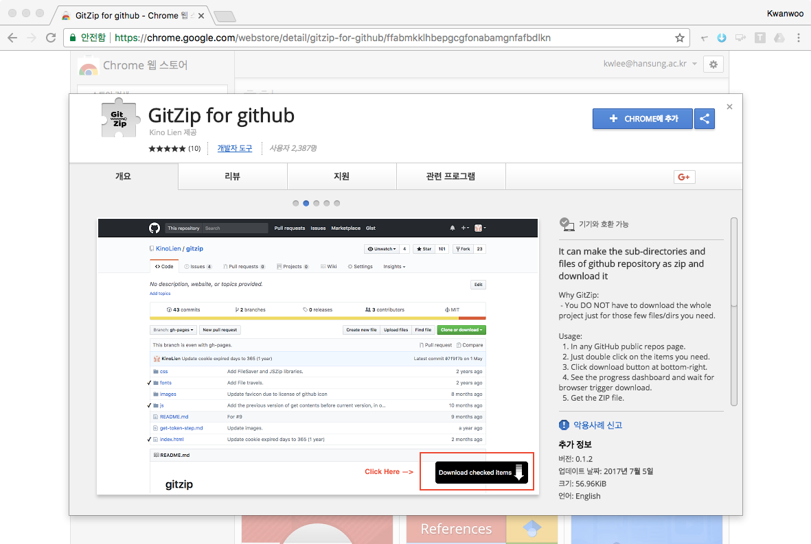
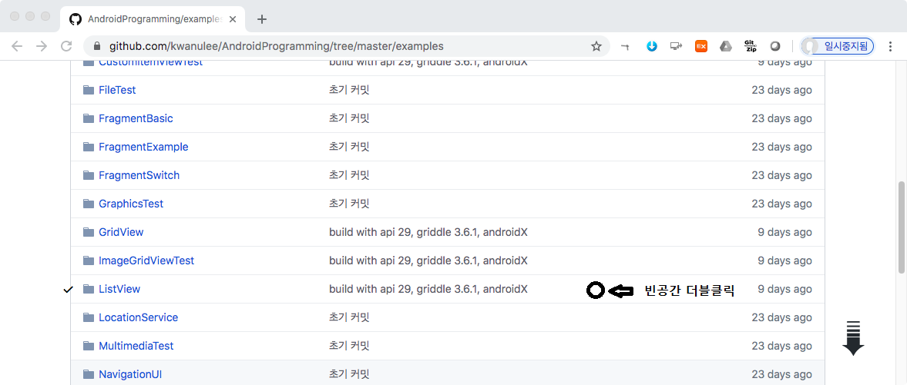
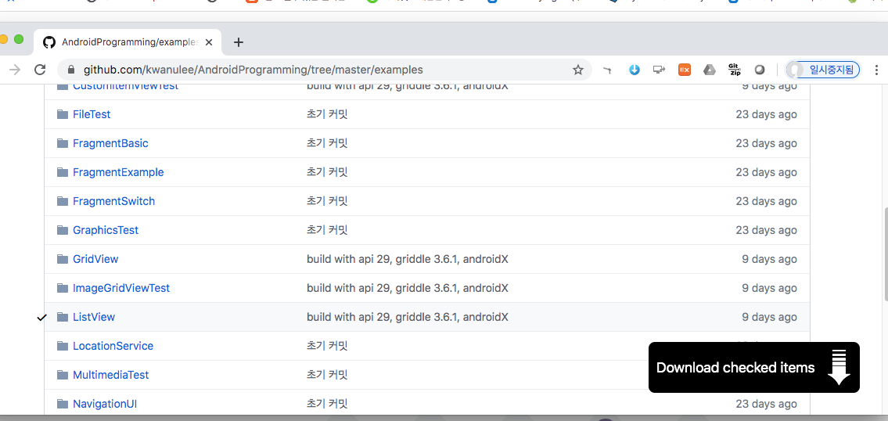

# 안드로이드 프로그래밍 강의자료

## 1. 안드로이드 개요
- [안드로이드 소개](http://kwanulee.github.io/AndroidProgramming/intro-android/intro_android.html) 
- [개발환경 설치](http://kwanulee.github.io/AndroidProgramming/intro-android/install_dev_env.html) 
- [안드로이드 앱 시작하기](http://kwanulee.github.io/AndroidProgramming/intro-android/start-android-project.html)  
- [[실습-안드로이드 시작하기]](안드로이드_시작하기_실습.html) 

## 2. 안드로이드 앱 프로젝트
- [안드로이드 앱 기본](http://kwanulee.github.io/AndroidProgramming/android-project/android_app_basic.html)
- [안드로이드 앱 프로젝트 기본](http://kwanulee.github.io/AndroidProgramming/android-project/android_project_basic.html)
- [프로젝트 빌드](http://kwanulee.github.io/AndroidProgramming/android-project/project-build.html)
- [[실습-안드로이드 프로젝트]](http://kwanulee.github.io/AndroidProgramming/android-project/안드로이드_프로젝트_실습.html) 

## 3. 안드로이드 UI
- [안드로이드 UI 기본](http://kwanulee.github.io/AndroidProgramming/android-ui/ui-intro.html)
- [뷰: 위젯 (Widget)](https://kwanulee.github.io/AndroidProgramming/android-ui/ui-widget.html)
- [뷰그룹: 레이아웃 (Layout)](https://kwanulee.github.io/AndroidProgramming/android-ui/ui-layout.html)
- [Margin, Padding, Gravity](https://kwanulee.github.io/AndroidProgramming/android-ui/ui-mpg.html)
- [[실습-안드로이드 UI]](http://kwanulee.github.io/AndroidProgramming/android-ui/안드로이드_UI_실습.html)

 
## 4. 어댑터 뷰 (Adapter View)
- [어댑터뷰 개념](http://kwanulee.github.io/AndroidProgramming/adapter-view/adapterview.html)
- [리스트뷰](http://kwanulee.github.io/AndroidProgramming/adapter-view/listview.html)
- [그리드뷰](http://kwanulee.github.io/AndroidProgramming/adapter-view/gridview.html)
- [커스텀항목뷰](http://kwanulee.github.io/AndroidProgramming/adapter-view/custom-item-view.html)
- [[실습-어댑터 뷰]](http://kwanulee.github.io/AndroidProgramming/adapter-view/adapterview-practice.html)

## 5. 액티비티와 인텐트 (Activity and Intent)
- [액티비티](http://kwanulee.github.io/AndroidProgramming/activity-intent/activity.html) 
- [인텐트](http://kwanulee.github.io/AndroidProgramming/activity-intent/intent.html) 
- [액티비티 간의 통신](http://kwanulee.github.io/AndroidProgramming/activity-intent/activity-communication.html) 
- [액티비티 수명주기](http://kwanulee.github.io/AndroidProgramming/activity-intent/activity-lifecycle.html) 

## 6. 프래그먼트 (Fragment)
- [프래그먼트 개요](http://kwanulee.github.io/AndroidProgramming/fragment/fragment-overview.html) 
- [프래그먼트 사용하기](http://kwanulee.github.io/AndroidProgramming/fragment/fragment-usage.html) 
- [프래그먼트 예제](http://kwanulee.github.io/AndroidProgramming/fragment/fragment-example.html) 
- [[실습-프래그먼트]](http://kwanulee.github.io/AndroidProgramming/fragment/fragment-practice.html)

## 7. 탐색 (Navigation)
- [앱바와 액션 추가 및 처리](http://kwanulee.github.io/AndroidProgramming/navigation/actionbar.html)
- [Swipe Views with Tabs](http://kwanulee.github.io/AndroidProgramming/navigation/swiping-views.html)

## 8. 설정 및 파일
- [설정](http://kwanulee.github.io/AndroidProgramming/data-management/sharedpreferences.html) 
- [파일](http://kwanulee.github.io/AndroidProgramming/data-management/file.html) 

## 9. 데이터베이스
- [데이터베이스, SQL 기본](http://kwanulee.github.io/AndroidProgramming/data-management/database_overview.html) 
- [SQLite 라이브러리 시작하기](http://kwanulee.github.io/AndroidProgramming/data-management/sqlite.html) 
- [[실습-데이터저장 및 관리]](http://kwanulee.github.io/AndroidProgramming/data-management/datamanagement_lab.html)

## 10. Content Provider
- [콘텐츠 제공자](http://kwanulee.github.io/AndroidProgramming/data-management/content-provider.html) 
- [캘린더 제공자](http://kwanulee.github.io/AndroidProgramming/data-management/calendar-provider.html)
-  [[실습-콘텐츠 제공자]](http://kwanulee.github.io/AndroidProgramming/data-management/sqlite-content-provider-lab.html)

## 11. 멀티미디어
- [오디오 재생하기](http://kwanulee.github.io/AndroidProgramming/multimedia/multimedia.html#1)
- [동영상 재생하기](http://kwanulee.github.io/AndroidProgramming/multimedia/multimedia.html#2)
- [오디오 녹음하기](http://kwanulee.github.io/AndroidProgramming/multimedia/multimedia.html#3)
- [카메라 앱으로 사진 및 동영상 저장하기](http://kwanulee.github.io/AndroidProgramming/multimedia/multimedia.html#4)
- [Photo 앱으로 선택한 사진 저장하기](http://kwanulee.github.io/AndroidProgramming/multimedia/multimedia.html#5)

-  [[실습-멀티미디어]](http://kwanulee.github.io/AndroidProgramming/multimedia/multimedia_lab.html)

## 12. 위치 기반 서비스 및 지도
- [위치기반 서비스](http://kwanulee.github.io/AndroidProgramming/location_map/location.html) 
- [지도](http://kwanulee.github.io/AndroidProgramming/location_map/map.html) 
-  [[실습-위치기반 서비스 및 지도]](http://kwanulee.github.io/AndroidProgramming/location_map/location-map-lab.html)

## 13. 서비스와 브로드캐스트 리시버, 알림
- [서비스](http://kwanulee.github.io/AndroidProgramming/service/service.html)
- [브로드캐스트 리시버](http://kwanulee.github.io/AndroidProgramming/broadcast_notification/broadcast_receiver.html)
- [알림 (Notification)](http://kwanulee.github.io/AndroidProgramming/broadcast_notification/notification.html)
-  [[실습-브로드캐스트 리시버와 알림]](http://kwanulee.github.io/AndroidProgramming/broadcast_notification/broadcast-notification-lab.html)

## 14. 애니메이션 및 그래픽
- [애니메이션](http://kwanulee.github.io/AndroidProgramming/animation-graphics/animation.html) 
- [그래픽](http://kwanulee.github.io/AndroidProgramming/animation-graphics/graphics.html) 
-  [[실습-애니메이션]](http://kwanulee.github.io/AndroidProgramming/animation-graphics/animation_lab.html)

## 기타
- [git/GitHub를 이용한 프로젝트 관리](http://kwanulee.github.io/AndroidProgramming/android-project/git_github.html)
- [[실습]](http://kwanulee.github.io/AndroidProgramming/android-project/git_github_실습.html)

## Android 예제 프로젝트 
- **Android 예제 프로젝트 위치**
	- https://github.com/kwanulee/AndroidProgramming/tree/master/examples

	

각 Android 예제 프로젝트를 개별적으로 다운 받기 위해서는 다음 방법을 사용하면 편리합니다.

1. **Chrome 브라우저**에서 [GitZip for github](https://chrome.google.com/webstore/detail/gitzip-for-github/ffabmkklhbepgcgfonabamgnfafbdlkn) 사이트를 접속하여 **[CHROME에 추가]** 버튼을 클릭하여 **GitZip for github** 확장 프로그램을 **Chrome**에 추가합니다.

	
	
2. 다운 받고자 하는 **GitHub 저장소의 특정 디렉토리**의 빈 공간을 더블 클릭한다.

	가령, **ListView** 프로젝트를 다운 받으려면, 아래 그림처럼 **ListView** 폴더 행의 빈공간을 클릭하면 오른쪽 아래에 아래 방향의 화살표가 생성됩니다.

	 

3. 화면 오른쪽 아래의 **아래 방향의 화살표**로 마우스 포인터를 이동하면 **Download Checked Item** 이 나타나고 이를 클릭하여 다운로드

	 