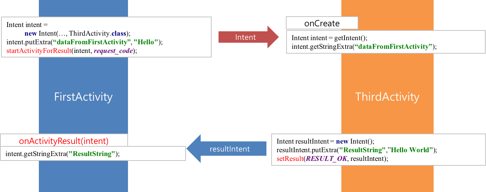

[**이전 학습**: 인텐트](intent.html)
# 액티비티 간의 통신

## 학습목표
- 인텐트를 활용하여 액티비티 컴포넌트 간에 메시지를 주고 받는 방법을 이해한다.

## 1. 액티비티 간의 데이터 전달 
- 인텐트는 액티비티 간에 데이터를 전달하는 도구로도 사용
- **Extras**를 활용하여 이름과 값의 쌍으로된 정보를 전달
  - Extras에 값을 저장하는 메소드
    	- Intent **putExtra**(String name, int value)
    	- Intent **putExtra**(String name, String value)
    	- Intent **putExtra**(String name, boolean value)
  - Extras에 저장된 값을 읽는 메소드
    	- int **getIntExtra**(String name, int defaultValue)
    	- String **getStringExtra**(String name)
    	- boolean **getBooleanExtra**(String name, boolean defaultValue)

### [[연습5] - FirstActivity에서 ThirdActivity로 데이터 전송 및 수신](exercise5.html)

## 2. 액티비티로부터 결과 받기
- 액티비티로 인수를 전달하고 계산된 결과를 돌려받기 위해서는 다음 메소드를 사용
  - public void **startActivityForResult**(Intent *intent*, int *requestCode*)
    	- 위 메소드를 이용하여 리턴값을 돌려 주는 액티비티 호출
      		- *intent*: 시작 시킬 액티비티나 작업을 기술한 인텐트
      		- *requestCode*: 호출한 대상을 나타내는 식별자
  - protected void **onActivityResult**(int *requestCode*, int *resultCode*, Intent *data*)
    	- 호출된 액티비티가 종료되면 호출되는 메소드
      		- *requestCode*:  액티비티를 호출할 때 전달한 요청코드
      		- *resultCode*: 액티비티의 실행결과
     		- *data*: 호출된 액티비티의 수행결과가 Extras를 통해 전달된 인텐트 객체.
  - public void **setResult**(int *requestCode*, Intent *data*)
    	- 현재 액티비티를 띄운 액티비티로 응답을 보낼 때 사용
     		 - *resultCode*: 호출한 액티비티로 전달될 실행결과코드
      		- *data*: 액티비티의 수행결과를 Extras를 통해 전달할 인텐트 객체.

  

    		
  

### [[연습6] - FirstActivity에서 시작시킨 ThirdActivity의 수행결과를 수신하기](exercise6.html)

---
[**다음 학습**: 액티비티 수명주기](activity-lifecycle.html)