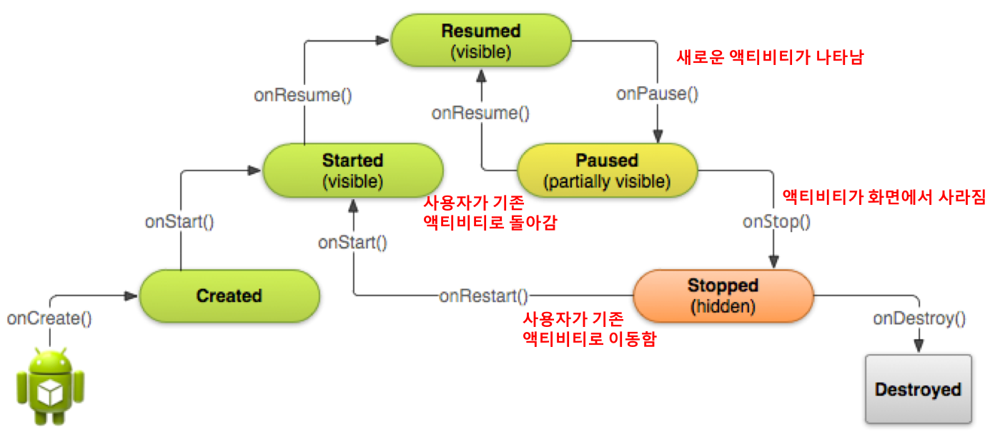

[**이전 학습**: 액티비티 간의 통신](activity-communication.html)

# 액티비티 수명주기

## 학습목표
- 액티비티 수명주기를 이해한다.

## 1. 개요

    

- 한 액티비티의 수명은 **onCreate**() 호출과 **onDestroy**() 호출 사이에 있습니다. 
	- onCreate()에서 액티비티가 생성되어 레이아웃  설정 등을 수행한 다음에, onDestroy()가 호출되는 시점에 사용하고 있는 리소스를 모두 해제하고 생을 마감합니다.
- 액티비티의 화면이 눈에 보이게 되는  Visibility는 **onStart**()에서 **onStop**() 호출 사이에 있습니다.
	- 이 기간 중에는 사용자가 액티비티를 화면에서 보고 이와 상호작용할 수 있습니다. 예컨대 onStop()이 호출되어 새 액티비티가 시작되면 이 액티비티는 더 이상 표시되지 않게 됩니다. 시스템은 액티비티의 전체 수명 내내 onStart() 및 onStop()을 여러 번 호출할 수 있으며, 이때 액티비티는 사용자에게 표시되었다 숨겨지는 상태를 오가게 됩니다.

- 액티비티가 foreground에서 동작하는 구간은 **onResume**()에서 **onPause**() 호출 사이를 말합니다.
	- 이 기간 중에는 이 액티비티가 화면에서 다른 모든 액티비티 앞에 표시되며 사용자 입력도 여기에 집중됩니다. 액티비티는 전경에 나타났다 숨겨지는 전환을 자주 반복할 수 있습니다. 예를 들어 , 기기가 절전 모드에 들어가거나 대화 상자가 나타나면 onPause()가 호출됩니다.

## 2. 수명주기 콜백 메소드
- 액티비티가 생성되면서 해제될 때까지 액비티티의 상태에 따라서 불려지는 메소드를 **라이프사이클 콜백 메소드**라 부르고, 애플리케이션 개발자는 필요한 경우에 해당 콜백 메소드를 재정의하여 필요한 일을 수행하게 할 수 있습니다.
- 주요 콜백 메소드
	- **onCreate**(): **반드시 구현**해야 하는 메소드로서 액티비티가 생성되면서 호출됨
		- 가장 중요한 작업은 화면을 setContentView()를 호출하여 설정하는 것
	- **onStart**() : 액티비티가가 시작됨 상태에 들어가면 시스템은 이 콜백을 호출
		- 액티비티가 시작되기 전에 초기화할 필요가 있는 작업을 수행 
	- **onResume**(): 액티비티가가가 재개됨 상태에 들어가면 포그라운드에 표시되고 시스템이 이 콜백을 호출 
		- 이 상태에 들어갔을 때 앱이 사용자와 상호작용함.
	- **onPause**(): 시스템은 사용자가 액티비티를 떠나는 것을 나타내는 신호로 이 메소드를 호출함
		- 액티비티가 완전히 소멸되는 것은 아니지만 사용자가 돌아오지 않을 수 있기 때문에 그 동안 이루어졌던 변경사항을 저장함
	- **onStop**() : 액티비티가 사용자에게 더 이상 표시되지 않으면 중단됨 상태에 들어가고, 시스템은 onStop() 콜백을 호출
		- 필요하지 않는 리소스를 해제하거나 조정 

### 2.1 액티비티 전환시 수명주기 콜백 메소드 호출 순서
1. FirstActivity에서 SecondActivity 시작 
	1. FirstActivity의 onPause()
	2. SecondActivity의 onCreate(), onStart(), onResume()
	4. FirstActivity의 onStop()
2. 단말기의 뒤로가기 버튼 누름
   1. SecondActivity의 onPause()
	2. FirstActivity의 onRestart(), onStart(), onResume()
	3. SecondActivity의 onStop(), onDestroy()

### [[연습7] - 수명주기 콜백 메소드 호출 순서 살펴보기](exercise7.html)
