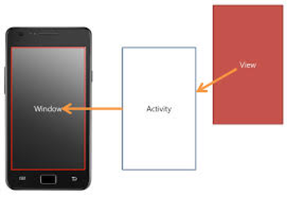

<style>
div.polaroid {
  	width: 640px;
  	box-shadow: 0 10px 30px 0 rgba(0, 0, 0, 0.2), 0 16px 30px 0 rgba(0, 0, 0, 0.19);
  	text-align: center;
	margin-bottom: 0.5cm;
}
</style>

[**목차**: 액티비티와 인텐트](https://kwanulee.github.io/AndroidProgramming/#5-액티비티와-인텐트)
# 액티비티

## 학습목표
- 액티비티의 기본 개념을 이해한다.

<a name="1"> </a>
## 1. 액티비티 개요
- **액티비티(Activity)**는 사용자와 상호작용할 수 있는 화면을 제공하는 애플리케이션의 구성요소
	- 예: 전화 걸기, 사진 찍기, 이메일 보내기 또는 지도 보기 등
- 액티비티 마다 **창(Window)**이 하나씩 주어져 이곳에 **사용자 인터페이스를 끌어올(draw)** 수 있음
	- **사용자 인터페이스**는 **View 객체**들로 구성

	<div class="polaroid">
	
	</div>

<a name="1.2"> </a>
### 1.1 	액티비티와 사용자 인터페이스 연결
- **setContentView()**를 이용하여 액티비티에 사용자인터페이스를 정의한 View를 설정

	```java
	public class FirstActivity extends AppCompatActivity {
		   @Override
		   protected void onCreate(Bundle savedInstanceState) {
		       super.onCreate(savedInstanceState);
		       setContentView(R.layout.activity_first);
		  }
	}
	```

	- [참고] **R.java**파일
		- 애플리케이션이 컴파일 될 때, 자동 생성됨
		- res 디렉토리에 있는 모든 리소스에 대한 리소스 ID 포함
			- 형식: R.[리소스유형].[리소스_이름]
			- 예
				- R.layout.activity\_first
				- R.string.hello
				- R.drawable.myimage

<a name="1.3"> </a>
### 1.2 	액티비티 등록
- 모든 Activity 컴포넌트는 **Android Manifest 파일에 등록**되어야 함

	```xml
	<manifest>
	    <application>
	        <activity android:name=".FirstActivity"
	            android:label="First Activity">
	        </activity>
	    </application>
	</manifest>

	```

- Android Manifest 역할
	- 애플리케이션 패키지 이름 (애플리케이션의 고유한 식별자 역할) 설정
	- **애플리케이션 구성요소들을 설명**
	- 이 애플리케이션과 상호작용하는 다른 애플리케이션이 가져야할 권한 설정
	- 애플리케이션에서 사용하는 라이브러리 설정
	- 애플리케이션이 필요로 하는 Android API의 최소 수준 설정

	- [추가자료] https://developer.android.com/guide/topics/manifest/manifest-intro.html

***
<a name="exercise1"></a>
### [[연습1] - 세 개의 액티비티로 구성된 앱 만들기](exercise1.html)  

---
[**다음 학습**: 인텐트](intent.html)