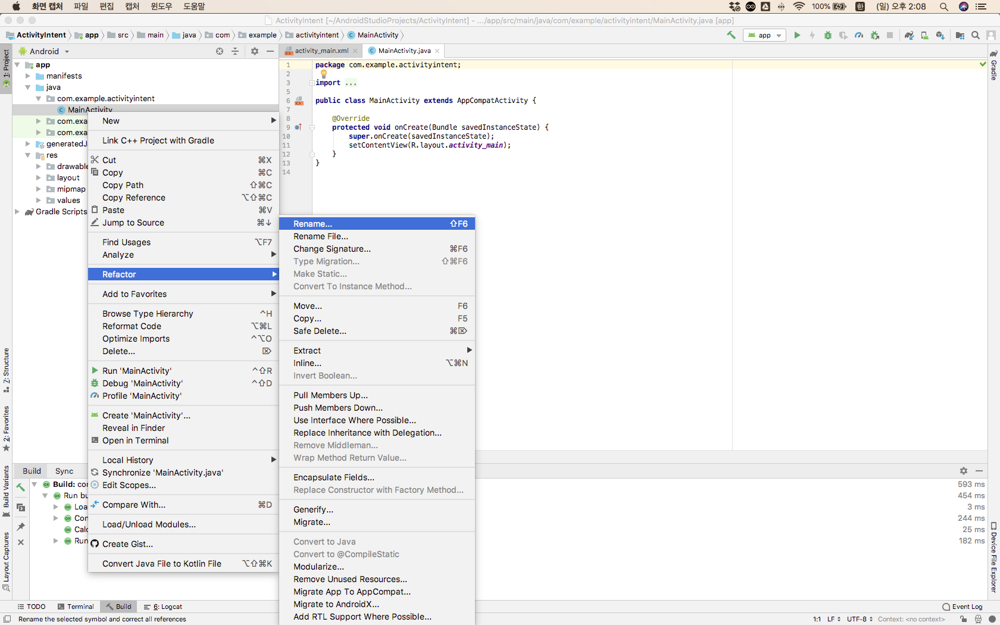
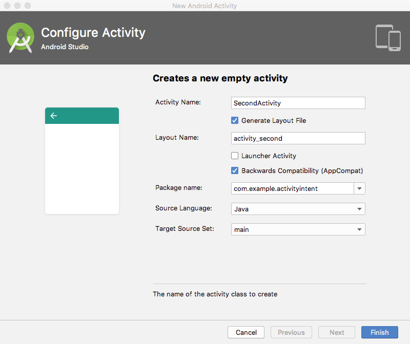

#### [연습1] - 세 개의 액티비티로 구성된 앱 만들기  
1. ActivityIntent라는 프로젝트를 생성한다.
2. 자동으로 생성된 MainActivity 클래스의 이름을 *FirstActivity*로 변경한다.
	- [**중요**] 왼쪽 프록젝트 탐색창에서 MainActivity 클래스를 선택한 상태에서, 오른쪽 마우스를 클릭하여 **Refactor**>**Rename** 메뉴를 통해서 이름을 변경해야 함 

		
	- [**확인**] MainActivity 클래스 이름이 FirstActivity로 변경되었고, AndroidManifest.xml 파일에서 액티비티 컴포넌트 이름이 FirstActivity로 변경되어 있는 지 확인해 본다.

3. 자동으로 생성된 activity\_main.xml 파일의 이름을 *activity\_first.xml*로 변경한다. 	
	- [**중요**] 왼쪽 프록젝트 탐색창에서 activity\_main.xml 파일을 선택한 상태에서, 오른쪽 마우스를 클릭하여 **Refactor**>**Rename** 메뉴를 통해서 이름을 변경
	- [**확인**] FirstActivity 클래스의 코드가 아래와 같이 변경되어 있는지 확인해 본다.

		```java
		public class FirstActivity extends AppCompatActivity {
		
		    @Override
		    protected void onCreate(Bundle savedInstanceState) {
		        super.onCreate(savedInstanceState);
		        setContentView(R.layout.activity_first);
		    }
		}
		```

4. *SecondActivity* 이름의 액티비티를 생성하여 프로젝트에 추가한다.
	- 왼쪽 프록젝트 탐색창에서 **app**을 선택한 상태에서 오른쪽 마우스를 클릭하여 **New**>**Activity**>**Empty Activity** 메뉴를 선택
	- **Configure Activity** 다이얼로그 창에서 다음 정보를 입력 후 **Finish** 버튼 클릭
		- **Activity Name**: *SecondActivity*
		- **Layout Name**: *activity\_second*  
		- 나머지 부분은 설정된 대로 둠

		
	- [**확인**] 프로젝트에서 다음의 변경사항을 확인해 본다.
		- SecondActivity 클래스가 생성됨
		- activity\_second.xml 파일이 생성됨
		- AndroidManifest.xml 파일에서 <**application**> 태그 하위에 다음 태크 요소가 포함되어 있는지 확인
			
			```xml
			<activity android:name=".SecondActivity"></activity>
			```
			
5.  *ThirdActivity* 이름의 액티비티를 생성하여 프로젝트에 추가한다.
	- 왼쪽 프록젝트 탐색창에서 **app**을 선택한 상태에서 오른쪽 마우스를 클릭하여 **New**>**Activity**>**Empty Activity** 메뉴를 선택
	- **Configure Activity** 다이얼로그 창에서 다음 정보를 입력 후 **Finish** 버튼 클릭
		- **Activity Name**: *ThirdActivity*
		- **Layout Name**: *activity\_third*  
		- 나머지 부분은 설정된 대로 둠
	- [**확인**] 프로젝트에서 다음의 변경사항을 확인해 본다.
		- ThirdActivity 클래스가 생성됨
		- activity\_third.xml 파일이 생성됨
		- AndroidManifest.xml 파일에서 <**application**> 태그 하위에 다음 태크 요소가 포함되어 있는지 확인
			
			```xml
			<activity android:name=".ThirdActivity"></activity>
			```