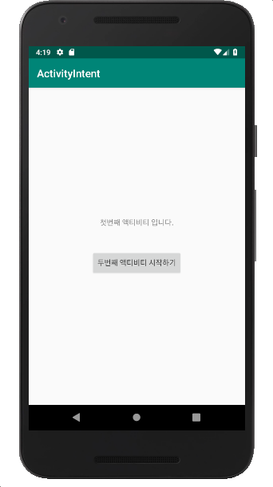
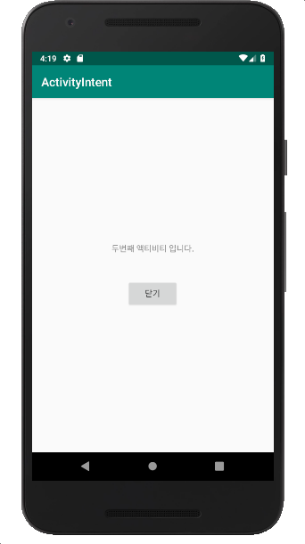

#### [연습2] - FirstActivity에서 SecondActivity 시작시키기
1. [연습1](exercise1.html)에서 생성한 프로젝트를 바탕으로 진행
2. FirstActivity에서 사용할 레이아웃 파일 activity\_first.xml을 다음과 같이 작성

	```xml
	<?xml version="1.0" encoding="utf-8"?>
	<LinearLayout xmlns:android="http://schemas.android.com/apk/res/android"
	    xmlns:tools="http://schemas.android.com/tools"
	    android:layout_width="match_parent"
	    android:layout_height="match_parent"
	    android:orientation="vertical"
	    android:padding="16dp">
	
	    <TextView
	        android:layout_width="wrap_content"
	        android:layout_height="wrap_content"
	        android:text="첫번째 액티비티 입니다."
	        android:id="@+id/textView" />
	
	    <Button
	        android:layout_width="wrap_content"
	        android:layout_height="wrap_content"
	        android:text="두번째 액티비티 시작하기"
	        android:id="@+id/buttonSecondActivity"
	        android:layout_below="@+id/textView"
	        android:layout_alignParentLeft="true"
	        android:layout_marginTop="43dp" />
	
	</LinearLayout>
	```
3. SecondActivity에서 사용할 레이아웃 파일 activity\_second.xml을 다음과 같이 작성

	```xml
	<?xml version="1.0" encoding="utf-8"?>
	<LinearLayout xmlns:android="http://schemas.android.com/apk/res/android"
	    android:layout_width="match_parent"
	    android:layout_height="match_parent"
	    android:orientation="vertical"
	    android:gravity="center"
	    android:padding="16dp">
	
	    <TextView
	        android:layout_width="wrap_content"
	        android:layout_height="wrap_content"
	        android:text="두번째 액티비티 입니다."
	        android:id="@+id/textView" />
	    <Button
	        android:layout_width="wrap_content"
	        android:layout_height="wrap_content"
	        android:text="닫기"
	        android:id="@+id/buttonSecondActivity"
	        android:layout_marginTop="43dp" />
	
	</LinearLayout>
	```
	
4. FirstActivity 클래스에서 명시적 인텐트로 SecondActivity 컴포넌트를 시작시키는 코드를 버튼 클릭 이벤트 처리기에 추가한다.

	```java
	public class FirstActivity extends AppCompatActivity {
	
	    @Override
	    protected void onCreate(Bundle savedInstanceState) {
	        super.onCreate(savedInstanceState);
	        setContentView(R.layout.activity_first);
	
	        Button btn = findViewById(R.id.buttonFirstActivity);
	        btn.setOnClickListener(new View.OnClickListener() {
	            @Override
	            public void onClick(View view) {
	                Intent intent = new Intent(getApplicationContext(), SecondActivity.class);
	                startActivity(intent);
	            }
	        });
	    }
	}
	
	``` 
5. SecondActivity 클래스에서 버튼이 클릭되면 finish()메소드를 호출하여서 현재의 액티비티를 종료하는 버튼 클릭 이벤트 처리기를 추가한다.

	```java
	
	public class SecondActivity extends AppCompatActivity {
	
	    @Override
	    protected void onCreate(Bundle savedInstanceState) {
	        super.onCreate(savedInstanceState);
	        setContentView(R.layout.activity_second);
	
	        Button btn = findViewById(R.id.buttonSecondActivity);
	        btn.setOnClickListener(new View.OnClickListener() {
	            @Override
	            public void onClick(View view) {
	                finish();
	            }
	        });
	    }
	}
	```
6. 실행결과

초기 실행 화면 | "두번째 액티비티 시작하기" 클릭 후 | "닫기" 클릭 후
------------|----------------------------|-------------
||