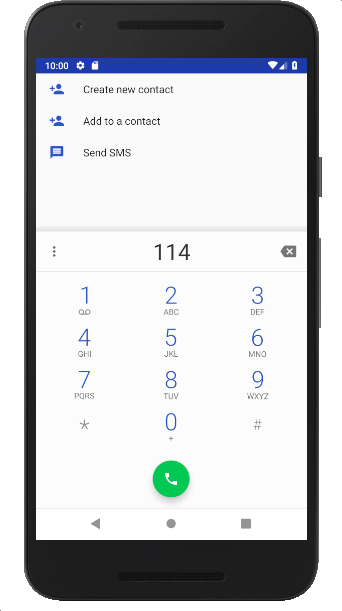
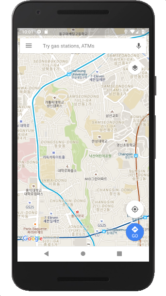

#### [연습3] - FirstActivity에서 암시적 인텐트로 다른 액티비티 시작시키기
1. [연습2](exercise2.html)까지 수행한 프로젝트를 바탕으로 진행
2. 기존 activity\_first.xml에 암시적 인텐트로 다른 액티비티를 호출할 두 개의 버튼 위젯을 추가한다.
	- 추가된 버튼 위젯의 **onClick** 속성에 *doOnBtnClick* 값을 설정

	```xml
	<?xml version="1.0" encoding="utf-8"?>
	<LinearLayout ...>
	
	    <TextView
	        ... />
	
	    <Button
	        ... />
	        
	    <Button
	        android:layout_width="wrap_content"
	        android:layout_height="wrap_content"
	        android:text="다이얼 작업 시작하기"
	        android:id="@+id/buttonDialActivity"
	        android:onClick="doOnBtnClick" />
	
	    <Button
	        android:layout_width="wrap_content"
	        android:layout_height="wrap_content"
	        android:text="지도보기 작업 시작하기"
	        android:id="@+id/buttonMapActivity"
	        android:onClick="doOnBtnClick" />
	
	</LinearLayout>
	```
3. FirstActivity에 버튼 클릭 이벤트를 처리할 *doOnBtnClick*() 메소드 정의

	```java
	public class FirstActivity extends AppCompatActivity {
	
	    @Override
	    protected void onCreate(Bundle savedInstanceState) {
	        // 이전 코드와 동일
	    }
	
	    /**
	     * 버튼 클릭 이벤트 처리
	     * @param view : 클릭된 버튼 객체
	     *
	     * 클릭된 버튼 객체가 무엇인지를 id를 통해 인지하여, 두 가지 다른 인텐트 객체를 생성
	     */
	    public void doOnBtnClick(View view) {
	        Intent implicit_intent = null;
	        switch (view.getId()) {
	            case R.id.buttonDialActivity:
	                // 114 전화번호로 다이얼 작업을 수행할 수 있도록 인텐트 설정
	                implicit_intent = new Intent(Intent.ACTION_DIAL,
	                        Uri.parse("tel:114"));
	                break;
	            case R.id.buttonMapActivity:
	                // 주어진 위도,경도 위치로 지도를 보여줄 수 있도록 인텐트 설정
	                implicit_intent = new Intent(Intent.ACTION_VIEW,
	                        Uri.parse("geo:37.5817599,127.0081608"));
	                break;
	        }
	        if (implicit_intent != null)
	            startActivity(implicit_intent);
	    }
	}
	
	```
	
4. 실행결과

초기 실행 화면 | "다이얼 작업 시작하기" 클릭한 경우 | "지도보기 작업 시작하기" 클릭한 경우
------------|----------------------------|-------------
||