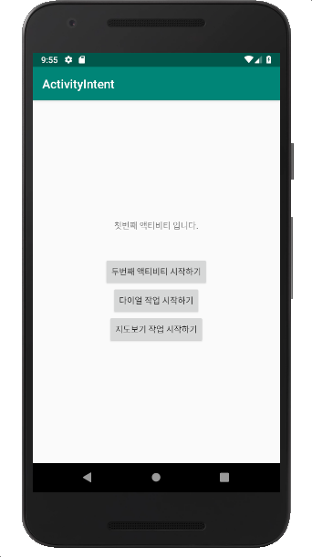
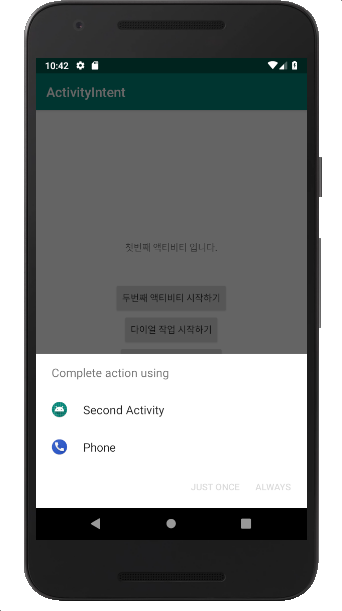

#### [연습4] - SecondActivity가 ACTION\_DIAL 암시적 인텐트를 수신하도록 만들기]
1. [연습3](exercise3.html)까지 수행한 프로젝트를 바탕으로 진행
2. AndroidManifest.xml에서 **android:name** 속성 값이 *SecondActivity*인 \<activity\> 요소 하위에 다음과 같은 **\<intent-filter\>** 태그를 추가한다. 
	-  **android:name** 속성 값이 *SecondActivity*인 \<activity\>의 **android:label** 속성이 지정되어 있지 않다면, 아래와 같이 값을 지정하는 것이 좋다. 
		-  암시적 인텐트를 통과시킨 인텐트 필터를 포함한 구성요소가 하나 이상인 경우, 해당 구성요소의 **android:label** 속성 값을 바탕으로 나열된다. 
	
	```xml
	<?xml version="1.0" encoding="utf-8"?>
	<manifest xmlns:android="http://schemas.android.com/apk/res/android"
	    package="com.example.activityintent">
	
	    <application
	        ...>
	        <activity android:name=".ThirdActivity"></activity>
	        
	        <activity android:name=".SecondActivity"
	            android:label="Second Activity">
	            
	            <!--추가된 인텐트 필터 시작-->
	            <intent-filter>
	                <action android:name="android.intent.action.DIAL" />
	                <category android:name="android.intent.category.DEFAULT" />
	                <data android:scheme="tel" />
	            </intent-filter>
	            <!--추가된 인텐트 필터 끝-->
	            
	        </activity>
	        
	        <activity android:name=".FirstActivity">
	            ...
	        </activity>
	    </application>
	
	</manifest>
	```
	
3. 실행결과

초기 실행 화면 | "다이얼 작업 시작하기" 클릭한 경우 | "Second Activity"를 선택한 경우
------------|----------------------------|-------------
||