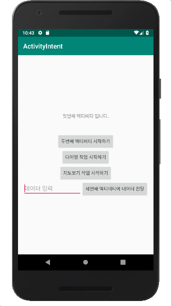
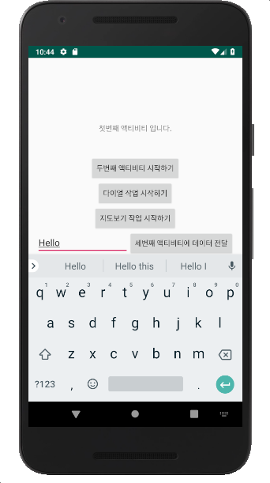
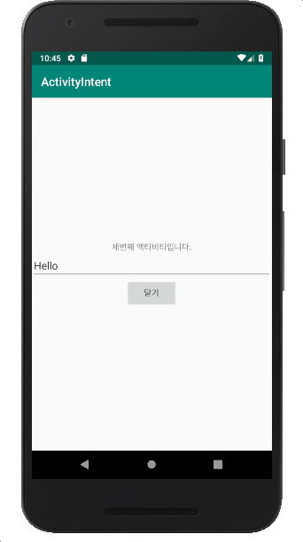
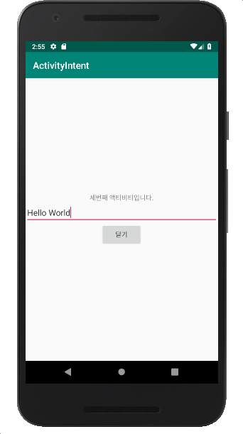
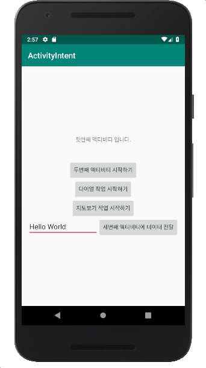

#### [연습6] - FirstActivity에서 시작시킨 ThirdActivity의 수행결과를 수신하기
1. [연습5](exercise5.html)까지 수행한 프로젝트를 바탕으로 진행

2. FirstActivity 클래스에서 다음 코드를 추가하시오
	- ThirdActivity의 수행 결과를 얻기 위해서는, ThirdActivity를 시작시킬때, **startActivity**() 메소드 대신에 **startActivityForResult()** 메소드를 사용한다. 
		- **startActivityForResult()** 메소드 사용 시에 요청코드를 함께 전달해야 함. 

		```java
		public class FirstActivity extends AppCompatActivity {
		
		    private static final int FIRST_ACTIVITY_REQUEST_CODE = 0;
		
		    @Override
		    protected void onCreate(Bundle savedInstanceState) {
		        //... 생략
		        
		        btn = findViewById(R.id.buttonThirdActivity);
		        btn.setOnClickListener(new View.OnClickListener(){
		
		            @Override
		            public void onClick(View v) {
		                Intent intent = new Intent(getApplicationContext(), ThirdActivity.class);
		
		                EditText edit = findViewById(R.id.edit_data);
		                intent.putExtra("dataFromFirstActivity", edit.getText().toString());
		
						// ThirdActivity의 수행 결과를 얻기 위해서는 startActivity() 메소드 대신에 startActivityForResult() 메소드를 사용한다
		                startActivityForResult(intent, FIRST_ACTIVITY_REQUEST_CODE);
		            }
		        });
		    }
	```
	- ThirdActivity가 종료되면서 전달된 데이터를 수신하기 위해서, FirstActivity 클래스에서 **onActivityResult()** 메소드를 재정의한다.

		```java
		public class FirstActivity extends AppCompatActivity {
		
			// ... 생략
		
		    @Override
		    /**
		     * FirstActivity에서 시작시킨 액티비티가 종료되면 호출되는 메소드로서,
		     * 인텐트 객체인 data의 Extra에 저장된 결과를 "ResultString" 키 값으로 얻어와서
		     * 화면 레이아웃에 포함된 EditText 객체에 출력한다.
		     * @param requestCode: 액티비티를 호출할 때 전달한 요청코드
		     * @param resultCode: 액티비티의 실행결과
		     * @param data: 호출된 액티비티의 수행결과가 Extras를 통해 전달된 인텐트 객체.
		     */
		    protected void onActivityResult(int requestCode, int resultCode, Intent data) {
		        super.onActivityResult(requestCode, resultCode, data);
		
		        // 결과를 반환하는 액티비티가 FIRST_ACTIVITY_REQUEST_CODE 요청코드로 시작된 경우가 아니거나
		        // 결과 데이터가 빈 경우라면, 메소드 수행을 바로 반환함.
		        if (requestCode != FIRST_ACTIVITY_REQUEST_CODE || data == null)
		            return;
		        String msg = data.getStringExtra("ResultString");
		
		        EditText edit = findViewById(R.id.edit_data);
		        edit.setText(msg);
		    }
		}
	```

3. ThirdActivity 클래스의 다음 내용을 업데이트 한다.
	- ThirdActivity 클래스에서 버튼이 클릭되면, 현재 화면의 **EditText** 객체에 입력된 값을 읽어와서, 새롭게 생성시킨 인텐트 객체의 **Extra**에 "**ResultString**" 키 값으로 저장한 후에, 이를 **setResult()** 메소드를 통해 ThirdActivity를 시작시킨 액티비티(FirstActivity)로 결과를 전달한다 .

	```java
	public class ThirdActivity extends AppCompatActivity {
	
	    @Override
	    protected void onCreate(Bundle savedInstanceState) {
	        //... 생략
	        
	        Button btn = findViewById(R.id.buttonThirdActivity);
	        btn.setOnClickListener(new View.OnClickListener() {
	            @Override
	            public void onClick(View view) {
	                
	                Intent resultIntent = new Intent();
	
	                EditText et = findViewById(R.id.editText);
	                resultIntent.putExtra("ResultString", et.getText().toString());
	                setResult(RESULT_OK, resultIntent);
	                finish();
	            }
	        });
	    }
	}
	```


3. 실행결과

 1. 초기 실행 화면 | 2. 데이터입력 | 3. 버튼 클릭 후
------------|----------------------------|-------------
||

 4. 데이터 수정 | 5. 닫기 버튼 클릭 
------------|----------------------------
|
