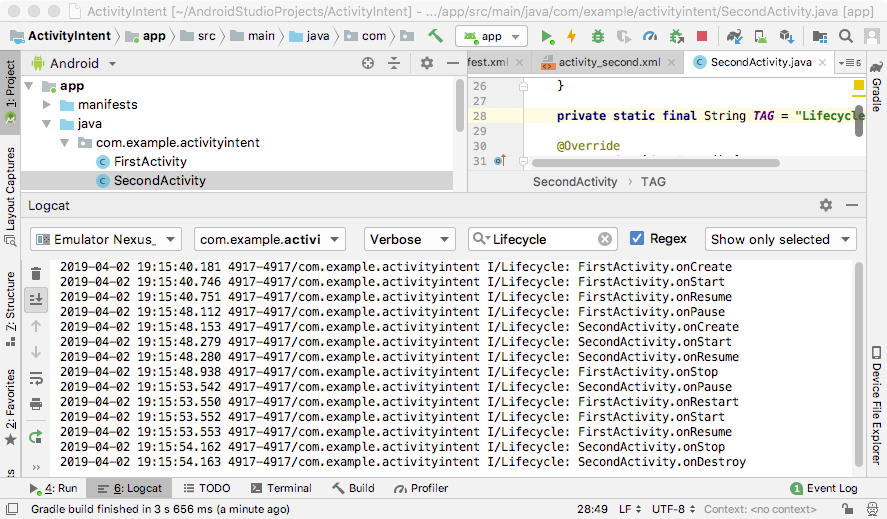

#### [연습7] - 수명주기 콜백 메소드 호출 순서 살펴보기
1. [연습6](exercise6.html)까지 수행한 프로젝트를 바탕으로 진행

2. FirstActivity 클래스에서 수명주기 콜백 메소드를 재정의 하시오
	- Android Studio에서 수명주기 콜백 메소드를 쉽게 생성하는 방법
		1. 수명주기 콜백 메소드를 생성하고자 하는 클래스(예,FirstActivity)의 소스코드를 연다.
		2. 메소드를 생성하고자 하는 소스코드의 위치에 커서를 위치 시킨 후에, 오른쪽 마우스 클릭을 통해 **Generate** 메뉴를 실행시킨다.
		3. **Override Methods..** 메뉴를 선택 후, 생성하고자 하는 메소드를 선택한 후 **OK** 버튼을 클릭한다.

	- 콜백 메소드 안에 로그를 출력하는 코드를 삽입한다.
		- 로그 출력 방법

			```java
			Log.i("tag string", "log message");
			``` 
	- 결과 코드
			
		```java
		public class FirstActivity extends AppCompatActivity {
		
		    private static final int FIRST_ACTIVITY_REQUEST_CODE = 0;
		
		    @Override
		    protected void onCreate(Bundle savedInstanceState) {
		        super.onCreate(savedInstanceState);
		        
		        Log.i(TAG, getLocalClassName() + ".onCreate");
		        
		        //...  생략  
		    }
		
		    //... 생략
		    
		    private static final String TAG = "Lifecycle";
		    
		    @Override
		    protected void onStart() {
		        super.onStart();
		        Log.i(TAG, getLocalClassName() + ".onStart");
		    }
		
		    @Override
		    protected void onResume() {
		        super.onResume();
		        Log.i(TAG, getLocalClassName() + ".onResume");
		    }
		
		    @Override
		    protected void onPause() {
		        super.onPause();
		        Log.i(TAG, getLocalClassName() + ".onPause");
		    }
		
		    @Override
		    protected void onStop() {
		        super.onStop();
		        Log.i(TAG, getLocalClassName() + ".onStop");
		    }
		
		    @Override
		    protected void onRestart() {
		        super.onRestart();
		        Log.i(TAG, getLocalClassName() + ".onRestart");
		    }
		
		    @Override
		    protected void onDestroy() {
		        super.onDestroy();
		        Log.i(TAG, getLocalClassName() + ".onDestroy");
		    }
		}
	
		```

3. 동일한 방법으로 SecondActivity에도 콜백 메소드를 재정의하시오.

	```java
	public class SecondActivity extends AppCompatActivity {
	
	    @Override
	    protected void onCreate(Bundle savedInstanceState) {
	        super.onCreate(savedInstanceState);
	
	        Log.i(TAG, getLocalClassName() + ".onCreate");
	        //...    
	    }
	
	    private static final String TAG = "Lifecycle";
	
	    @Override
	    protected void onStart() {
	        super.onStart();
	        Log.i(TAG, getLocalClassName() + ".onStart");
	    }
	
	    @Override
	    protected void onResume() {
	        super.onResume();
	        Log.i(TAG, getLocalClassName() + ".onResume");
	    }
	
	    @Override
	    protected void onPause() {
	        super.onPause();
	        Log.i(TAG, getLocalClassName() + ".onPause");
	    }
	
	    @Override
	    protected void onStop() {
	        super.onStop();
	        Log.i(TAG, getLocalClassName() + ".onStop");
	    }
	
	    @Override
	    protected void onRestart() {
	        super.onRestart();
	        Log.i(TAG, getLocalClassName() + ".onRestart");
	    }
	
	    @Override
	    protected void onDestroy() {
	        super.onDestroy();
	        Log.i(TAG, getLocalClassName() + ".onDestroy");
	    }
	}
	
	```

4. 결과 확인

	- FirstActivity에서 버튼 눌러서 SecondActivity를 생성한 후 백(Back) 버튼을 누른다. 이 때 표시된 로그를 **Logcat** 창에서 확인한다.
		- 필터로 태그 값 (예, FirstActivity 또는 SecondActivity)를 입력하면, 필터에 입력된 로그만 표시됨

	<div class="polaroid">
    
</div> 	

