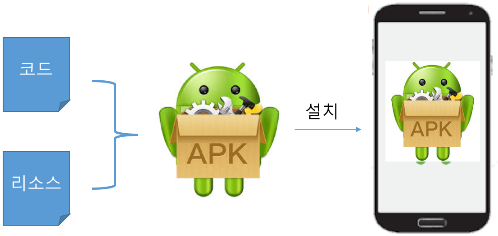
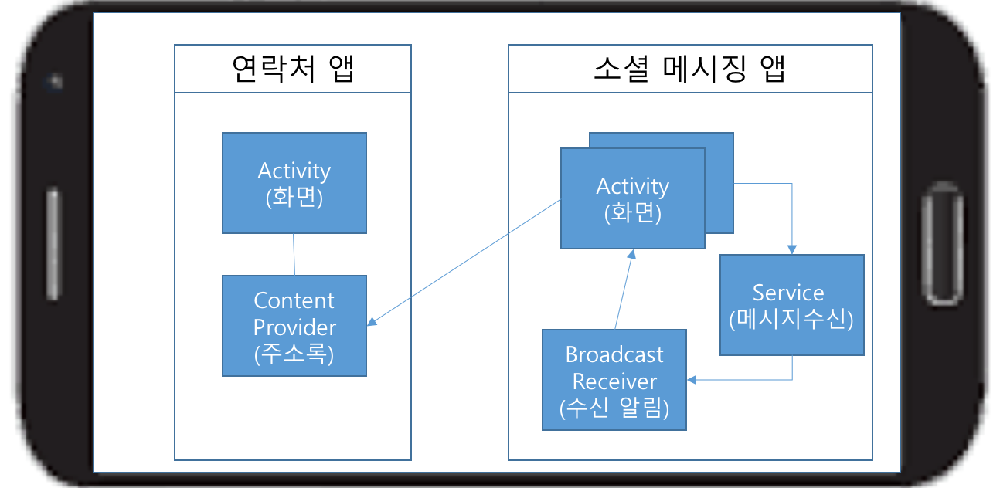

# 안드로이드 앱 기본
## 학습목표
- 안드로이드 앱의 기본 구성요소에 대해 이해한다.

---

## 1. 안드로이드 앱 개요
- **안드로이드 앱**은 **Kotlin, Java, C++** 언어를 사용하여 작성할 수 있음
	- [Kotlin](https://developer.android.com/kotlin?hl=ko)
		- 2017년에 구글이 안드로이드의 공식 언어로 Kotlin을 추가
		- 자바에 비해 상당히 간결한 문법
		- Java와의 상호 운용이 100% 지원  
	- [NDK(Native Development Kit)](https://developer.android.com/ndk/guides?hl=ko)는 Android에서 C 및 C++ 코드를 사용할 수 있게 해주는 일련의 도구 모음
- **안드로이드 앱**은 하나의 **.apk**파일로 패키지되어 **안드로이드 디바이스**에 설치됨
	- **.apk**파일은 **코드** + **리소스**(이미지, 화면 레이아웃, 오디오 파일 등)로 구성됨 

		

		
		

---

## 2. 앱 컴포넌트

- 하나의 안드로이드 앱은 하나 이상의 **컴포넌트**로 구성된다.
- **컴포넌트**는 앱을 구성하는 빌딩 블럭으로 네 가지 유형이 있습니다.
	- **Activity (액티비티)** : 사용자 인터페이스 화면을 포함한 컴포넌트
	- **Service (서비스)**: 백그라운드에서 실행되는 컴포넌트
	- **Broadcast Receiver (방송 수신자)**: 시스템 및 다른 앱에서 보낸 방송(예, 문자수신)을 수신하는 컴포넌트 (방송을 수신하기 위해서는 사전에 관심있는 방송을 등록해야 함.)
	- **Content Provider (콘텐츠 제공자)**: 데이터를 관리하고 다른 앱에 데이터를 제공하는 컴포넌트
	
	

	
	

 
 
---

## 3. 앱 리소스
- **안드로이드 앱**은 소스 코드와 별도로 여러 리소스가 필요합니다.  ([리소스 유형](https://developer.android.com/guide/topics/resources/available-resources))
	- 화면 레이아웃 정의
	- 이미지
	- 문자열, 색상, 스타일 
	- 메뉴
- 앱 리소스를 코드와 분리하여 별도로 관리함으로써 얻는 **이점**
	- **코드를 수정하지 않고 앱의 다양한 특성을 쉽게 업데이트**할 수 있습니다. 
	- 일련의 대체 리소스를 제공함으로써 **다양한 기기 구성(예: 여러 가지 언어 및 화면 크기)에 맞게 앱을 최적화**할 수도 있습니다 .

		
		
---
[**다음 학습**: 안드로이드 앱 프로젝트 기본](android_project_basic.html)