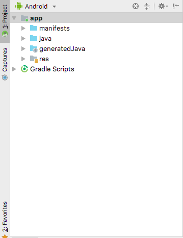
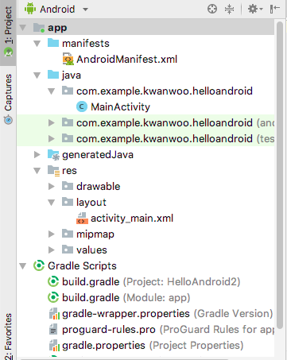
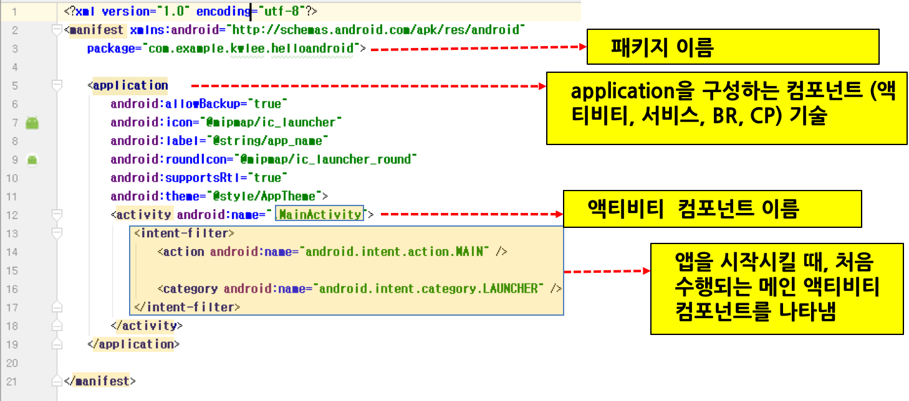
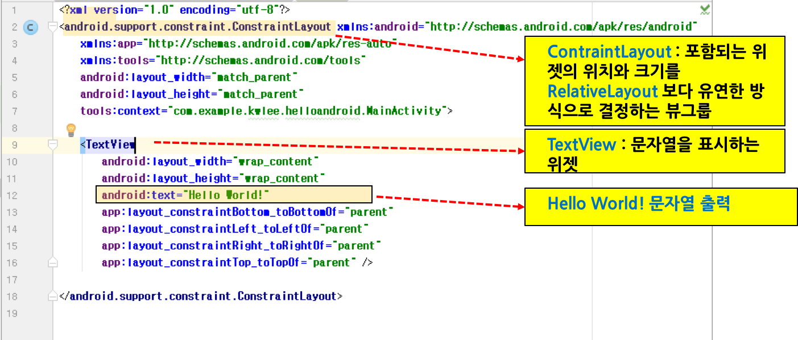
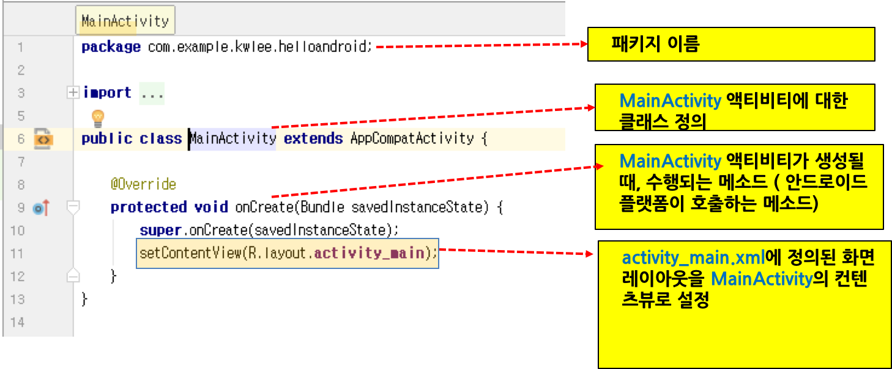

<style> 
div.polaroid {
  	width: 640px;
  	box-shadow: 0 10px 30px 0 rgba(0, 0, 0, 0.2), 0 16px 30px 0 rgba(0, 0, 0, 0.19);
  	text-align: center;
	margin-bottom: 0.5cm;
}
</style>

# 안드로이드 앱 프로젝트 기본
## 학습목표
- 안드로이드 앱에 대응하는 AndroidStudio 프로젝트 구조와 프로젝트 구성요소를 이해한다.

---
<a name="1"></a>
## 1. AndroidStudio 프로젝트 구조
- **HelloAndroid 프로젝트 구조 (Android 뷰)**

개략 구조  | 상세 구조
------------- | -------------
 | 

- 안드로이드 앱 프로젝트는 크게 세 가지 파일로 구성됨
	- **매니페스트 파일 (manifests)**
	- **자바 소스 파일 (java)**
	- **리소스 파일 (res)** 

---
<a name="2"></a>
## 2. 매니페스트 파일
- 앱의 기본 정보를 설명하는 파일로서, 앱의 패키지  이름, 앱의 구성 요소인 컴포넌트(예, 액티비티, 서비스 등), 앱이 수행되는 데 필요한 권한 등을 정의한 XML 파일
- **AndroidManifest.xml**
	
	<div class="polaroid">
	
	</div>
	
	- [\<manifest\>](https://developer.android.com/guide/topics/manifest/manifest-element?hl=ko) 태그의 *package* 속성
		- 이 앱의 고유한 식별자 역할을 하는 패키지 이름이 정의
	- [\<application\>](https://developer.android.com/guide/topics/manifest/application-element?hl=ko) 태그
		- 이 앱을 구성하고 있는 컴포넌트를 \<application\> 태그 하위에 정의
		- 컴포넌트 종류에 따른 태그
			- 액티비티의 경우 [\<activity\>](https://developer.android.com/guide/topics/manifest/activity-element?hl=ko) 요소 
			- 서비스의 경우 [\<service\>](https://developer.android.com/guide/topics/manifest/service-element?hl=ko) 요소
			- 브로드캐스트 수신기의 경우 [\<receiver\>](https://developer.android.com/guide/topics/manifest/receiver-element?hl=ko) 요소
			- 콘텐츠 제공자의 경우 [\<provider\>](https://developer.android.com/guide/topics/manifest/provider-element?hl=ko) 요소
	- [\<activity\>](https://developer.android.com/guide/topics/manifest/activity-element?hl=ko) 태그
		- *android:name* 속성이 Activity 서브클래스의 정규화된 클래스 이름을 나타냄
		- 여기서는 이름이 *MainActivity*인 Activity 서브클래스가 앱을 구성하는 유일한 컴포넌트임 
	- [\<intent-filter\>](https://developer.android.com/guide/topics/manifest/intent-filter-element?hl=ko) 태그
		- 안드로이드 컴포넌트 (예, \<activity\> 태그) 하위에 포함되는 태그로서, 해당 컴포넌트가 수신할 수 있는 [인텐트](https://developer.android.com/guide/components/intents-filters?hl=ko)를 걸러내는 역할을 수행
		- 이 예제에서는 이름이 *MainActivity*인 액티비티 컴포넌트가 앱을 시작시키는 시작점으로서, 애플리케이션 론처(예, 홈 스크린)에 등록되어 있음을 나타냄.    

---
<a name="3"></a>
## 3. 리소스 파일
- *애플리케이션 리소스*(예, 이미지 혹은 문자열)를 Java 코드에서 분리하여 독립적으로 유지관리할 수 있도록 함으로써, 다양한 환경 변화(예, 화면크기 변화 혹은 사용 언어 변경)를 코드의 변경없이 수용할 수 있음.
	- 예를 들어, 여러가지 화면 크기에 따라 여러가지 UI 레이아웃을 리소스 파일로 제공하거나, 언어 설정에 따라 각기 다른 문자열을 리소스 파일로 제공할 수 있음. 
- 프로젝트의 res/ 디렉터리에 속한 특정 하위 디렉터리에 각 유형의 리소스를 배치

	```
	res/
	     drawable/  
	         ic_launcher_background.xml  
	     layout/  
	         activity_main.xml
	     mipmap/  
	         ic_launcher.png 
	     values/
	         colors.xml  
	         strings.xml  
	         styles.xml
	```
	- 더 자세한 내용은 다음 [링크](https://developer.android.com/guide/topics/resources/providing-resources?hl=ko)를 참조

- 예
	- **activity_main.xml**

		<div class="polaroid">
		
		</div>
	
		- 화면의 레이아웃을 정의한 XML 파일 (*res/layout* 폴더에 위치)
		- 이 파일은 ConstraintLayout 안에 하나의 TextView 요소가 포함된 화면 디자인을 나타냄
			- [ContraintLayout](https://developer.android.com/reference/android/support/constraint/ConstraintLayout)은 내부에 포함되는 위젯의 위치와 크기를 [RelativeLayout](https://developer.android.com/reference/android/widget/RelativeLayout) 보다 유연한 방식으로 결정하는 **뷰 그룹**
			- [TextView](https://developer.android.com/reference/android/widget/TextView)는 문자열을 표시하는 **위젯** 
				- <span style="color:blue">android:text</span> 속성에 지정된 문자열(Hello World!)을 표시	 
	- **strings.xml**

		```xml
		<resources>
    		<string name="app_name">HelloAndroid</string>
		</resources>

		```
		- 애플리케이션 또는 다른 리소스(예: XML 출력)에서 참조할 수 있는 문자열을 제공하는 XML 리소스 (*res/values* 폴더에 위치)
	
- [**aapt**](https://developer.android.com/studio/command-line/aapt2) 도구는 *애플리케이션 리소스*를 컴파일하여 **컴파일된 리소스**(**R** 클래스와 *패키지된 리소스 파일*)을 생성함. 
	
	- **R** 클래스는 리소스를 Java 프로그램에서 접근하기 위한 리소스 ID를 정의
		- 리소스 ID 형식

			```
			R.리소스 유형.리소스 이름
			```
			- *리소스 유형* :  각 리소스는 유형으로 그룹화됩니다. (예: string, drawable, layout 등). 다양한 유형에 대한 자세한 내용은 [리소스 유형](https://developer.android.com/guide/topics/resources/available-resources)을 참조
			- *리소스 이름*: 확장자를 제외한 **파일 이름** 혹은 **XML android:name 특성 값** 중 하나
		- 리소스 ID 예제
			- R.layout.activity\_main
			- R.string.hello 
	- 리소스를 앱 프로젝트 내의 다른 XML 코드 내부에서 접근하는 경우
		- 리소스 접근 형식 

			```
			@리소스 유형/리소스 이름
			```
		
		- 예제	
			- @string/hello


---
<a name="4"></a>
## 4. 자바 소스 파일
- Android 앱은 Java 프로그래밍 언어로 작성
- **MainActivity.java**

	<div class="polaroid">
	
	</div>
	
	- 안드로이드 프로젝스 생성 시에 자동으로 만들어진 Java 파일

	
	- <span style="color:red;">package</span>  com.example.kwlee.helloandroid;
	
		- MainActivity 클래스가 속한 패키지
		- 안드로이드 프로젝트 생성 시에 설정된 이름 ([그림](https://kwanulee.github.io/Android/intro-android/figure/start-android/as-new-project.JPG))
		
	- public class MainActivity extends [AppCompatActivity](https://developer.android.com/reference/android/support/v7/app/AppCompatActivity)  
		- 액티비티 컴포넌트는 [Activity](https://developer.android.com/reference/android/app/Activity)의 서브 클래스로 정의되어야 함
		-  **AppCompatActivity**는 [Activity](https://developer.android.com/reference/android/app/Activity)의 서브클래스로서 하위 플랫폼 버전을 지원
			- 참고. [Activity와 AppCompatActivity의 차이](https://m.blog.naver.com/PostView.nhn?blogId=prez25&logNo=220984729217&proxyReferer=https%3A%2F%2Fwww.google.com%2F)   

	- protected void onCreate(Bundle savedInstanceState)
		- 안드로이드 플랫폼이 호출하는 메소드로서 액티비티가 생성되는 순간에 딱 한번 호출됨
		- 주로 액티비티와 관련된 변수 초기화 및 사용자 인터페이스 설정 코드를 포함함 
		
	- setContentView(*R.layout.activity_main*)
		- *R.layout.activity_main*이 가리키는 리소스를 이 액티비티의 콘텐츠뷰로 사용하겠다는 의미
		- *R.layout.activity_main*은 res/layout 폴더에 있는 activity\_main.xml을 가리키는 정적상수 (**R** 클래스에서 정의됨)


