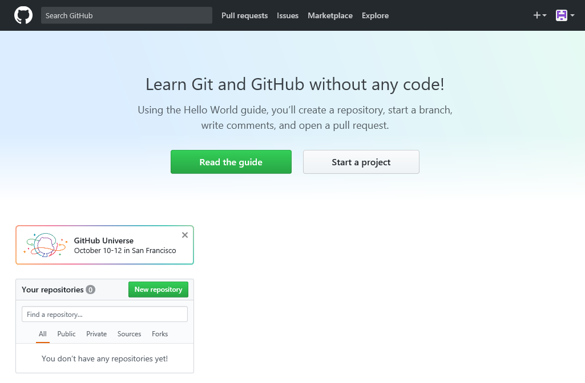

# **GitHub** 계정 만들기 

1. **GitHub** 사이트  [(https://github.com)](https://github.com) 접속
2. 계정 정보 입력 후, [**Sign up for GitHub**] 버튼 클릭 

	

		
	

3. 계정에 대한 개인 계획 선택 후, [**Continue**] 버튼 클릭
	- 공용 저장소로만 사용할 계획이면 무료 (**추천**)
	- 개인 저장소로도 사용할 계획이면 월별 7$ 과금됨 
	
	

		
	
	
4. 설문 항목에 응답 후, [**Submit**] 버튼 클릭
5. 가입 후 초기 화면
	

		
	
	
