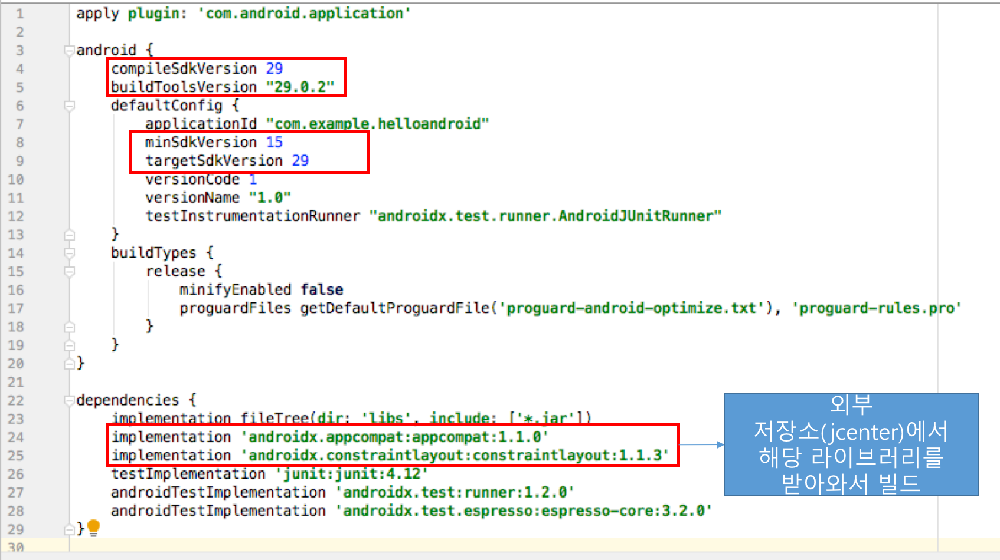

<style> 
div.polaroid {
  	width: 640px;
  	box-shadow: 0 10px 30px 0 rgba(0, 0, 0, 0.2), 0 16px 30px 0 rgba(0, 0, 0, 0.19);
  	text-align: center;
	margin-bottom: 0.5cm;
}
</style>

# 프로젝트 빌드[^build]
## 학습목표
- 안드로이드 프로젝트의 빌드 개념과 프로세스를 이해한다.
- 빌드 프로세스 자동화 도구인 Gradle에서 사용하는  빌드 구성 파일을 살펴본다. 

---
<a name="1"></a>
## 1. 프로젝트 빌드 개요
- **컴파일 vs. 빌드**
	- **컴파일**은 소스코드를 컴퓨터가 이해할 수 있는 바이너리 코드로 변환하는  작업을  말함
	- **빌드 (build)**는 실행가능한 소프트웨어 산출물을 만드는 일련의 과정으로서 컴파일은 빌드의 한 과정임.
- Android 빌드 시스템은 앱 리소스 및 소스 코드를 컴파일하고, 배포할 수 있는 **APK**로 패키징함
- Android Studio는 고급 빌드 툴킷인 [Gradle](https://gradle.org/)을 사용하여 빌드 프로세스를 자동화하고 관리

---
<a name="2"></a>
## 2. 빌드 프로세스


1. **컴파일러**는 소스 코드를 **DEX(Dalvik Executable)** 파일로 변환하고 그 외 모든 것을 **컴파일된 리소스**로 변환합니다. 
	- [**aapt**](https://developer.android.com/studio/command-line/aapt2) 도구는 리스소 파일(/res 폴더 하위 파일)들을 **컴파일된 리소스**(**R** 클래스파일과 패키지된 리소스파일)로 변환시킴
	- **javac** 컴파일러는 Java 소스파일 (자동으로 생성된 **R.java**와 사용자가 정의한 .java 파일)을 Java 클래스파일(.class 확장자)로 변환시킴
	- **dx** 안드로이드 개발 도구는 컴파일된 Java 클래스파일을 DEX 파일(.dex 확장자)로 변환시킴
	- 이 DEX 파일에는 Android 기기에서 실행되는 바이트코드가 포함됨
2. **APK Packager**는 DEX 파일과 *컴파일된 리소스*를 **단일 APK에 결합**함 
3. 앱을 Android 기기에 설치하고 배포하기 위해서, **APK Packager**는 디버그 또는 릴리스 키스토어를 사용하여 **APK를 서명**
	1. **디버그 버전의 앱**(즉, 테스트 및 프로파일링 전용의 앱)을 빌드 중인 경우에는, 패키저가 디버그 키스토어로 앱에 서명함. *Android Studio는 디버그 키스토어로 새 프로젝트를 자동으로 구성함*
	2. **릴리스 버전의 앱**(즉, 외부에 릴리스할 앱)을 빌드 중인 경우에는, 패키저가 릴리스 키스토어로 앱에 서명함. (더 자세한 내용은 [Android Studio에서 앱 서명](https://developer.android.com/studio/publish/app-signing#studio)을 참조)
4. 최종 APK를 생성하기 전에, 패키저는 기기에서 실행될 때 더 적은 메모리를 사용하도록 앱을 최적화하기 위해 [zipalign](https://developer.android.com/studio/command-line/zipalign) 도구를 사용함

---
<a name=""></a>
## 3. 빌드 구성 파일
- 새 프로젝트를 시작할 때, 아래 그림과 같이 Android Studio가 프로젝트 구조를 생성하고, 빌드 구성 파일(**build.gradle(project level)**, **settings.gradle**, **build.gradle(module level)** 등)을 자동으로 만들고, *적합한 기본값*에 따라 파일에 값을 채움니다.
	
	

### 3.1 build.gradle(Project level)
- 루트 프로젝트 디렉토리에 있는 최상위 build.gradle 파일은 프로젝트의 모든 모듈에 적용되는 빌드 구성을 정의


	```
	buildscript {
	    repositories {
	        google()
	        jcenter()
	    }
	    dependencies {
	        classpath 'com.android.tools.build:gradle:3.4.1'
	    }
	}
	
	allprojects {
	    repositories {
	        google()
	        jcenter()
	    }
	}
	
	task clean(type: Delete) {
	    delete rootProject.buildDir
	}
	```
	- **buildscript**{} 블록 : 모든 모듈에 공통되는 **Gradle** 리포지토리와 종속성을 정의 
	- **allprojects**{} 블록: 현 프로젝트의 모든 모듈에서 사용되는 리포지토리와 종속성을 정의

### 3.2 settings.gradle
- 앱을 빌드할 때 어떤 모듈을 포함할지를 Gradle에 알려 줌
- 대부분의 프로젝트에서 이 파일은 간단하며 다음 코드만을 포함함

	```
	include ':app'
	```

	
### 3.3 build.gradle(Module level)
- 이 파일이 위치하는 특정 모듈의 빌드 설정을 구성

	<div class="polaroid">
		
	</div>
	
	- **android**{} 블록: Android 특화된 빌드 옵션을 구성
		- *compileSdkVersion*: Gradle이 앱을 컴파일하기 위해서 사용하는 안드로이드 API 레벨
		- *buildToolsVersion*: Gradle이 앱을 빌드하기 위해 사용하는 SDK 빌드 도구, 명령행 유틸리티, 컴파일러의 버전 
		- *minSdkVersion*: 앱을 실행시키기 위해 요구되는 최소한의 API 레벨
		- *targetSdkVersion*: 앱을 테스트하기 위해 사용된 API 레벨
	- **dependencies**{} 블록: 모듈 자체를 빌드하기 위해 요구되는 종속성을 명세


	
##4. 참고자료
[^build]:  빌드구성, https://developer.android.com/studio/build/.