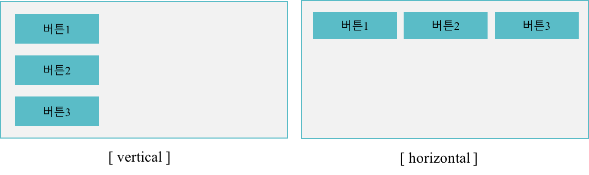
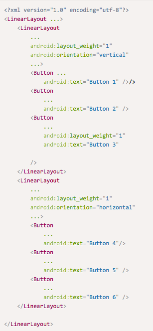
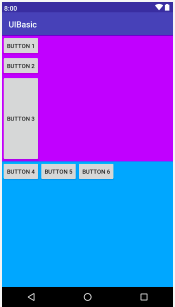
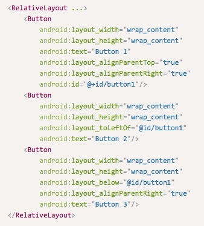
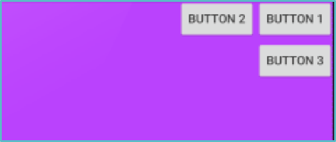
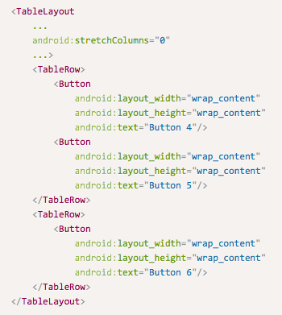
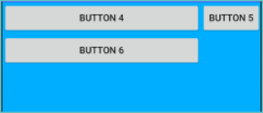
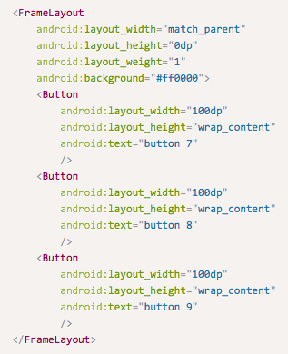
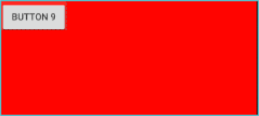

[**이전 학습**: 위젯 (Widget)](ui-widget.html)
# 레이아웃(Layout)

## 학습목표
- 안드로이드 UI 요소를 배치하는 레이아웃 (Layout)의 기능 및 설정 방법을 이해한다.

## 1. 레이아웃 이란?
- [ViewGroup](https://developer.android.com/reference/android/view/ViewGroup)의 파생 클래스로서, 포함된 [View](https://developer.android.com/reference/android/view/View.html)를 정렬하는 기능
- 종류
	- [LinearLayout](https://developer.android.com/reference/android/widget/LinearLayout)
		- 컨테이너에 포함된 뷰들을 수평 또는 수직으로 일렬 배치하는 레이아웃
	- [RelativeLayout](https://developer.android.com/reference/android/widget/RelativeLayout)
		- 뷰를 서로간의 위치 관계나 컨테이너와의 위치관계를 지정하여 배치하는 레이아웃
	- [TableLayout](https://developer.android.com/reference/android/widget/TableLayout)
		- 표 형식으로 차일드를 배치하는 레이아웃
	- [FrameLayout](https://developer.android.com/reference/android/widget/FrameLayout)
		- 컨테이너에 포함된 뷰들을 전부 좌상단에 배치하는 레이아웃

---
## 2. LinerLayout
- 자식 뷰를 수평, 수직으로 일렬 배치하는 레이아웃으로, 가장 단순하고 직관적이며 사용빈도가 높다.
- **주요 속성**
	- **orientation**
		- vertical : 차일드를 위에서 아래로 수직으로 배열
		- horizontal : 차일드를 왼쪽에서 오른쪽으로 수평 배열

		

	   
	   

	- **layout\_weight**
		- 자식뷰 들을 배치하고 남은 공간을 layout_weight 값을 기준으로 공간을 할당
- 예제: https://github.com/kwanulee/AndroidProgramming/blob/master/examples/UIBasic/app/src/main/res/layout/linear_layout.xml

	[linear_layout.xml](https://github.com/kwanulee/AndroidProgramming/blob/master/examples/UIBasic/app/src/main/res/layout/linear_layout.xml)| 실행화면
	--- | ---	
	 | 
---

## 3. RelativeLayout
- 위젯끼리의 관계를 지정하거나 위젯과 parent(container)와의 관계 지정하여 자식 뷰를 배치
- **주요 속성**
	- 위젯끼리의 관계를 지정하는 속성: anchor view의 id를 지정 

	속성 | 설명
	----|----
	layout\_alignBaseline | anchor view와 baseline을 맞춘다
	layout\_alignBottom | anchor view와 아래쪽 가장자리를 맞춘다
	layout\_alignTop | anchor view와 위쪽 가장자리를 맞춘다
	layout\_alignLeft | anchor view와 왼쪽 가장자리를 맞춘다
	layout\_alignRight | anchor view와 오른쪽 가장자리를 맞춘다
	layout\_alignStart | anchor view와 시작 가장자리를 맞춘다
	layout\_alignEnd | anchor view와 끝 가장자리를 맞춘다
	layout\_Above | anchor view의 위쪽에 배치
	layout\_Below | anchor view의 아래쪽에 배치
	layout\_toLeftOf | anchor view의 왼쪽에 배치
	layout\_toRightOf | anchor view의 오른쪽에 배치
	layout\_toStartOf | anchor view의 시작에 배치
	layout\_toEndOf | anchor view의 끝에 배치

	- Parent와의 관계 지정하는 속성
	
	속성 | 설명
	----|----
	layout\_centerHorizontal | 수평 방향으로 컨테이너의 가운데 배치
	llayout\_centerVertical | 수직 방향으로 컨테이너의 가운데 배치	layout\_centerInParent | 컨테이너의 가운데 배치
	layout_alignParentLeft | 컨테이너와 왼쪽 가장자리를 맞춘다.
	layout_alignParentRight | 컨테이너와 오른쪽 가장자리를 맞춘다.
	layout_alignParentBottom | 컨테이너와 아래쪽 가장자리를 맞춘다.
	layout_alignParentTop | 컨테이너와 위쪽 가장자리를 맞춘다.
	

- 예제: https://github.com/kwanulee/AndroidProgramming/blob/master/examples/UIBasic/app/src/main/res/layout/other_layout.xml#L10-L33 

	[other_layout.xml](https://github.com/kwanulee/AndroidProgramming/blob/master/examples/UIBasic/app/src/main/res/layout/other_layout.xml#L10-L33) | 실행화면
	--- | ---	
	 | 

---
## 4. TableLayout
- 표 형식으로 차일드를 배치하는 레이아웃

- 표를 구성하는 행의 개수만큼 TableRow를 포함하고, TableRow는 각 행에 포함된 셀(View)을 포함한다.
- **주요 속성**
	- **stretchColumns**: 늘릴 열을 지정 (인텍스는 0부터 시작됨)
		- "*" : 모든 열을 늘여서 배치한다.
		- "1, 2" : 1열(왼쪽에서 2번째)과 2열 (왼쪽에서 3번째) 을 늘여서 배치한다

- **TableRow**
	- 정해진 규칙에 따라 크기가 결정되므로,  layout\_width/height를 지정할 필요가 없다.
		- layout\_height는 항상 wrap\_content
		- layout\_width 는 항상 match\_parent

- 예제: https://github.com/kwanulee/AndroidProgramming/blob/master/examples/UIBasic/app/src/main/res/layout/other_layout.xml#L35-L57

	[other_layout.xml](https://github.com/kwanulee/AndroidProgramming/blob/master/examples/UIBasic/app/src/main/res/layout/other_layout.xml#L35-L57) | 실행화면
	--- | ---	
	 | 

## 5. FrameLayout 
- 모든 자식 View는 좌상단에 배치되며, 여러 개의 자식View를 포함하는 경우 나열된 순서대로 겹쳐져서 표시됨
- 예제: https://github.com/kwanulee/AndroidProgramming/blob/master/examples/UIBasic/app/src/main/res/layout/other_layout.xml#L58-L78

	[other_layout.xml](https://github.com/kwanulee/AndroidProgramming/blob/master/examples/UIBasic/app/src/main/res/layout/other_layout.xml#L58-L78) | 실행화면
	--- | ---	
	 | 

## 6. ConstraintLayout
- [ConstraintLayout](https://developer.android.com/reference/androidx/constraintlayout/widget/ConstraintLayout)은 [RelativeLayout](https://developer.android.com/reference/android/widget/RelativeLayout)과 유사하지만, RelativeLayout보다 유연하고 Android 스튜디오의 Layout Editor와 함께 사용하기가 더 쉽습니다.
- **ConstraintLayout**은 화면에 배치할 View를 ViewGroup을 통한 계층 없이 평면적인 배치를 사용하므로, 크고 복잡한 레이아웃을 쉽게 작성할 수 있을 뿐만아니라, 화면에 표시되는 성능도 ViewGroup의 계층을 사용하는 디자인 보다 더 나은 특징이 있습니다.
- **ConstraintLayout** 사용에 대한 자세한 정보는 다음 [링크](https://developer.android.com/training/constraint-layout)를 클릭하여 알아보세요.

---
[**다음 학습**: Margin/Padding/Gravity](ui-mpg.html)