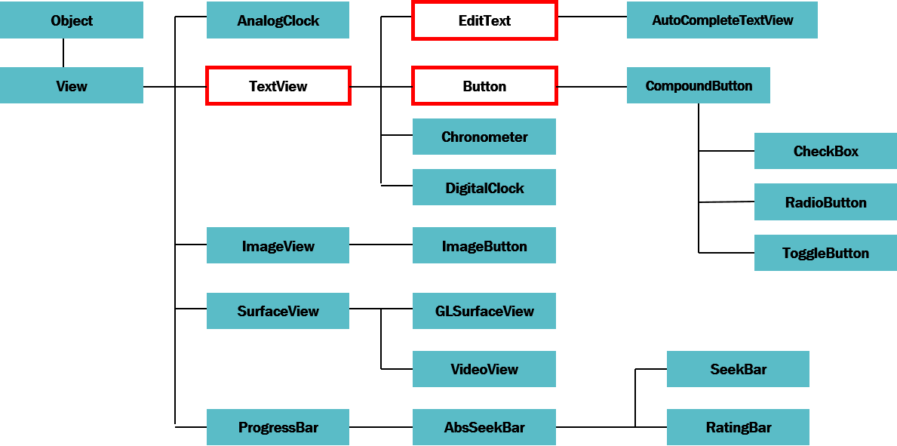
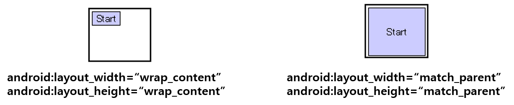
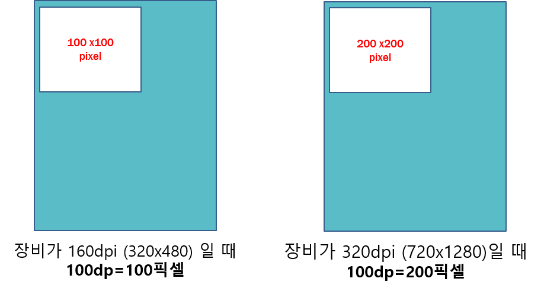

<style>
div.polaroid {
  	width: 640px;
  	box-shadow: 0 10px 30px 0 rgba(0, 0, 0, 0.2), 0 16px 30px 0 rgba(0, 0, 0, 0.19);
  	text-align: center;
	margin-bottom: 0.5cm;
}
</style>

# [안드로이드 UI](ui-intro.html)

[**이전**: 1. 안드로이드 UI 기본](ui-intro.html)

## 2. 위젯(Widget)
- 안드로이드 UI 기본 요소인 다양한 위젯 (Widget)의 설정 방법을 알아봅니다.

### 2.1 위젯 이란?
- **위젯(Wdiget)**은 [**View**](https://developer.android.com/reference/android/view/View)의 서브 클래스 중에서 화면에 보이는 것들을 말함
  - 대표적인 위젯은 *TextView*, *EditText*, *Button* 등이 있습니다.

  <div class="polaroid">
	
	</div>

---
### 2.2 [View](https://developer.android.com/reference/android/view/View)
View 클래스는 모든 UI 컴포넌트들의 부모 클래스이므로, View 클래스의 속성은 모든 UI 컴포넌트들에서 공통적으로 사용할 수 있다.

- **id**: UI 컴포넌트를 고유하게 식별하는 식별자
	- 식별자 지정 형식
		
		```
		android:id="@+id/my_button"
		```
		
		- [예시](https://github.com/kwanulee/Android/blob/master/examples/UIBasic/app/src/main/res/layout/other_layout.xml#L21) 
	- 식별자 참조 형식
	
		```
		android:id="@id/my_button"
		```
		
		- [예시](https://github.com/kwanulee/Android/blob/master/examples/UIBasic/app/src/main/res/layout/other_layout.xml#L30) 
		   
- **layout\_width**,  **layout\_height**: UI 컴포넌트의 크기를 결정
  - *match\_parent* (혹은 *fill\_parent*) : 부모 UI 컴포넌트의 크기에 맞춤
      - SDK2.2(프로요)부터는 *match\_parent*로 변경. 둘 다 사용 가능
  - *wrap\_content*:  UI 컴포넌트의 내용물 크기에 맞춤
	
		```
		<Button
	            android:layout_width="wrap_content"
	            android:layout_height="wrap_content"
	            android:text="Start"/>
	    ```
	    <div class="polaroid">
		   
		  </div>

  - layout\_width,  layout\_height의 값을 특정한 단위로 지정할 수도 있음
  
  		```
		<Button
	            android:layout_width="100px"
	            android:layout_height="100px"
	            android:text="Start"/>
	    ```

    	- *px* (pixels), *in* (inches), *mm* (millimeters)
      		- Pixel 방식으로 view의 크기를 설정하면, 디스플레이의 해상도에 따라 view의 크기가 달라 보일 수 있습니다.
        		- 가령, 가로세로 100 pixel 크기의 UI요소는 저해상도 디스플레이에서 보이는 것이  고해상도 디스플레이어에서 보이는 것보다 크게 보입니다.

			        <div class="polaroid">
			  	     
			  	      </div>
    	- *dp* (density\-independent pixels): 밀도에 독립적인 단위
      		- 1 dp는 밀도가 160dpi의 화면 일때 1 픽셀을 나타냄

		        <div class="polaroid">
		       
		        </div>
- **background**
  - 뷰의 배경을 지정하며, 색상 및 이미지 등의 여러 가지 객체로 지정 가능하다.
  - 색상 지정 시 네 가지 형식이 적용된다.
    - #RGB
    - #ARGB
    - #RRGGBB
    - #AARRGGBB
    - ex) #ff0000 (#f00): 빨간색,  #0000ff : 파란색

---
### [[연습1] 뷰의 크기 조절](ui-widget-exercise1.html)
---

### 2.3 [TextView](https://developer.android.com/reference/android/widget/TextView)  
- 화면에 text를 표시하는 용도
- **주요 속성**
  - View 속성 상속: **id**, **layout_width**, **layout_height**, **background**, etc.
  - **text**: 출력할 문자열 지정
  - **textSize**: 폰트 크기
  - **textStyle**: 텍스트 스타일 (normal, bold, italic)
  - **typeface**: 텍스트 폰트(normal, sans, serif, monspace)
  - **textColor**:  문자열 색상
  - **singleLine**: 속성값이 "true"이면, 텍스트가 위젯의 폭보다 길 때 강제로 한 줄에 출력

### 2.4 [EditText](https://developer.android.com/reference/android/widget/EditText)
- 입력이 가능한 Text 창
- **주요 속성**
  - **TextView**의 모든 속성 상속 (EditText는 TextView의 서브클래스임)
  - **inputType**: 입력시 허용되는 키보드 타입 설정 및 키보드 행위를 설정
    	- 키보드 타입 설정 값
      		- "text": 일반적인 텍스트 키보드
      		- "phone": 전화번호 입력 키보드
      		- "textEmailAddress": @ 문자를 가진 텍스트 키보드
    	- 키보드 행위 설정 값
      		- "textCapWords":  문장의 시작을 대문자로 변환
      		- "textAutoCorrect": 입력된 단어와 유사한 단어를 제시하고 제시된 단어 선택시, 입력된 단어를 대치
      		- "textMultiLine": 여러 줄을 입력 받을 수 있음

---
### [[연습2] Textview/EditText 테스트](ui-widget-exercise2.html)
---
### 2.5 [Button](https://developer.android.com/reference/android/widget/Button?hl=en)
- 일반적으로 많이 사용되는 푸시 버튼으로 사용자가 버튼을 클릭하였을 때, 어떤 행동을 수행하고자 할 때 사용된다.

	
- **Button** 클래스는 **TextView**의  서브클래스이므로, **TextView**의 모든 속성을 사용할 수 있다.
	- **singleLine**: 텍스트가 위젯의 폭보다 길 때 강제로 한 줄에 출력 
- 버튼 내에 텍스트, 아이콘을 표시할 수 있음
  - 버튼 전체를 이미지로 그리기 위해서는 **ImageButton** 사용

- **예제** 
	- [연습 2](ui-widget-exercise2.html)의 text\_views.xml 파일에 버튼 위젯 추가) 

	```xml
	<?xml version="1.0" encoding="utf-8"?>
	<LinearLayout ...>
		...
		<EditText ... />
	    <Button
	        android:layout_width="wrap_content"
	        android:layout_height="wrap_content"
	        android:text="Submit"
	        />
	</LinearLayout>


### 2.6 버튼 클릭이벤트 처리
- 사용자가 버튼 위젯을 클릭할 때, 지정된 행동을 수행하기 위해서는 다음 두 가지 방법 중 하나를 사용할 수 있다.

#### 2.6.1 버튼 위젯의 onClick 속성 활용 방법
1. 버튼 위젯을 정의한 화면을 **contentView**로 설정한 액티비티 클래스에 새로운 메소드(예, *doAction*())를 추가한다.

	```java
	public class MainActivity extends AppCompatActivity {
	
	    @Override
	    protected void onCreate(Bundle savedInstanceState) {
	        super.onCreate(savedInstanceState);
	        setContentView(R.layout.text_views);
	    }
	    
	    // 버튼 클릭이벤트를 처리하는 메소드 정의
	    public void doAction(View v) {
	        // Shows a Toast message in response to button
	        Toast.makeText(getApplicationContext(), "Submitted Successfully",
                Toast.LENGTH_SHORT).show();
	    }
	    
	}
	```

2. 버튼 위젯을 정의한 xml 레이아웃 파일(예, *text\_views.xml*)에서, 버튼 위젯의 **onClick** 속성에 앞 단계에서 추가한 메소드(예, *doAction*())를 설정한다.

	```xml
	<?xml version="1.0" encoding="utf-8"?>
	<LinearLayout ...>
		...
	    <Button
	        android:layout_width="wrap_content"
	        android:layout_height="wrap_content"
	        android:text="Submit"
	        android:onClick="doAction"/>
	
	</LinearLayout>
	```

#### 2.6.2 이벤트 처리 객체를 이용하는 방법
이 방법에서는 이벤트를 처리하는 객체를 생성하여 해당 이벤트를 발생시키는 위젯에 등록한다. 위젯에서 이벤트가 발생하면 등록된 이벤트 처리 객체가 정의된 일을 수행한다.

- **절차**   
	1. 버튼이 클릭되었을 때 발생되는 클릭 이벤트를 처리하기 위해서는 [View.OnClickListener](https://developer.android.com/reference/android/view/View.OnClickListener) 인터페이스를 구현하는 클	래스 정의한다.
	2. 구현한 클래스의 객체를 생성하여 클릭 이벤트를 발생시키는 버튼 위젯에 등록한다.

- **예제**
	- 버튼 위젯을 정의한 xml 레이아웃 파일(예, text\_views.xml)에서, Button 객체를 Java 코드에서 참조하기 위해서 버튼 위젯에 id 속성 추가
	
		```xml
		<?xml version="1.0" encoding="utf-8"?>
		<LinearLayout ...>
			...
		    <Button
		    	android:id="@+id/submit_button"
		        android:layout_width="wrap_content"
		        android:layout_height="wrap_content"
		        android:text="Submit"
		        />
		
		</LinearLayout>
		```
	
	-  이벤트 처리 클래스 정의 후, 이벤트 처리 객체 생성 및 등록

		```java
		public class MainActivity extends AppCompatActivity {
		
		    @Override
		    protected void onCreate(Bundle savedInstanceState) {
		        super.onCreate(savedInstanceState);
		        setContentView(R.layout.text_views);
		
				 // text_views.xml에 정의된 View 객체 중에서 id가 submit_button인 것을 찾아 반환함 
		        Button btn = findViewById(R.id.submit_button);
		        //2. 구현한 클래스의 객체를 생성하여 클릭 이벤트를 발생시키는 버튼 위젯에 등록
		        btn.setOnClickListener(new ClickListener());
		    }
		
		    ...
		
			//1. 버튼이 클릭되었을 때 발생되는 클릭 이벤트를 처리하기 위해서는 View.OnClickListener 인터페이스를 구현하는 클래스 정의
		    class ClickListener implements View.OnClickListener {
		        @Override
		        public void onClick(View v) {
		            Toast.makeText(getApplicationContext(), R.string.button_clicked_msg,
		                    Toast.LENGTH_SHORT).show();
		        }
		    }
		}
		
		```  	
		
- 참고 (**findViewByID**() 함수)
	- [Activity](https://developer.android.com/reference/android/app/Activity) 클래스에 정의된 메소드로 **Activity** 하위 클래스(예, [AppCompatActivity](https://developer.android.com/reference/android/support/v7/app/AppCompatActivity))에서 사용 가능 
	- 해당 액티비티와 연결된 XML layout 리소스 요소(위젯) 중에서 id 속성을 바탕으로 해당 Java 객체를 가져옴 
		- [**주의**] **onCreate**() 메소드 내의 **setContentView**()를 통해서 연결된 XML 리소스 요소 중에서만 **findViewByID**() 메소드로 가져올 수 있음. 


---
[**다음**: 3. 레이아웃 (Layout)](ui-layout.html)
