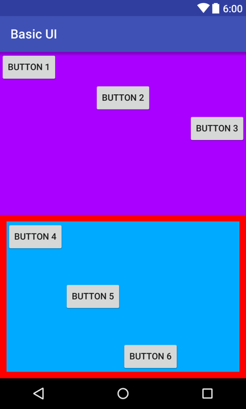
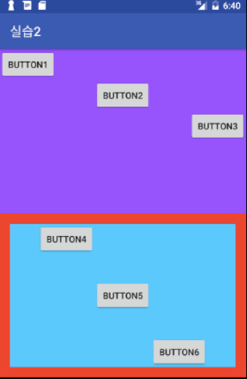
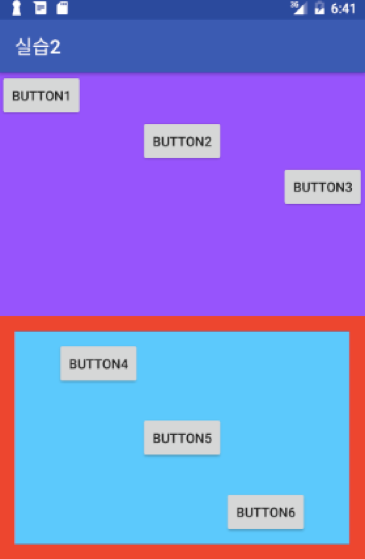

<style> 
div.polaroid {
  	width: 200px;
  	box-shadow: 0 10px 30px 0 rgba(0, 0, 0, 0.2), 0 16px 30px 0 rgba(0, 0, 0, 0.19);
  	text-align: center;
	margin-bottom: 0.5cm;
}
</style>

# 안드로이드 UI 실습

##1.  UI 레이아웃 구성

- **LinearLayout** 내에 **LinearLayout**을 2개 사용하고 각각의 **weight**를 1로 사용
- 아래쪽 **LinearLayout**은 **margin**을 사용하여 빨간색 background인 부모 **LinearLayout**이 살짝 보이도록 한다.
- Button마다 적절한 **layout_gravity**를 사용하여 위치를 조정

	<div class="polaroid">
		 
	</div>	

##2. 버튼 클릭 이벤트 처리
- **BUTTON 1**과 **BUTTON 2**, **BUTTON 3**을 누르면 각각 "**Button 1 clicked**", “**Button 2 clicked**”, “**Button 3 clicked**” 메시지 토스트를 보여주도록 한다.
- 출력되는 메시지는 **res/values/strings.xml**에서 따로 정의한다.

토스트 메시지:

```java
	Toast.makeText(getApplicationContext(), R.string.msg, 	Toast.LENGTH_SHORT).show();
```
##3. 버튼의 텍스트 변경
- **BUTTON 4**번을 누르면 **BUTTON 1**의 text를 “**BUTTON One**”과 “**BUTTON 1**”이 번갈아 바뀌도록 한다.

버튼의 text를 바꾸는 방법:

```java
	Button btn = (Button)findViewById(R.id.button1);
	btn.setText("Button One");
```

##4. 레이아웃의 Gravity 변경
- **BUTTON 5**번을 누르면 이를 포함한 리니어 레이아웃의 **gravity** 값을 “**CENTER_HORIZONTAL**”로 설정하여 아래와 같이 바뀌도록 한다.

	<div class="polaroid">
		 
	</div>	

레이아웃의 gravity를 바꾸는 방법:

```java
	LinearLayout layout = (LinearLayout) findViewById(R.id.linearlayout2);
	layout.setGravity(Gravity.CENTER_HORIZONTAL);
```

##5. 레이아웃의 Padding 변경 
- **BUTTON 6**번을 누르면 이를 포함한 리니어 레이아웃의 **padding** 값을 상하좌우 각각 *20*으로 설정하여 아래와 같이 바뀌도록 한다.

	<div class="polaroid">
		 
	</div>	

레이아웃의 gravity를 바꾸는 방법:

```java
	LinearLayout layout = (LinearLayout) findViewById(R.id.linearlayout2);
	layout.setPadding(20,20,20,20);
```