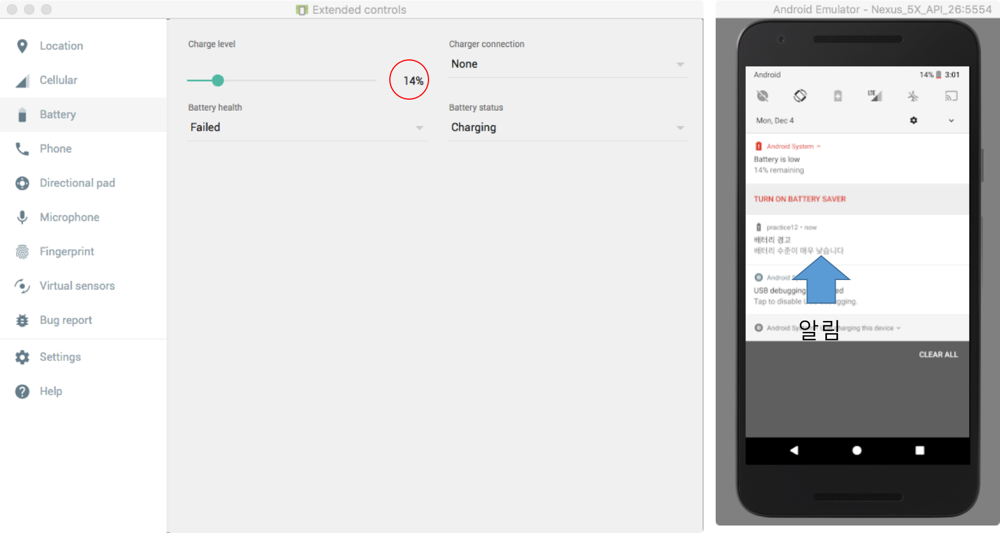
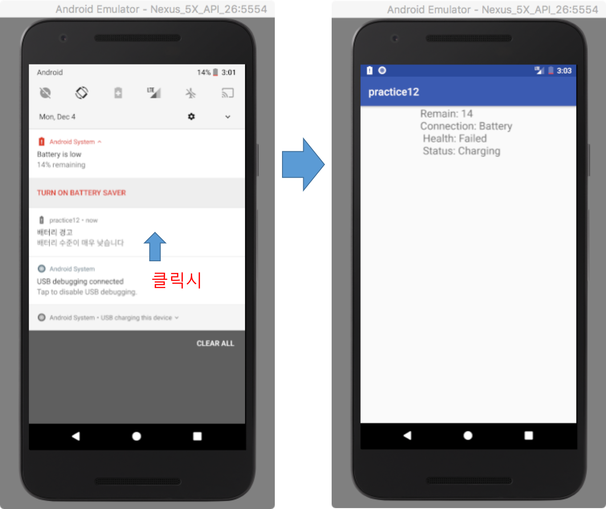

# 브로드캐스트 리시버와 알림 실습

## 개요
이번 실습은 예제로 주어진 배터리 상태 모니터링을 위한 브로드캐스트 예제와 알림 예제를 결합하여, 배터리 잔량이 14%이하로 떨어졌을 때, 알림 메시지를 표시하고, 알림 메시지를 클릭하였을 때, 현재 배터리의 상태를 보여주는 액티비티를 실행하는 앱을 개발하는 것입니다.

- 에뮬레이터 제어기에서 배터리의 잔량을 14%로 내린 경우 

- 알림 창을 열고, 알림 메시지를 클릭한 경우

## 1. 배터리의 수준의 중요한 변화을 모니터링 하기 브로드캐스트 리시버 구현 및 등록

- 배터리의 수준이 매우 낮은 상태를 모니터링 하기 위한 브로드캐스트 리시버를 구현하고 등록하시오.
	- 브로드캐스트 리시버는 ACTION\_BATTERY\_LOW를 수신대기 한다. 

[힌트]
참조코드: 

- https://github.com/kwanulee/Android/blob/master/examples/BroadcastTest/app/src/main/java/com/kwanwoo/android/broadcasttest/MainActivity.java#L35-L48

- https://github.com/kwanulee/Android/blob/master/examples/BroadcastTest/app/src/main/java/com/kwanwoo/android/broadcasttest/BatteryWatchBR.java 

## 2. 알림 정의 및 발행

- 브로드캐스트 리시버가 ACTION\_BATTERY\_LOW를 수신한 후,  **배터리 상태 경고** 알림을 표시한다.
- 알림 메시지를 클릭하는 경우에 배터리의 현재 상태 정보를 표시해주는 액티비티를 실행시켜야 합니다.
	- 표시되는 배터리 상태정보는 다음과 같습니다.
		- Battery level, Charger Connection, Battery Health, Battery Status  
- API level 26 이상의 플랫폼에서도 동작하도록 구현해야 합니다.

[힌트]
참조코드: https://github.com/kwanulee/Android/tree/master/examples/NotificationTest
