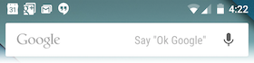
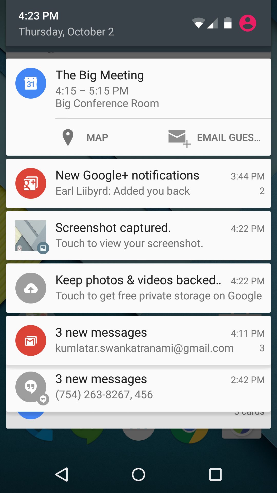

# 알림 (Notification)

- 토스트 메시지는 잠시만 보였다가 사라짐
- 알림(Notification)은 애플리케이션의 정상 UI 외부에서 사용자에게 표시할 수 있는 메시지
	- 시스템에 알림을 실행하라고 명령하면 처음에 알림 영역에서 아이콘으로 나타납니다. 
	
		
	
	- 알림 세부 정보를 보려면 사용자는 알림 창을 열어야 합니다. 
	- 알림 영역과 알림 창은 사용자가 언제든 볼 수 있는, 시스템이 제어하는 영역 입니다.

		
	
	[소스: https://developer.android.com/guide/topics/ui/notifiers/notifications.html?hl=ko]
	
##1.간단한 알림 생성
  
###1.1  알림 내용 설정
- **[NotificationCompat.Builder](https://developer.android.com/reference/android/support/v4/app/NotificationCompat.Builder.html)**를 사용하여 알림을 위한 내용과 행동을 지정하여 Builder 객체를 생성
- 최소한 다음 요소를 포함해야 함
	- 아이콘 설정: [setSmallIcon(int)](https://developer.android.com/reference/android/app/Notification.Builder.html#setSmallIcon(int))
	- 제목 설정: [setContentTitle()](https://developer.android.com/reference/android/app/Notification.Builder.html#setContentTitle(java.lang.CharSequence))
	- 상세 텍스트 설정: 	[setContentText()](https://developer.android.com/reference/android/app/Notification.Builder.html#setContentText(java.lang.CharSequence))
- 예제

	```java
	NotificationCompat.Builder mBuilder =
	    new NotificationCompat.Builder(this)
	    .setSmallIcon(R.drawable.notification_icon)
	    .setContentTitle("My notification")
	    .setContentText("Detailed description of My notification ");
	```
	
- 부가 설정
	- 알림 우선순위 : [setPriority()](https://developer.android.com/reference/android/support/v4/app/NotificationCompat.Builder.html?hl=ko#setPriority(int))
		- NotificationCompat.PRIORITY\_MIN ~ NotificationCompat.PRIORITY\_MAX
	- 자동 취소: [setAutoCancel()](https://developer.android.com/reference/android/support/v4/app/NotificationCompat.Builder.html#setAutoCancel(boolean))
		- 클릭시, 알림이 자동 취소됨	
	- 디폴트 알림: [setDefaults()](https://developer.android.com/reference/android/support/v4/app/NotificationCompat.Builder.html#setDefaults(int))
		- DEFAULT\_SOUND, DEFAULT\_VIBRATE, DEFAULT\_LIGHTS의 bitwise-or
		- DEFAULT\_ALL: 모든 값 적용 
	- 알림 발생 시간: [setWhen()](https://developer.android.com/reference/android/support/v4/app/NotificationCompat.Builder.html#setWhen(long))

	```java
	NotificationCompat.Builder mBuilder =
	    new NotificationCompat.Builder(this)
	    .setSmallIcon(R.drawable.notification_icon)
	    .setContentTitle("My notification")
	    .setContentText("Detailed description of My notification "); 
	               
	    .setAutoCancel(true)
	    .setWhen(System.currentTimeMillis())
	    .setPriority(Notification.PRIORITY_HIGH)
	    .setDefaults(Notification.DEFAULT_ALL);
	```
	
###1.2 알림 발행
- [NotificationManager](https://developer.android.com/reference/android/app/NotificationManager.html) 객체의 [notify()](https://developer.android.com/reference/android/app/NotificationManager.html#notify(int, android.app.Notification)) 메소드 호출해서 [Notification](https://developer.android.com/reference/android/app/Notification.html?hl=ko) 객체를 전달
	- NotificationManager 객체는 시스템 서비스로부터 획득
	- Notification 객체는 NotificationCompat.Builder 객체의 build() 메소드로 획득 
- 예제

	```java
	NotificationManager nm = (NotificationManager) getSystemService(Context.NOTIFICATION_SERVICE);
    nm.notify(NOTI_ID, mBuilder.build());
	```

		
##2. 알림 클릭 행동 정의
- 사용자가 알림을 클릭했을 때의 행동을 정의
- **행동**은 [PendingIntent]()로 정의되며, 이는 액티비티를 시작시킬 인텐트를 포함하고 있음

###2.1 PendingIntent 
- PendingIntent 클래스는 다른 인텐트를 래핑하며 다른 응용 프로그램으로 전달하여 실행 권한을 준다
	- 일반 인텐트와의 차이점으로는 다른 컴포넌트에게 작업을 요청하는 인텐트를 사전에 생성시키고 만든다는 점과 "특정 시점"에 자신이 아닌 다른 컴포넌트들이 펜딩인텐트를 사용하여 다른 컴포넌트에게 작업을 요청시키는 데 사용된다는 점이 차이점
	
		[출처: http://techlog.gurucat.net/80 ]	
- 다음 세 개의 정적 메서드를 이용하여 생성
	- PendingIntent **getActivity**(Context context, int requestCode, Intent intent, int flag) 
		- Activity를 시작하는 인텐트를 생성함
		- Context.startActivity(Intent) 호출과 유사함
	-  PendingIntent **getBroadcast**(Context context, int requestCode, Intent intent, int flag)
		- BroadcastReceiver를 시작하는 인텐트를 생성함  
		- Context.startBroadcast(Intent) 호출과 유사함

	-  PendingIntent **getService**(Context context, int requestCode, Intent intent, int flag)
		- Service를 시작하는 인텐트를 생성함 
		- Context.startService(Intent) 호출과 유사함

###2.2 PendingIntent를 알림 클릭 동작과 연결
- 	NotificationCompat.Builder의 [setContentIntent()](https://developer.android.com/reference/android/support/v4/app/NotificationCompat.Builder.html#setContentIntent(android.app.PendingIntent)) 메소드 사용
-  예제 

	```java
        Intent notificationIntent = new Intent(this, NotificationDetail.class);
        notificationIntent.putExtra("notificationId", 9999); //전달할 값
        PendingIntent contentIntent 
        		= PendingIntent.getActivity(
        					this, 
        					0, 
        					notificationIntent, // 작업 요청할 명시적 인텐트
        					PendingIntent.FLAG_UPDATE_CURRENT);

        NotificationCompat.Builder notification = new NotificationCompat.Builder(this, "default");
        notification.setContentTitle(getString(R.string.notification_title))
                .setContentText(getString(R.string.notification_text))
                .setSmallIcon(R.drawable.ic_access_alarm_black_24dp)
                .setLargeIcon(BitmapFactory.decodeResource(getResources(), R.mipmap.ic_launcher))
*           .setContentIntent(contentIntent)
                .setAutoCancel(true)
                .setWhen(System.currentTimeMillis())
                .setPriority(Notification.PRIORITY_HIGH)
                .setDefaults(Notification.DEFAULT_ALL);

        NotificationManager mNotificationManager = 
        	(NotificationManager) getSystemService(Context.NOTIFICATION_SERVICE);
        mNotificationManager.notify(NOTI_ID, notification.build());

	```

https://github.com/kwanulee/Android/blob/master/examples/NotificationTest/app/src/main/java/com/kwanwoo/android/notificationtest/MainActivity.java#L73-L90

##3. NotificationChannel
- Android O에는 사용자의 알림 관리에 도움이 되는 통합 시스템을 제공하기 위해 알림 채널이 도입됨
	- 참고 사이트: http://shnoble.tistory.com/81

- API level 26 (Android 8.0) 이상의 플랫폼 부터는 NotificationChannel을 먼저 생성한 후에, 다음 생성자를 사용하여 생성된 NotificationChannel ID를 두번째 파라미터로 넘겨줌
	- [NotificationCompat.Builder(Context context, String channelId)](https://developer.android.com/reference/android/support/v4/app/NotificationCompat.Builder.html#NotificationCompat.Builder(android.content.Context,%20java.lang.String))
- NotificationChannel 생성 예제

	```java
	private void initChannel() {
	        if (android.os.Build.VERSION.SDK_INT >=26) {
	            // The id of the channel.
	            String id = "my_channel_01";
	
	            // The user-visible name of the channel.
	            CharSequence name = getString(R.string.channel_name);
	
	            // The user-visible description of the channel.
	            String description = getString(R.string.channel_description);
	
	            int importance = NotificationManager.IMPORTANCE_HIGH;
	
	            NotificationChannel mChannel = new NotificationChannel(id, name, importance);
	
	            // Configure the notification channel.
	            mChannel.setDescription(description);
	            mChannel.enableLights(true);
	            mChannel.setLightColor(Color.BLUE);
	            mChannel.enableVibration(true);
	            mChannel.setVibrationPattern(new long[]{100, 200, 300, 400, 500, 400, 300, 200, 400});
	
	            NotificationManager mNotificationManager =
	                    (NotificationManager) getSystemService(Context.NOTIFICATION_SERVICE);
	            mNotificationManager.createNotificationChannel(mChannel);
	        }
	    }
	```

https://github.com/kwanulee/Android/blob/master/examples/NotificationTest/app/src/main/java/com/kwanwoo/android/notificationtest/MainActivity.java#L41-L67