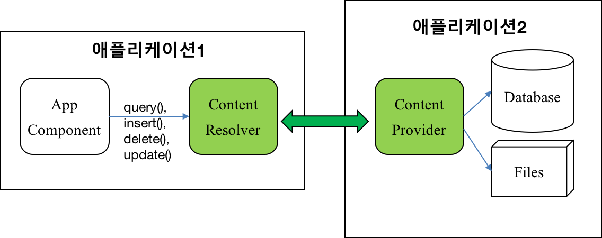

<style> 
div.polaroid {
  	width: 640px;
  	box-shadow: 0 10px 30px 0 rgba(0, 0, 0, 0.2), 0 16px 30px 0 rgba(0, 0, 0, 0.19);
  	text-align: center;
	margin-bottom: 0.5cm;
}
</style>

[**목차**: 콘텐츠 제공자](https://kwanulee.github.io/AndroidProgramming/#10-content-provider)

# 콘텐츠 제공자 (Content Provider)

## 1. 개요

- **파일, 설정, SQLite 데이터베이스**는 애플리이션의 고유 데이터로서 다른 애플리케이션에서는 접근하는 것이 불가능 (단, 외부저장소의 공유 디렉토리 파일은 예외)
- **콘텐츠 제공자**는 애플리케이션의 **구조화된 데이터 집합을 다른 애플리케이션과 공유**하기 위한 제한된 방법을 제공해 준다. 
	+ Android 자체에 오디오, 동영상, 이미지 및 개인 연락처 정보 등의 데이터를 관리하는 콘텐츠 제공자가 포함되어 있음
		* 예, **카카오톡**과 같은 SNS 앱은 **연락처 앱**이 저장한 개인 연락처 정보를 이용 
- **콘텐츠 제공자** 내의 데이터에 액세스하고자 하는 경우, 애플리케이션의 [Context](https://developer.android.com/reference/android/content/Context.html)에 있는 [ContentResolver](https://developer.android.com/reference/android/content/ContentResolver.html) 객체를 사용한다.
	+ ContentResolver는 데이터의 CRUD(Create,Read, Update, Delete) 제공
	
	<div>
		
	</div>
	
추가 자료: https://developer.android.com/guide/topics/providers/content-providers.html?hl=ko

- **콘텐츠 제공자 사용 시나리오** 
	1. 자신의 애플리케이션에서 기존 콘텐츠 제공자에 액세스하기 위한 코드를 구현 
	2. 자신의 애플리케이션에서 새로운 콘텐츠 제공자를 생성하여 다른 애플리케이션과 데이터를 공유
- 본 학습에서는 기존 콘텐츠 제공자를 사용하는 방법과 관련된 기본 사항을 설명합니다. 자신의 애플리케이션에서 콘텐츠 제공자를 구현하는 방법에 대한 자세한 내용은 [콘텐츠 제공자 생성](https://developer.android.com/guide/topics/providers/content-provider-creating?hl=ko)을 참조하세요.

<a name=2></a>
## 2. 콘텐츠 제공자의 접근 권한

- 보통 특정 콘텐츠 제공자에 접근하기 위해 권한을 필요로 함
* 권한 부여/확인하는 방법
    1. Manifest 파일에 **권한** 표시
    2. 데이터나 장치에 접근하기 전에 **권한** 을 확인 (**Android 6.0 (API level 23) 이상**)
        - 해당 권한이 있으면 해당 데이터에 접근
        - 해당 권한이 없으면 사용자에게 요청 다이얼로그를 표시함
    3. 요청 다이얼로그 결과(Allow 또는 Deny)에 따라 (**Android 6.0 (API level 23) 이상**)
        - Allow면 해당 데이터에 접근
        - Deny이면 해당 데이터에 접근하지 못하기 때문에 앱을 종료하거나 해당 데이터 접근 없이 진행
* [**주의**] **Android 6.0 (API level 23) 이상**부터는 **앱 실행 중에 필요한 권한(permission)을 반드시 확인하고 없으면 요청**해야 함

### 2.1 Manifest 파일에 권한 선언
- 제공자에 액세스하는 데 필요한 권한을 얻으려면 애플리케이션은 자신의 매니페스트 파일에 있는 <uses-permission>으로 그러한 권한을 요청합니다.
   - 예를 들면, 연락처 정보를 읽기 위해서는 **READ\_CONTACTS** 라는 권한을 필요로 함

	```xml
	<manifest xmlns:android="http://schemas.android.com/apk/res/android"
	    package="com.kwanwoo.android.contentresolvertest">
	    
	   <uses-permission android:name="android.permission.READ_CONTACTS"/>
	    
	    <application ...>
	      ...
	    </application>
	</manifest>
	```
https://github.com/kwanulee/AndroidProgramming/blob/master/examples/ContentResolverTest/app/src/main/AndroidManifest.xml#L5
 

### 2.2 데이터나 장치에 접근하기 전에 **권한**을 확인
- **Android 6.0 (API level 23) 이상**부터는 **앱 실행 중에 필요한 권한(permission)을 반드시 확인하고 없으면 요청**해야 합니다.

```java
public class MainActivity extends AppCompatActivity {

    final int REQUEST_CODE_READ_CONTACTS = 1;

    @Override
    protected void onCreate(Bundle savedInstanceState) {
        super.onCreate(savedInstanceState);
        setContentView(R.layout.activity_main);

        // 권한 확인
        if (ContextCompat.checkSelfPermission(MainActivity.this, Manifest.permission.READ_CONTACTS)
                != PackageManager.PERMISSION_GRANTED) { // 권한이 없으므로, 사용자에게 권한 요청 다이얼로그 표시
            ActivityCompat.requestPermissions(MainActivity.this,
                    new String[]{Manifest.permission.READ_CONTACTS}, REQUEST_CODE_READ_CONTACTS);
        } else // 권한 있음! 해당 데이터나 장치에 접근!
            getContacts();
    }
```

https://github.com/kwanulee/AndroidProgramming/blob/master/examples/ContentResolverTest/app/src/main/java/com/kwanwoo/android/contentresolvertest/MainActivity.java#L20-L36

### 2.3 요청 다이얼로그 결과(Allow 또는 Deny)에 따라

```java
    public void onRequestPermissionsResult(int requestCode, String[] permissions, int[] grantResults) {
        super.onRequestPermissionsResult(requestCode, permissions, grantResults);
        if (requestCode == REQUEST_CODE_READ_CONTACTS) {
            if (grantResults.length > 0 && grantResults[0] == PackageManager.PERMISSION_GRANTED) {
                getContacts();
            } else {
                Toast.makeText(getApplicationContext(), "READ_CONTACTS 접근 권한이 필요합니다", Toast.LENGTH_SHORT).show();
            }
        }
    }
```

https://github.com/kwanulee/AndroidProgramming/blob/master/examples/ContentResolverTest/app/src/main/java/com/kwanwoo/android/contentresolvertest/MainActivity.java#L78-L88


## 3. 콘텐츠 제공자에서 데이터 검색

### 3.1 쿼리 구성
- [query](https://developer.android.com/reference/android/content/ContentResolver.html#query(android.net.Uri, java.lang.String[], java.lang.String, java.lang.String[], java.lang.String)) 메소드 ([ContentResolver](https://developer.android.com/reference/android/content/ContentResolver.html) 클래스 내)


	```java
	Cursor query (Uri uri, 
	                String[] projection, 
	                String selectionClause, 
	                String[] selectionArgs, 
	                String sortOrder)
	```
	인수            | 설명
	--------------|-------------------
	uri           | 콘텐츠 제공자의 URI. content:// 형식
	projection    | 반환해야 할 열들
	selectionClause     | 선택될 행들에 대한 조건
	selectionArgs | 조건에 필요한 인수
	sortOrder     | 선택된 행들의 정렬 방법
	
- 콘텐츠 URI
	+ 콘텐츠 URI는 제공자에서 데이터를 식별하는 URI
	+ 콘텐츠 URI에는 전체 제공자의 상징적인 이름(제공자의 권한)과 테이블을 가리키는 이름(경로)이 포함
	+ 형식
	
		```
		content://AUTHORITY/PATH/ID
		```

- 예제
	+ **연락처 정보**를 제공하는 제공자에 액세스하는 데 필요한 변수를 **ContactsContract** 계약 클래스에 정의된 상수를 이용하여 정의 

		```java
	        String [] projection = {
	                ContactsContract.CommonDataKinds.Phone._ID,
	                ContactsContract.CommonDataKinds.Phone.DISPLAY_NAME,
	                ContactsContract.CommonDataKinds.Phone.NUMBER
	        };
	
			 // 연락처 전화번호 타입에 따른 행 선택을 위한 선택 절
	        String selectionClause = ContactsContract.CommonDataKinds.Phone.TYPE + " = ? ";
	
	        // 전화번호 타입이 'MOBILE'인 것을 지정
	        String[] selectionArgs = {""+ContactsContract.CommonDataKinds.Phone.TYPE_MOBILE};
		```
		
		https://github.com/kwanulee/AndroidProgramming/blob/master/examples/ContentResolverTest/app/src/main/java/com/kwanwoo/android/contentresolvertest/MainActivity.java#L40-L50
		
	+ 설정된 파라미터를 바탕으로 query() 메소드를 실행
	
		```java
	        Cursor c = getContentResolver().query(
	                ContactsContract.CommonDataKinds.Phone.CONTENT_URI,  // 조회할 데이터 URI
	                projection, 		// 조회할 컬럼 들
	                selectionClause, 	// 선택될 행들에 대한 조건절
	                selectionArgs, 		// 조건절에 필요한 파라미터
	                null);				// 정렬 안함
		```

		https://github.com/kwanulee/AndroidProgramming/blob/master/examples/ContentResolverTest/app/src/main/java/com/kwanwoo/android/contentresolvertest/MainActivity.java#L49-L54
		
### 3.2 쿼리 결과 표시

- 쿼리 결과인 Cursor 객체가 들어 있는 [SimpleCursorAdapter](https://developer.android.com/reference/android/widget/SimpleCursorAdapter.html) 객체를 생성하며, 이 객체를 [ListView](https://developer.android.com/reference/android/widget/ListView.html)에 대한 어댑터로 설정

	1. ListView의 항목 뷰 정의 (item.xml)
	
		```java
		<LinearLayout
		    xmlns:android="http://schemas.android.com/apk/res/android"
		    android:orientation="horizontal" android:layout_width="match_parent"
		    android:layout_height="match_parent">
		
		    <TextView
 	     		android:id="@+id/name"
		        android:layout_width="wrap_content"
		        android:layout_height="wrap_content"
		        android:textAppearance="?android:attr/textAppearanceMedium"
		        android:textColor="@color/colorPrimaryDark"
		        android:layout_weight="1"/>
		    <TextView
		    	android:id="@+id/phone"
		        android:layout_width="wrap_content"
		        android:layout_height="wrap_content"
		        android:textColor="@color/colorPrimaryDark"
		        android:textAppearance="?android:attr/textAppearanceMedium"
		        android:layout_weight="1"/>
		
		</LinearLayout>
		```
	https://github.com/kwanulee/AndroidProgramming/blob/master/examples/ContentResolverTest/app/src/main/res/layout-port/item.xml
	
	2.  SimpleCursorAdapter 설정 

		```java
	        String[] contactsColumns = { // 쿼리결과인 Cursor 객체로부터 출력할 열들
	                ContactsContract.CommonDataKinds.Phone.DISPLAY_NAME,
	                ContactsContract.CommonDataKinds.Phone.NUMBER
	        };
	
	        int[] contactsListItems = { // 열의 값을 출력할 뷰 ID (layout/item.xml 내) 
	                R.id.name,
	                R.id.phone
	        };
	
	        SimpleCursorAdapter adapter = new SimpleCursorAdapter(this,
	                R.layout.item,
	                c,
	                contactsColumns,
	                contactsListItems,
	                0);
	
	        ListView lv = (ListView) findViewById(R.id.listview);
	        lv.setAdapter(adapter);
		```
		
		https://github.com/kwanulee/AndroidProgramming/blob/master/examples/ContentResolverTest/app/src/main/java/com/kwanwoo/android/contentresolvertest/MainActivity.java#L49-L75
		
	
		
## 4. 콘텐츠 제공자에 데이터 삽입, 업데이트 및 삭제
- SQL과 유사하게 query뿐 아니라 insert, update, delete를 지원
- [ContentResolver](https://developer.android.com/reference/android/content/ContentResolver.html)의 아래 메소드를 사용
	- Uri [insert](https://developer.android.com/reference/android/content/ContentResolver.html#insert(android.net.Uri, android.content.ContentValues)) (Uri url, ContentValues values);
	- int [update](https://developer.android.com/reference/android/content/ContentResolver.html#update(android.net.Uri, android.content.ContentValues, java.lang.String, java.lang.String[])) (Uri uri, ContentValues values, String where, String[] selectionArgs);
	- int [delete](https://developer.android.com/reference/android/content/ContentResolver.html#delete(android.net.Uri, java.lang.String, java.lang.String[])) (Uri url, String where, String[] selectionArgs);

- [**주의**] 모든 콘텐츠 제공자가 데이터 삽입,업데이트,삭제 기능을 제공하지는 않습니다. 필요에 따라서 이 기능들을 제공할 수도 있고, 안할 수도 있습니다.
	- 가령, 연락처 정보를 제공하는 콘텐츠 제공자는 연락처 정보를 직접 삽입, 업데이트, 삭제하는 기능을 제공하고 있지 않습니다.

	
---

[**다음 학습**: 캘린더 제공자](https://developer.android.com/guide/topics/providers/calendar-provider?hl=ko)