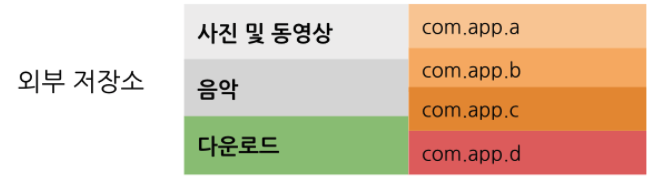
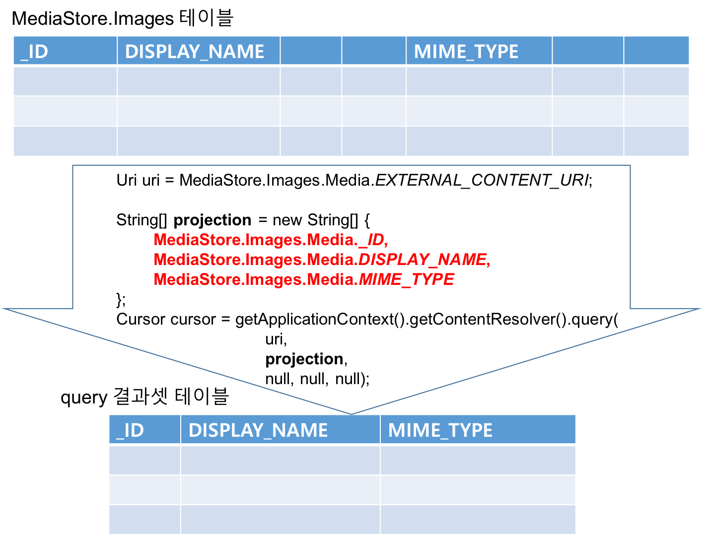

[**이전 학습**: 설정](sharedpreferences.html)

# 파일 (Files)

## 학습목표

- Android 기기의 파일에 자료를 저장하고 읽는 방법을 이해한다.
- 앱별 저장소에 파일을 저장하고 읽는 방법을 이해한다.
- 공유 저장소에 미디어 파일을 저장하고 읽는 방법을 이해한다.


## 1. 개요 
- Linux 파일 시스템과 java.io의 입출력 스트림에 대한 이해 필수입니다.
- 모든 Android 기기에는 용도에 따라 "**앱별 저장소**" 와 "**공유 저장소**"의 두 가지 영역으로 구분되고, 실제 저장소 위치는 **내부 저장소**와 **외부 저장소**로 구분됩니다.
	- **앱별 저장소**
		- 앱 전용으로 사용되는 파일을 저장하는 저장소
		- 항상 사용가능하고 앱 삭제시 저장소 내의 파일이 같이 삭제됨 
		- 저장 위치: 내부 혹은 외부
		- 액세스 방법
			- 내부 저장소 파일:  **getFilesDir()** 또는 **getCacheDir()**로 액세스
			- 외부 저장소 파일: **getExternalFilesDir()** 또는 **getExternalCacheDir()**로 액세스
			
	- **공유 저장소**
		- 공유 가능한 미디어 (이미지, 오디오 파일, 동영상), 문서 및 기타 파일을 저장하는 저장소
		- 외부 저장소의 마운트 여부에 따라 사용 가능하고, 앱 삭제 후에도 관련 파일은 삭제되지 않음
		-  저장 위치: 외부
		- 액세스 방법
			- 미디어 파일: **MediaStore API**로 액세스
			- 문서 및 기타 파일: **저장소 액세스 프레임워크**

<!--
		- 접근 권한 (**미디어 파일**에 만 해당됨, 문서 및 기타 파일은 권한 필요없음)
			- **Android 11 (API 수준 30)  이상**에서 *다른 앱의 미디어 파일에 액세스* 할 때 **READ\_EXTERNAL\_STORAGE** 권한 필요
			- **Android 10 (API 수준 29)**에서 *다른 앱의 파일에 액세스* 할 때 **READ\_EXTERNAL\_STORAGE** 또는 **WRITE\_EXTERNAL\_STORAGE** 권한 필요
			- **Android 9 (API 수준 28) 이하**에서 모든 파일에 액세스할 때,  **READ\_EXTERNAL\_STORAGE** 또는 **WRITE\_EXTERNAL\_STORAGE** 권한이 필요 
-->
---
### 1.1 외부 저장소 사용 권한 및 액세스 권한
- **Android 10 (API 수준 29)** 이전 버전의 Android에서 사용하는 외부 저장소는 개별 앱 공간과 공용 공간으로 크게 나뉘어져 있었습니다.
	- 앱이 외부저장소의 개별 앱 공간에 있는 파일을 액세스 하는 경우에는 별도의 권한이 필요하지 않습니다.
	- 앱이 외부저장소의 공용 공간에 있는 파일을 엑세스하기 위해서 읽기 및 쓰기 액세스 권한(**READ\_EXTERNAL\_STORAGE** 및 **WRITE\_EXTERNAL\_STORAGE**)을 선언해야 했습니다.   

	

-  **Android 10 (API 수준 29)** 부터 Android에서 사용하는 외부 저장소는 공용공간이 사진 및 동영상, 음악, 다운로드 구조로 분리되어 관리되는 **[범위 지정 저장소(Scoped Storage)](https://developer.android.com/training/data-storage?hl=ko#scoped-storage)**를 기본으로 합니다.
	- 개별 앱 공간은 이전과 같이 추가 권한 없이 접근이 가능합니다.
	- 각 공용 공간은 MediaStore를 통해서만 읽고 쓸 수 있고, 해당 타입에 맞는 파일만 저장할 수 있습니다. (다운로드 공간은 타입 제한 없음)
	- 추가 권한 없이도 각 공용 공간에 파일을 생성하고, 자신이 생성한 파일을 읽을 수 있습니다.  (다운로드 공간 접근을 위한 권한은 필요 없음)
	- 다른 앱에서 생성한 파일에 접근할 때는 **READ\_EXTERNAL\_STORAGE** 또는 **WRITE\_EXTERNAL\_STORAGE** (**Android 11(API 수준 30)** 부터는 **WRITE\_EXTERNAL\_STORAGE** 권한은 더 이상 의미 없음)
권한 필요. 

	

### 1.2 예제 프로젝트
- **앱별 저장소 안드로이드 예제 프로젝트 Github 주소**
	- https://github.com/kwanulee/AndroidProgramming/tree/master/examples/FileTest 
- **공유 저장소 안드로이드 예제 프로젝트 Github 주소**
	- https://github.com/kwanulee/AndroidProgramming/tree/master/examples/MediaStoreTest 
	
## 2. 앱별 내부 저장소의 파일 입출력
안드로이드 시스템의 내부 저장소 내에 앱별로 파일을 구성할 수 있는 두 가지 디렉터리가 제공됩니다.

- 앱의 **영구** 파일 디렉토리
	- 이 디렉토리의 파일은 사용자가 앱을 제거하거나 해당 파일을 직접 삭제하기 전까지는 유지됩니다.
- 앱의 **캐시**된 파일 디렉토리
	- 민감한 데이터를 일시적으로만 저장해야 하는 경우 내부 저장소 내 앱의 지정된 **캐시 디렉터리**를 사용하여 데이터를 저장해야 합니다. 모든 앱별 저장소의 경우와 마찬가지로 이 디렉터리에 저장된 파일은 사용자가 앱을 제거할 때 삭제되지만 이 디렉터리의 파일은 사용 가능한 캐시공간이 부족한 경우에 더 빨리 삭제될 수 있습니다. 

### 2.1 내부저장소의 파일 액세스
#### 2.1.1 [Context](https://developer.android.com/reference/android/content/Context.html) 객체 및 [File](https://developer.android.com/reference/java/io/File?hl=ko) 객체를 사용하여 파일  액세스 

- 내부 저장소 파일 디렉토리의 절대 경로 얻기
	- **영구 파일 디렉토리**:  [Context](https://developer.android.com/reference/android/content/Context.html) 객체의 [getFilesDir()](https://developer.android.com/reference/android/content/Context#getFilesDir()) 메소드
		-  영구 파일의 위치는 **/data/data/패키지명/files** 디렉토리
	- **캐시 파일 디렉토리**:  [Context](https://developer.android.com/reference/android/content/Context.html) 객체의 [getCacheDir()](https://developer.android.com/reference/android/content/Context#getCachesDir()) 메소드
	 	- 캐시 파일의 위치는 **/data/data/패키지명/caches** 디렉토리
- 영구 파일 목록 보기
	-  [Context](https://developer.android.com/reference/android/content/Context.html) 객체의 [fileList()](https://developer.android.com/reference/android/content/Context#fileList()) 메소드

		```java
        Array<String> files = context.fileList();
        ```

- 영구 파일에 접근을 위한  [File](https://developer.android.com/reference/java/io/File?hl=ko) 객체 생성 예

  ```java
  File file = new File(context.getFilesDir(), filename);
  ```


- 캐시 파일에 접근을 위한  [File](https://developer.android.com/reference/java/io/File?hl=ko) 객체 생성 예

  ```java
  File file = new File(context.getCachesDir(), filename);
  ```
  
- 파일 삭제
  	- 파일을 표시하는 File 객체의 delete() 메서드

	  	```java
	  	cacheFile.delete();
	  	```
  	- 앱 컨텍스트의 deleteFile() 메서드.: 파일 이름을 전달합니다.
  	
  		```java
	  	context.deleteFile(cacheFileName);
	  	```


#### 2.1.2 스트림을 사용하여 영구 파일 액세스
- 안드로이드에서 자바의 모든 입출력 기능을 다 사용할 수 는 없고, 보안상의 제약으로 인해 [Context](https://developer.android.com/reference/android/content/Context.html) 클래스에서 보안이 적용된 파일 관리 메서드를 별도로 제공하며, 이를 이용하여 파일을 Open한다.

	```java
	FileOutputStream openFileOutput (String name, int mode)
    FileInputStream openFileInput (String name)
	```	
 
	- name
        - 파일의 이름으로 경로를 표시하는 ‘/’ 문자가 들어가면 에러
    - mode
    
	    모드          | 설명
	-------------|---------------------------------------------------
	    MODE\_RPIVATE | 혼자만 사용하는 배타적인 모드로 파일을 생성. (디폴트)
	    MODE\_APPEND  | 파일이 이미 존재할 경우 덮어쓰기 모드가 아닌 추가 모드로 Open.

---

- OpenFileOuput 사용 예제

	~~~java
	package com.example.kwanwoo.filetest;
	... 생략 ...
	
	private void saveToInternalStorage() {
	        String data = input.getText().toString();
	
	        try {
	            FileOutputStream fos = openFileOutput
	                                        ("myfile.txt", // 파일명 지정
	                                        Context.MODE_APPEND);// 저장모드
	            PrintWriter out = new PrintWriter(fos);
	            out.println(data);
	            out.close();
	
	            result.setText("file saved");
	        } catch (Exception e) {
	            result.setText("Exception: internal file writing");
	        }
	}
	~~~
	
	https://github.com/kwanulee/AndroidProgramming/blob/master/examples/FileTest/app/src/main/java/com/example/kwanwoo/filetest/MainActivity.java#L92-L116

	- "myfile.txt"는 디바이스의 **data/data/com.example.kwanwoo.filetest/files/** 에 위치
		- **Android Studio**의 좌측 하단에 있는 **Device File Explorer** 탭을 열어 해당 파일이 생성되었는 지 확인 가능합니다.
	
			
	


- OpenFileInput 사용 예제

	```java
    private void loadFromIntenalStorage() {
        try {
            FileInputStream fis = openFileInput("myfile.txt");//파일명
            BufferedReader buffer = new BufferedReader
                    (new InputStreamReader(fis));
            String str = buffer.readLine(); // 파일에서 한줄을 읽어옴

            // 파일에서 읽은 데이터를 저장하기 위해서 만든 변수
            StringBuffer data = new StringBuffer();
            while (str != null) {
                data.append(str + "\n");
                str = buffer.readLine();
            }
            buffer.close();
            result.setText(data);
        } catch (FileNotFoundException e) {
            result.setText("File Not Found");
        } catch (Exception e) {
            result.setText("Exception: internal file reading");
        }
    }
	```

	https://github.com/kwanulee/AndroidProgramming/blob/master/examples/FileTest/app/src/main/java/com/example/kwanwoo/filetest/MainActivity.java#L118-L144


## 3. 앱별 외부 저장소 사용하기
- 앱별 파일을 저장하는 데 내부 저장소 공간이 충분하지 않으면 대신 외부 저장소를 사용할 수 있슴
- 안드로이드 시스템의 외부 저장소 내에 앱별로 파일을 구성할 수 있는 두 가지 디렉터리가 제공됩니다.
	- 앱의 영구 파일 디렉토리
	- 앱의 캐시된 파일 디렉토리

- **Android 4.4. (API 수준 19) 이상**에서는 앱별 외부 저장소를 접근하기 위한 권한은 필요하지 않음
- 앱별 외부 저장소에 저장된 파일은 앱을 제거할 때 삭제 됨

### 3.1 외부 저장소 사용 권한 
- 자신의 앱에서 앱별 외부 저장소를 접근하는 경우
	- **Android 4.4 (API 수준 19) 이상**을 실행하는 기기에서 권한은 필요하지 않음
- 다른 앱에서 앱별 외부 저장소의 접근하는 경우
 	- **Android 9 (API 수준 28) 이하**를 실행하는 기기에서 적절한 권한이 필요함
 	- **Android 10 (API 수준 29) 이상**을 타겟팅하는 앱의 경우
 		- [범위 지정 저장소](https://developer.android.com/training/data-storage?hl=ko#scoped-storage)를 사용 설정하면 다른 앱에 속한 앱별 디렉토리에 접근 불가
 		-  [범위 지정 저장소](https://developer.android.com/training/data-storage?hl=ko#scoped-storage)를 사용 설정을 해제하면 적절한 권한이 있는 경우에 다른 앱에 속한 앱별 디렉토리에 접근 가능  
 	- **Android 11 (API 수준 30) 이상**을 타겟팅하는 앱의 경우
 		- [범위 지정 저장소](https://developer.android.com/training/data-storage?hl=ko#scoped-storage)만 사용 가능하므로, 다른 앱에 속한 앱별 디렉토리에 접근 불가


### 3.2 외부 저장소의 상태 확인
* 외부 저장소를 사용하기 전에 *사용 가능성* 검사
    - static String Environment.getExternalStorageState()
        + 반환값
            - MEDIA\_MOUNTED: 미디어가 읽기/쓰기 권한으로 마운트 됨
            - MEDIA\_MOUNTED\_READ\_ONLY: 미디어가 읽기 권한으로 마운트 됨
            - MEDIA\_REMOVED: 미디어가 존재하지 않음
            - MEDIA\_UNMOUNTED: 미디어가 마운트 안됨
	
	```java
	    public boolean isExternalStorageWritable() {
	        String state = Environment.getExternalStorageState();
	        if (Environment.MEDIA_MOUNTED.equals(state)) {
	            result.setText("외부메모리 읽기 쓰기 모두 가능");
	            return true;
	        }
	        return false;
	    }
	    
	 	 public boolean isExternalStorageReadable() {
	        String state = Environment.getExternalStorageState();
	        if (Environment.MEDIA_MOUNTED.equals(state)||
	                Environment.MEDIA_MOUNTED_READ_ONLY.equals(state)) {
	            result.setText("외부메모리 읽기만 가능");
	            return true;
	        }
	        return false;
	     }
	```

	https://github.com/kwanulee/AndroidProgramming/blob/master/examples/FileTest/app/src/main/java/com/example/kwanwoo/filetest/MainActivity.java#L169-L188


### 3.3 외부 저장소 사용 

* 외부 저장소의 앱 전용(private) 저장소 디렉토리 접근하기
    - [File getExternalFilesDir(String type)](https://developer.android.com/reference/android/content/Context.html#getExternalFilesDir(java.lang.String))    [[Context](https://developer.android.com/reference/android/content/Context.html) 클래스 메소드]
        + Type
            - DIRECTORY\_MUSIC 
            - DIRECTORY\_PODCASTS
            - DIRECTORY\_RINGTONES
            - DIRECTORY\_ALARMS
            - DIRECTORY\_NOTIFICATIONS
            - DIRECTORY\_PICTURES
            - DIRECTORY\_MOVIES 등
        + 반환값: 외부저장소의 Android/data/패키지명/files 디렉토리 아래의 지정된 타입의 서브 디렉토리
            - (예,sdcard/Android/data/com.example.kwanwoo.filetest/files/Download)
	- 예제 코드

		```java
		//  앱 전용 저장소 (sdcard/Android/data/com.example.kwanwoo.filetest/files/Download를 사용할 경우
		    File path = getExternalFilesDir(Environment.DIRECTORY_DOWNLOADS);
		    
		    File f = new File(path, "external.txt");      // 경로, 파일명
		    FileWriter write = new FileWriter(f, true);   // 지정된 파일에 문자 스트림 쓰기
		
		    PrintWriter out = new PrintWriter(write);     // formatted 출력 스트림
		    out.println(data);
		    out.close();
		```

		[https://github.com/kwanulee/AndroidProgramming/blob/master/examples/FileTest/app/src/main/java/com/example/kwanwoo/filetest/MainActivity.java#L228-L241](https://github.com/kwanulee/AndroidProgramming/blob/master/examples/FileTest/app/src/main/java/com/example/kwanwoo/filetest/MainActivity.java#L228-L241)

## 4. res/raw 폴더 파일 이용하기
* 대용량의 읽기 전용 데이터 파일은 리소스에 포함시켜 두는 것이 좋다.
    - ( ex: 게임의 지도 맵 데이터, 우편 번호부, 영한사전 데이터 등 )
* 포함시킬 파일은 **res/raw**에 복사해 둔다
	
	

* 리소스의 파일을 읽을 때는 [Resources](https://developer.android.com/reference/android/content/res/Resources.html) 클래스의 [openRawResource](https://developer.android.com/reference/android/content/res/Resources.html#openRawResource(int)) 메서드를 사용하며, id로는 확장자를 뺀 파일명을 부여한다.

	```java
		InputStream openRawResource (int id)
	```
	   
	- 모든 file resource는 접미사(확장자)를 제외하고 유일한 이름을 가져야 한다.
	- res/raw에 file1.txt 와 file1.dat가 동시에 존재하면 안됨

	```java
	    private void loadFromRawResource() {
	        try {
	            InputStream is = getResources().openRawResource(R.raw.description);
	            BufferedReader buffer = new BufferedReader
	                    (new InputStreamReader(is));
	
	            String str = buffer.readLine(); // 파일에서 한줄을 읽어옴
	
	            // 파일에서 읽은 데이터를 저장하기 위해서 만든 변수
	            StringBuffer data = new StringBuffer();
	
	            while (str != null) {
	                data.append(str + "\n");
	                str = buffer.readLine();
	            }
	            buffer.close();
	            result.setText(data);
	        } catch (Exception e) {
	            result.setText("Exception: raw resource file reading");
	        }
	    }
	```
	https://github.com/kwanulee/Android/blob/master/examples/FileTest/app/src/main/java/com/example/kwanwoo/filetest/MainActivity.java#L146-L166


## 5. 공유 저장소의 미디어 파일에 액세스
* 다른 앱에서 액세스할 수 있고, 사용자가 앱을 제거하더라도 유지되어야 하는 사용자 데이터는 공유 저장소에 보관되어야 합니다.
	- 참고: 앱 내에서만 사용되는 미디어 파일은 외부 저장소 내 앱별 디렉토리에 저장하는 것이 좋음. 
* Android는 공유 가능한 다음 데이터 유형을 저장하고 이 데이터에 액세스하는 API를 제공합니다.
	- **미디어 콘텐츠**: 앱은 플랫폼의 **MediaStore API**를 사용하여 사진, 오디오, 비디오 콘텐츠에 액세스할 수 있습니다.
	- **문서 및 기타 파일**:  앱은 플랫폼의 **저장소 액세스 프레임워크**를 사용하여 PDF 문서와 EPUB 형식을 사용하는 도서 등의 파일에 액세스할 수 있습니다.
		- 문서 및 기타 파일 접근에 대한 자세한 내용은 https://developer.android.com/training/data-storage/shared/documents-files 참조 

### 5.1 저장소 권한
- **Android 9(API 수준 28) 이하**를 실행하는 기기에서는 (공유) 외부 저장소를 사용하기 위해서 관련 권한을 요청해야 합니다. 다음과 같이 앱 매니페스트 파일의 권한 선언에 android:maxSdkVersion 속성을 추가하여 이 조건을 적용할 수 있습니다.

	```xml
	<uses-permission android:name="android.permission.WRITE_EXTERNAL_STORAGE"
                 android:maxSdkVersion="28" />
	```
- **Android 10(API 수준 29) 이상**를 실행하는 기기에서 [범위지정 저장소](https://developer.android.com/training/data-storage?hl=ko#scoped-storage)를 사용하는 경우에는, 불필요하게 권한을 요청할 필요가 없습니다.
	- 자신의 앱이 미디어 컬렉션에 추가 한 파일을 접근할 때는 특별한 권한이 필요없음
	- 다른 앱이 미디어 컬렉션에 추가한 파일을 접근할 때는 **READ\_EXTERNAL\_STORAGE** 권한을 요청해야 함  

- 권한 요청 절차
	1. 앱의 매니페스트 파일에서 **READ\_EXTERNAL\_STORAGE** 권한 선언.
	2. 앱 실행 시 접근 권한 확인 및 요청

#### 5.1.1 권한 선언
* 다른 앱이 미디어 컬렉션에 추가한 파일을 접근할려면 Manifest 파일에서 **READ\_EXTERNAL\_STORAGE** 권한을 선언

	```xml
	<manifest ...>
	    <uses-permission android:name="android.permission.READ_EXTERNAL_STORAGE"/>
	</manifest>
	```
	https://github.com/kwanulee/AndroidProgramming/blob/master/examples/MediaStoreTest/app/src/main/AndroidManifest.xml#L4

#### 5.1.2 앱 실행 시 접근 권한 확인 및 요청
1. **권한의 보유 여부를 확인**해야 합니다.
	- 권한 보유 여부를 확인하려면 [ContextCompat.checkSelfPermission()](https://developer.android.com/reference/android/support/v4/content/ContextCompat.html#checkSelfPermission(android.content.Context,%20java.lang.String)) 메서드를 호출합니다. 
	
	```java
	private boolean haveStoragePermission() {
		return ContextCompat.checkSelfPermission(this,
					Manifest.permission.READ_EXTERNAL_STORAGE)
			== PackageManager.PERMISSION_GRANTED;
	}
	```
2. 앱에 필요한 권한이 아직 없는 경우, **필요한 권한을 요청**합니다.
	- 앱은 [ActivityCompat.requestPermissions()](https://developer.android.com/reference/android/support/v4/app/ActivityCompat.html#requestPermissions(android.app.Activity,%20java.lang.String[],%20int)) 메서드를 호출하여 **적절한 권한을 요청**해야 합니다.	 
   		- static void ActivityCompat.**requestPermissions** (Activity *activity*, 
                String[] *permissions*, 
                int *requestCode*)
            - *activity*: 접근권한을 필요로하는 앱의 액티비티
            - *permissions*: 요청할 권한의 String 배열. null이어서는 안됨
            - *requestCode*: 사용자 정의 int 상수로서, **onRequestPermissionsResult(int *requestCode*, String[] permissions, int[] grantResults)**에 전달될 결과와 매칭하기 위해서 사용됨 .

	    ```java
	    private final int READ_EXTERNAL_STORAGE_REQUEST = 1;
	    
	    private void requestStoragePermission() {
	        String[] PERMISSIONS_STORAGE = {
	                Manifest.permission.READ_EXTERNAL_STORAGE
	        };
	
	        ActivityCompat.requestPermissions(
	                    MainActivity.this,
	                    PERMISSIONS_STORAGE,
	                    READ_EXTERNAL_STORAGE_REQUEST
	            );
	    }
	    ```
	- ActivityCompat.requestPermissions() 메서드가 호출되면 다음과 같은 대화상자가 나타나서, 앱 사용자는 권한의 승인/거부를 앱 실행 중에 결정할 수 있습니다.
		
		

3. 사용자가 응답하면, 시스템은 앱의 [onRequestPermissionsResult()](https://developer.android.com/reference/android/support/v4/app/ActivityCompat.OnRequestPermissionsResultCallback.html#onRequestPermissionsResult(int,%20java.lang.String[],%20int[])) 메서드를 호출하여 사용자 응답에 전달합니다. 
	- 권한이 부여되었는지 여부를 확인하려면 여러분의 앱이 이 메서드를 재정의해야 합니다. 
	- 이 콜백에는 여러분이 **requestPermissions()**에 전달한 것과 동일한 요청 코드가 전달됩니다. 예를 들어, 앱이 **READ\_EXTERNAL\_STORAGE\_REQUEST** 요청 코드가 **requestPermissions()**를 통해 요청된 경우, 다음과 같은 콜백 메서드를 가질 수 있습니다.
		
		```java
	    public void onRequestPermissionsResult(int requestCode, String permissions[], int[] grantResults) {
	        if (grantResults.length > 0
	                && grantResults[0] == PackageManager.PERMISSION_GRANTED) { // permission was granted
	            switch (requestCode) {
	                case READ_EXTERNAL_STORAGE_REQUEST:
	                    getImagesFromMediaStore();
	                    break;
	            }
	        } else { // permission was denied
	            Toast.makeText(getApplicationContext(),"접근 권한이 필요합니다",Toast.LENGTH_SHORT).show();
	        }
    }
	
		```
			
- 앱의 권한 설정은 **설정>애플리케이션>**[해당 앱]**>권한**에서 언제든지 변경할 수 있음
					
	
	
	


            
### 5.2 미디어 컬렉션
- 시스템은 자동으로 외부 저장소의 볼륨을 스캔하여, 다음과 같이 미디어 파일을 잘 정의된 **미디어 컬렉션**에 추가합니다.
	
	| 미디어 파일 | 저장 디렉토리 | 미디어 컬렉션|
	|------------|----------|-------------|
	| 이미지  |DCIM/ 및 Pictures/ 디렉터리 | **MediaStore.Images** 테이블|
	| 동영상 | DCIM/, Movies/ 및 Pictures/ 디렉터리 | **MediaStore.Video** 테이블 |
	| 오디오 | Alarms/, Audiobooks/, Music/, Notifications/, Podcasts/ 및 Ringtones/ 디렉터리 | **MediaStore.Audio** 테이블 |
	| 다운로드 파일| Download/ 디렉토리 | Android 10(API 수준 29) 이상을 실행하는 기기에서는 이러한 파일이 **MediaStore.Downloads** 테이블에 저장 |
	 
	 - [참고] 미디어 저장소에는 **MediaStore.Files**라는 컬렉션도 포함되어 있습니다. 컬렉션의 콘텐츠는 앱이 Android 10 이상을 타겟팅하는 앱에서 사용 가능한 범위 지정 저장소를 사용하는지 여부에 따라 달라집니다.
		- 범위 지정 저장소를 사용 설정하면 컬렉션에는 앱에서 생성한 사진, 동영상 및 오디오 파일만 표시됩니다.
		- 범위 지정 저장소를 사용할 수 없거나 사용하고 있지 않다면 컬렉션에는 모든 유형의 미디어 파일이 표시됩니다.

### 5.3 미디어 컬렉션 쿼리
#### 5.3.1 query() 메소드
- 미디어 컬렉션으로부터  특정 조건을 만족하는 미디어를 찾으려면 다음과 같이 앱 컨텍스트에서 검색한 ContentResolver 객체의 [query()](https://developer.android.com/reference/android/content/ContentResolver#query(android.net.Uri,%20java.lang.String[],%20java.lang.String,%20java.lang.String[],%20java.lang.String)) 메소드 사용 

	```java
	public final Cursor query (Uri uri, 
	                String[] projection, 
	                String selection, 
	                String[] selectionArgs, 
	                String sortOrder)
	```

	|Parameters| 설명| null 여부 |
	|-----------|-----------|----|
	|**uri**	|검색할 미디어 컬렉션의 URI (*content:// scheme*형식).| X |
	| **projection**	|반환할 미디어 테이블의 컬럼 리스트 | O |
	|**selection**|	반환할 미디어 테이블의 레코드를 거르는 필터식 문자열, (SQL WHERE 절 형식, 단 WHERE는 제거) |O|
	|**selectionArgs**|	**selection**에 포함된 **?**에 대체될 문자열 리스트 |O|
	|**sortOrder**|	반환할 레코드의 정렬 순서 (SQL ORDER BY 형식, 단 ORDER BY는 제거) |O|
	
	

	- query() 메소드 사용 예제
		- 이미지 컬렉션 테이블로부터 모든 이미지 검색 (검색 결과셋 데이터는 이미지 컬렉션 테이블의 모든 컬럼을 포함한 테이블)

			```java
			Uri uri = MediaStore.Images.Media.EXTERNAL_CONTENT_URI;
			
			Cursor cursor = getApplicationContext().getContentResolver().query(
			                uri,
			                null,
			                null,
			                null,
			                null
			 );
			```
		- 이미지 컬렉션 테이블로부터 MIME\_TYPE 컬럼 값이 "image/jpeg"인 모든 이미지 검색 (검색 결과셋 데이터는\_ID, DISPLAY\_NAME, OWNER\_PACKAGE\_NAME 컬럼으로 구성된 테이블)
	
			```java
				Uri uri = MediaStore.Images.Media.EXTERNAL_CONTENT_URI;
				String[] projection = new String[] {
	                MediaStore.Images.Media._ID,
	                MediaStore.Images.Media.DISPLAY_NAME,
	                MediaStore.Images.Media.OWNER_PACKAGE_NAME
	        	};
		        String selection = MediaStore.Images.Media.DISPLAY_NAME + " = ?";
		        String[] selectionArgs = new String[] { "image/jpeg" };
		
		        Cursor cursor = getApplicationContext().getContentResolver().query(
		                uri,
		                projection,
		                selection,
		                selectionArgs,
		                null
		        );
			```
			
#### 5.3.2 **Cursor** 객체를 통한 쿼리 결과 접근
* 쿼리 결과는 결과셋 자체가 리턴되지 않으며 결과셋 테이블 위치를 가리키는 커서(Cursor)로 리턴된다.
	* 커서가 처음 가리키는 위치는 결과셋 테이블의 첫번째 레코드 이전을 가리키므로, 결과셋으로부터 값을 얻기 위해서는 반드시 **moveToFirst**나 **moveToNext** 메소드를 호출해서 커서의 위치를 이동시켜야 한다.
	* 커서가 가리키는 결과셋 레코드로부터 컬럼의 값을 얻기 위해서는 컬럼의 타입에 따라서 **getLong**, **getString**, **getDouble** 등의 메소드를 이용한다.
	
	    - 커서의 메소드 목록
		
		메서드          | 설명
		---------------|-----------------------------------------------------------
		close          | 결과셋을 닫는다.
		getColumnCount | 컬럼의 개수를 구한다
		**getColumnIndex** | 이름으로부터 컬럼 번호를 구한다.
		getColumnName  | 번호로부터 컬럼 이름을 구한다.
		getCount       | 결과셋의 레코드 개수를 구한다.
		**getLong**         | 컬럼값을 Long형 정수로 구하며 인수로 컬럼 번호를 전달한다.
		getDouble      | 컬럼값을 실수로 구한다.
		**getString**      | 컬럼값을 문자열로 구한다.
		moveToFirst    | 첫 레코드 위치로 이동하며, 결과셋이 비어있을 시 false를 리턴한다.
		moveToLast     | 마지막 레코드 위치로 이동하며, 결과셋이 비어있을 시 false를 리턴한다.
		**moveToNext**     | 다음 레코드 위치로 이동하며, 마지막 레코드이면 false를 리턴한다.
		moveToPrevious | 이전 레코드로 이동하며, 첫 레코드이면 false를 리턴한다.
		moveToPosition | 임의의 위치로 이동한다.

- 예제
	
	```java
	    private void getImagesFromMediaStore() {
	        ...	
	        Cursor cursor = getApplicationContext().getContentResolver().query(
	                uri,
	                projection,
	                selection,
	                selectionArgs,
	                null
	        );
	        StringBuffer data = new StringBuffer();
	        int idColumn = cursor.getColumnIndex(MediaStore.Images.Media._ID);
	        int nameColumn = cursor.getColumnIndex(MediaStore.Images.Media.DISPLAY_NAME);
	        int ownerColumn = cursor.getColumnIndex(MediaStore.Images.Media.OWNER_PACKAGE_NAME);
	        while (cursor.moveToNext()) {
	            long id = cursor.getLong(idColumn);
	            String name = cursor.getString(nameColumn);
	            long owner = cursor.getLong(ownerColumn);
	            data.append(id +" "+name+" ["+owner+"]\n");
	        }
	        result.setText(data);
	
	    }		
	```
	
#### 5.3.3 SimpleCursorAdapter 통한 쿼리 결과 출력

* [SimpleCursorAdapter](https://developer.android.com/reference/android/widget/SimpleCursorAdapter.html)를 이용하여 간편하게 리스트 뷰(어댑터 뷰)에 query() 결과를 출력

	``` java
	SimpleCursorAdapter (Context context,   
	      int layout,     // 어댑터 뷰 항목 표현을 위한 레이아웃  
	      Cursor c,       // 쿼리 결과를 가리키는 커서  
	      String[] from,  // 쿼리 결과에서 표시할 테이블 열들  
	      int[] to,       // 테이블 열의 값을 출력할 뷰 ID  
	      int flags)      // 보통은 0  
	```
* 예제
	
	```java
        ListView listView = findViewById(R.id.listview);

        SimpleCursorAdapter adapter = new SimpleCursorAdapter(
                                            getApplicationContext(),
                                            R.layout.item,
                                            cursor,
                                            new String[] {
                                                    MediaStore.Images.Media._ID,
                                                    MediaStore.Images.Media.DISPLAY_NAME,
                                                    MediaStore.Images.Media.OWNER_PACKAGE_NAME
                                            },
                                            new int[] {
                                                    R.id.item_id,
                                                    R.id.item_name,
                                                    R.id.item_owner
                                            },
                                            0
                                        );

        listView.setAdapter(adapter);
	```

	* item.xml for SimpleCursorAdapter

	```xml
	<LinearLayout xmlns:android="http://schemas.android.com/apk/res/android"
	    android:orientation="horizontal"
	    android:layout_width="match_parent"
	    android:layout_height="match_parent"
	    android:padding="5dp">
	
	    <TextView
	        android:id="@+id/item_id"
	        android:layout_width="wrap_content"
	        android:layout_height="wrap_content"
	        android:padding="5dp"
	        android:gravity="center"
	        />
	    <TextView
	        android:id="@+id/item_name"
	        android:layout_width="wrap_content"
	        android:layout_height="wrap_content"
	        android:padding="5dp"
	        android:layout_weight="1"
	        android:gravity="center"
	        />
	    <TextView
	        android:id="@+id/item_owner"
	        android:layout_width="wrap_content"
	        android:layout_height="wrap_content"
	        android:padding="5dp"
	        android:layout_weight="1"
	        android:gravity="center"
	        />
	</LinearLayout>
	```


### 5.4 미디어 컬렉션에 항목 추가
- 기존 컬렉션에 미디어 항목을 추가하는 경우 다음과 유사한 코드를 작성하면 됩니다.

	```java
	// Add a specific media item.
	ContentResolver resolver = getApplicationContext()
	        .getContentResolver();
	
	// Find all image files on the primary external storage device.
	// On API <= 28, use VOLUME_EXTERNAL instead.
	Uri imageCollection = MediaStore.Images.Media.getContentUri(
	        MediaStore.VOLUME_EXTERNAL_PRIMARY);
	
	// Publish a new picture.
	ContentValues newImageDetails = new ContentValues();
	newImageDetails.put(MediaStore.Images.Media.DISPLAY_NAME,
	        "My Image.jpg");
	
	// Keeps a handle to the new image's URI in case we need to modify it
	// later.
	Uri myFavoriteSongUri = resolver
	        .insert(imageCollection, newSongDetails);
	```
- 앱이 미디어 파일에 쓰기 작업을 하는 것과 같이 많은 시간이 소요되는 작업을 수행한다면, 작업 처리 동안에 앱이 독점적으로 파일을 엑세스 할 필요가 있습니다. 
	- Android 10 이상을 실행하는 기기에서는 앱이 **IS\_PENDING** 플래그 값을 **1**로 설정하여 작업 중인 파일에 대한 독점 액세스 권한을 얻을 수 있습니다. 
	- **IS\_PENDING**  값을 다시 **0**으로 변경할 때까지 이 앱에서만 파일을 볼 수 있습니다.

- 예제: 기존 이미지 파일을 복사하여 미디어 컬렉션에 추가

	```java
	public void addCopiedImageToMediaStore() {
	        ContentResolver resolver = getApplicationContext()
	                .getContentResolver();
	        Uri imageCollection = MediaStore.Images.Media.getContentUri(
	                MediaStore.VOLUME_EXTERNAL_PRIMARY);

	        // 미디어 컬렉션에 추가할 이미지 이름 및 소유자 정보를 UI에서 획득
	        String imgName = mName.getText().toString();
	        String imgOwner = mOwner.getText().toString();
	
	        ContentValues newImageDetails = new ContentValues();
	        newImageDetails.put(MediaStore.Images.Media.DISPLAY_NAME, imgName);
	        newImageDetails.put(MediaStore.Images.Media.OWNER_PACKAGE_NAME,imgOwner);
	        // 작업 중인 파일에 대한 독점적인 권한 설정
	        newImageDetails.put(MediaStore.Images.Media.IS_PENDING, 1);
	
	        // 이미지 컬렉션에 이미지 항목 추가
	        Uri newImageUri = resolver.insert(imageCollection, newImageDetails);
	
	        try {
                    // 추가할 이미지 항목에 대한 출력 스트림 획득        
	            OutputStream out = resolver.openOutputStream(newImageUri);
	            // 복사할 이미지 항목에 대한 입력 스트림 획득
	            InputStream in = resolver.openInputStream(
	                    ContentUris.withAppendedId(
	                            imageCollection,                        // image collection uri
	                            Long.valueOf(mId.getText().toString())) // 복사할 image id
	            );
	
	            int size = in.available();			// 복사할 이미지 데이터 크기
	            byte[] bytes = new byte[size];		// 복사할 이미지 데이터의 저장 버퍼 생성
	            in.read(bytes);					// 이미지 데이터를 입력 스트림에서 읽어 버퍼에 저장
	            out.write(bytes);				// 버퍼 내용을 출력 스트림에 쓰기
	
	            in.close();
	            out.close();
	        } catch (FileNotFoundException e) {
	            e.printStackTrace();
	        } catch (IOException e) {
	            e.printStackTrace();
	        }
	        newImageDetails.clear();
	        // 해당 파일에 대한 독점적인 권한 해제
	        newImageDetails.put(MediaStore.Images.Media.IS_PENDING, 0);
	        resolver.update(newImageUri, newImageDetails, null, null);
	
	    }
	```

### 5.5 미디어 컬렉션의 항목 업데이트
- **앱이 소유한 미디어 파일의 업데이트**는 특별한 권한 없이 아래와 같은 방법으로 진행된다.

       ```java
        ContentResolver resolver = getApplicationContext()
                .getContentResolver();

        Uri imageCollection = MediaStore.Images.Media.EXTERNAL_CONTENT_URI;
        long imageId; // 업데이트할 이미지 항목의 MediaStore.Images.Media._ID
        
        Uri imageUri = ContentUris.withAppendedId(
                imageCollection,
                imageId);

        String newImageName; // 업데이트할 이미지 항목의 이름
        ContentValues updatedImgDetails = new ContentValues();
        updatedImgDetails.put(MediaStore.Images.Media.DISPLAY_NAME,
                newImageName);
        
        // 이미지 항목의 업데이트        
        int numImagesUpdated = resolver.update( imageUri, updatedImgDetails, null, null);
       ```
-  **다른 앱이 소유한 미디어 파일의 업데이트**는 앱이 **범위 지정 저장소**를 사용하는 경우에, 원칙적으로 [RecoverableSecurityException](https://developer.android.com/reference/android/app/RecoverableSecurityException)이 발생되면서 거부된다.
	- 하지만, 플랫폼에서 발생한 [RecoverableSecurityException](https://developer.android.com/reference/android/app/RecoverableSecurityException)을 포착하여 파일 수정을 위한 **사용자 동의**를 받게 되면 파일 수정이 가능해 진다.
	- 다음 코드 스니펫에서는 특정 항목에 대한 쓰기 권한을 앱에 부여하도록 요청하는 방법을 예시한다.

		```java
		try {
		    // 이미지 항목의 업데이트        
	           int numImagesUpdated = resolver.update( imageUri, updatedImgDetails, null, null);
		} catch (SecurityException securityException) {
		    if (Build.VERSION.SDK_INT >= Build.VERSION_CODES.Q) {
		        RecoverableSecurityException recoverableSecurityException;
		        if (securityException instanceof RecoverableSecurityException) {
		            recoverableSecurityException =
		                    (RecoverableSecurityException)securityException;
		        } else {
		            throw new RuntimeException(
		                    securityException.getMessage(), securityException);
		        }
		        IntentSender intentSender =recoverableSecurityException.getUserAction()
		                .getActionIntent().getIntentSender();
		        startIntentSenderForResult(intentSender, image-request-code,
		                null, 0, 0, 0, null);
		    } else {
		        throw new RuntimeException(
		                securityException.getMessage(), securityException);
		    }
		}
		```       
	- 앱이 생성하지 않은 미디어 파일을 수정해야 할 때마다 이 프로세스를 완료합니다.

### 5.6 미디어 컬렉션의 항목 삭제
- 미디어 저장소에서 앱에 더 이상 필요하지 않은 항목을 삭제하려면 다음 코드 스니펫과 비슷한 로직을 사용합니다.

    ```java
    ContentResolver resolver = getApplicationContext().getContentResolver();
    Uri imageCollection = MediaStore.Images.Media.getContentUri(
                MediaStore.VOLUME_EXTERNAL_PRIMARY);
    Uri imageUri = ContentUris.withAppendedId(
                imageCollection,
                imageId
                );
    int numImagesRemoved = resolver.delete(imageUri, null, null);
    ``` 
- **범위 지정 저장소**를 사용하는 경우에는 미디어 항목 업데이트에서 설명한 대로, 앱이 삭제하려는 각 파일의 RecoverableSecurityException을 포착해야 합니다.