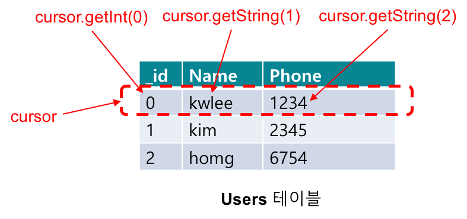

<style> 
div.polaroid {
  	width: 640px;
  	box-shadow: 0 10px 30px 0 rgba(0, 0, 0, 0.2), 0 16px 30px 0 rgba(0, 0, 0, 0.19);
  	text-align: center;
	margin-bottom: 0.5cm;
}
</style>

# **SQLite** 
---
1. [SQLite 개요](#1)
* [SQL (Structured Query Lanauge) 구문](#2)
* [스키마 (계약 클래스) 정의](#3)
* [SQLiteOpenHepler 클래스](#4)
	1. [SQLiteOpenHelper의 서브 클래스 정의](#4.1)
	2. [SQLiteOpenHelper 객체를 통한 DB 접근](#4.2)
* [SQLiteDatabase 클래스](#5)
	1. [SQL 실행을 위한 메소드](#5.1)
	2. [데이터베이스 조작과 조회를 위한 개별 메소드](#5.2)
* [SimpleCursorAdapter](#6)

- **예제 안드로이드 프로젝트 다운로드** [링크](https://minhaskamal.github.io/DownGit/#/home?url=https://github.com/kwanulee/Android/tree/master/examples/SQLiteDBTest) 
---
<a name="1"></a>
## 1. SQLite 개요
* SQLite 라이브러리
    - SQL (Structured Query Language) 문을 이용해 데이터를 조회하는 관계형 데이터베이스
    - 안정적 이며, 소규모 데이터베이스에 적합
    - 단순한 파일로 데이터를 저장 (별도의 서버 연결 및 권한 설정 불필요)
    - 복수 사용자는 지원되지 않음
    - 안드로이드의 일부로 포함됨

		
	

---
<a name="2"></a>
## 2. SQL 구문
* 데이터 정의 언어 (Data Definition Language)
    - <a href="https://ko.wikipedia.org/wiki/CREATE_(SQL)">CREATE</a> 테이블 생성
    - <a href="https://ko.wikipedia.org/wiki/CREATE_(SQL)">DROP</a> 테이블 삭제
    - <a href="https://ko.wikipedia.org/wiki/ALTER_(SQL)">ALTER</a> 테이블 속성 수정
* 데이터 조작 언어 (Data Manipulation Language)
    - <a href="https://ko.wikipedia.org/wiki/Insert_(SQL)">INSERT INTO</a> 레코드(행) 추가
    - <a href="https://ko.wikipedia.org/wiki/Update_(SQL)">UPDATE ~ SET</a> 레코드(행) 변경
    - <a href="https://ko.wikipedia.org/wiki/Delete_(SQL)">DELETE FROM</a> 레코드(행) 삭제
    - <a href="https://ko.wikipedia.org/wiki/Select_(SQL)">SELECT ~ FROM ~ WHERE</a> 레코드(행) 검색

---
<a name="3"></a>
## 3. 스키마 (계약 클래스) 정의
* **스키마**는 데이터베이스의 구성 체계에 대한 공식적인 선언
* **계약 (Contract) 클래스**라고 하는 도우미 클래스 내에 *테이블* 및 *컬럼*의 이름을 *상수*로 정의하고, 이를 통해 패키지 내의 모든 클래스에서 동일한 상수를 사용

```java
public final class UserContract {
    public static final String DB_NAME="user.db";
    public static final int DATABASE_VERSION = 1;
    private static final String TEXT_TYPE = " TEXT";
    private static final String COMMA_SEP = ",";
    // To prevent someone from accidentally instantiating the contract class,
    // make the constructor private.
    private UserContract() {}

    /* Inner class that defines the table contents */
    public static class Users implements BaseColumns {
        public static final String TABLE_NAME="Users";
        public static final String KEY_NAME = "Name";
        public static final String KEY_PHONE = "Phone";

        public static final String CREATE_TABLE = "CREATE TABLE " + TABLE_NAME + " (" +
                                                    _ID + " INTEGER PRIMARY KEY" + COMMA_SEP +
                                                    KEY_NAME + TEXT_TYPE + COMMA_SEP +
                                                    KEY_PHONE + TEXT_TYPE +  " )";
        public static final String DELETE_TABLE = "DROP TABLE IF EXISTS " + TABLE_NAME;
    }
}
```

https://github.com/kwanulee/Android/blob/master/examples/SQLiteDBTest/app/src/main/java/com/example/kwanwoo/sqlitedbtest/UserContract.java

---
<a name="4"></a>
## 4. SQLiteOpenHelper 클래스
* DB 생성 및 열기 담당

<a name="4.1"></a>
### 4.1. SQLiteOpenHelper의 서브 클래스 정의
* [SQLiteOpenHelper](https://developer.android.com/reference/android/database/sqlite/SQLiteOpenHelper.html)는 추상 클래스 이므로, 서브클래스에서 생성자와 아래의 콜백 메소드를 재정의 해야함
    - 생성자

		```java
		SQLiteOpenHelper(
		    Context context,                        // DB 생성 컨텍스트, 보통 메인 액티비티
		    String name,	                          // DB 파일 이름
		    SQLiteDatabase.CursorFactory factory,   // 표준커서 사용시 null
		    int version)                            // DB 버전
		```
	- 콜백 메서드 
	
	콜백 메서드     | 설명
	----------|--------------------------------
	onCreate  | **DB가 처음 만들어질 때 호출됨**. 테이블을 생성하고 초기 레코드를 삽입한다.
	onUpgrade | **DB 업그레이드 시 (DB버전을 올린 후 재시작 시) 호출됨**. 기존 테이블 삭제 및 생성하거나 ALTER TABLE로 스키마 수정
	
	- 생성된 DB는 애플리케이션과 관련된 전용 디스크 공간(**/data/data/패키지/databases**)에 저장되므로, 다른 애플리케이션이 액세스할 수 없음 
	

* 예제 코드
	
	```java
	public class DBHelper extends SQLiteOpenHelper {
	    final static String TAG="SQLiteDBTest";
	
	    public DBHelper(Context context) {
	        super(context, UserContract.DB_NAME, null, UserContract.DATABASE_VERSION);
	    }
	
	    @Override
	    public void onCreate(SQLiteDatabase db) {
	        Log.i(TAG,getClass().getName()+".onCreate()");
	        db.execSQL(UserContract.Users.CREATE_TABLE);
	    }
	
	    @Override
	    public void onUpgrade(SQLiteDatabase db, int i, int i1) {
	        Log.i(TAG,getClass().getName() +".onUpgrade()");
	        db.execSQL(UserContract.Users.DELETE_TABLE);
	        onCreate(db);
	    }
	    ...
	```

	https://github.com/kwanulee/Android/blob/master/examples/SQLiteDBTest/app/src/main/java/com/example/kwanwoo/sqlitedbtest/DBHelper.java#L11-L29

<a name="4.2"></a>
### 4.2. SQLiteOpenHelper 객체를 통한 DB 접근
* DB 접근 시 **[SQLiteOpenHelper](https://developer.android.com/reference/android/database/sqlite/SQLiteOpenHelper.html)** 객체의 다음 메서드를 호출하여 **[SQLiteDatabase](https://developer.android.com/reference/android/database/sqlite/SQLiteDatabase.html) 객체**를 얻는다.

	메서드               | 설명
	--------------------|------------------------------------------------------
	**[getReadableDatabase()](https://developer.android.com/reference/android/database/sqlite/SQLiteOpenHelper.html#getReadableDatabase())** | 읽기 위해 DB open. DB가 없거나 버전 변경 시 onCreate, onUpgrade가 호출됨.
	**[getWritableDatabase()](https://developer.android.com/reference/android/database/sqlite/SQLiteOpenHelper.html#getWritableDatabase())** | 읽고 쓰기 위해 DB open. 권한이 없거나 디스크 용량 부족 시 실패한다.
	
---
<a name="5"></a>
## 5. SQLiteDatabase 클래스
- [SQLiteDatabase](https://developer.android.com/reference/android/database/sqlite/SQLiteDatabase.html) 객체의 다양한 메소드를 이용하여 데이터베이스에 정보를 조작 (저장,삭제,수정) 및 조회를 수행

<a name="5.1"></a>
### 5.1. SQL 실행을 위한 메소드
* **[SQLiteDatabase](https://developer.android.com/reference/android/database/sqlite/SQLiteDatabase.html) 객체**의 다음 메소드를 통해 SQL문 실행
    - **void [execSQL](https://developer.android.com/reference/android/database/sqlite/SQLiteDatabase.html#execSQL(java.lang.String)) (String sql)**
        + SELECT 명령을 제외한 대부분의 명령을 직접 실행
    - **[Cursor](https://developer.android.com/reference/android/database/Cursor.html) [rawQuery](https://developer.android.com/reference/android/database/sqlite/SQLiteDatabase.html#rawQuery(java.lang.String,%20java.lang.String[]))(String sql, String[] selectionArgs)**
        + SELECT sql 문을 실행


* 예제 코드 (INSERT)

	```java
	    public void insertUserBySQL(String name, String phone) {
	        try {
	            String sql = String.format (
	                    "INSERT INTO %s (%s, %s, %s) VALUES (NULL, '%s', '%s')",
	                    UserContract.Users.TABLE_NAME,
	                    UserContract.Users._ID,
	                    UserContract.Users.KEY_NAME,
	                    UserContract.Users.KEY_PHONE,
	                    name,
	                    phone);
	
	            getWritableDatabase().execSQL(sql);
	        } catch (SQLException e) {
	            Log.e(TAG,"Error in inserting recodes");
	        }
	    }
	```	
	https://github.com/kwanulee/Android/blob/master/examples/SQLiteDBTest/app/src/main/java/com/example/kwanwoo/sqlitedbtest/DBHelper.java#L31-L46


* 예제 코드 (DELETE)
	
	```java
	    public void deleteUserBySQL(String _id) {
	        try {
	            String sql = String.format (
	                    "DELETE FROM %s WHERE %s = %s",
	                    UserContract.Users.TABLE_NAME,
	                    UserContract.Users._ID,
	                    _id);
	            getWritableDatabase().execSQL(sql);
	        } catch (SQLException e) {
	            Log.e(TAG,"Error in deleting recodes");
	        }
	    }
	```   	
	https://github.com/kwanulee/Android/blob/master/examples/SQLiteDBTest/app/src/main/java/com/example/kwanwoo/sqlitedbtest/DBHelper.java#L53-L64


* 예제 코드 (UPDATE)

	```java
    public void updateUserBySQL(String _id, String name, String phone) {
        try {
            String sql = String.format (
                    "UPDATE  %s SET %s = '%s', %s = '%s' WHERE %s = %s",
                    UserContract.Users.TABLE_NAME,
                    UserContract.Users.KEY_NAME, name,
                    UserContract.Users.KEY_PHONE, phone,
                    UserContract.Users._ID, _id) ;
            getWritableDatabase().execSQL(sql);
        } catch (SQLException e) {
            Log.e(TAG,"Error in updating recodes");
        }
    }
   	```
	
	https://github.com/kwanulee/Android/blob/master/examples/SQLiteDBTest/app/src/main/java/com/example/kwanwoo/sqlitedbtest/DBHelper.java#L66-L78


* 예제 코드 (SELECT)

	```java
	public class DBHelper extends SQLiteOpenHelper {
	...
	    public Cursor getAllUsersBySQL() {
	        String sql = "Select * FROM " + UserContract.Users.TABLE_NAME;
	*       return getReadableDatabase().rawQuery(sql,null);
	    } 
	```
	
	https://github.com/kwanulee/Android/blob/master/examples/SQLiteDBTest/app/src/main/java/com/example/kwanwoo/sqlitedbtest/DBHelper.java#L48-L51
	
---
* **Cursor** 객체를 통한 쿼리 결과 접근
	* 쿼리 결과는 결과셋 자체가 리턴되지 않으며 위치를 가리키는 커서(Cursor)로 리턴된다
	
	    - 커서의 메소드 목록
		
		메서드          | 설명
		---------------|-----------------------------------------------------------
		close          | 결과셋을 닫는다.
		getColumnCount | 컬럼의 개수를 구한다
		getColumnIndex | 이름으로부터 컬럼 번호를 구한다.
		getColumnName  | 번호로부터 컬럼 이름을 구한다.
		getCount       | 결과셋의 레코드 개수를 구한다.
		**getInt**         | 컬럼값을 정수로 구하며 인수로 컬럼 번호를 전달한다.
		getDouble      | 컬럼값을 실수로 구한다.
		**getString**      | 컬럼값을 문자열로 구한다.
		moveToFirst    | 첫 레코드 위치로 이동하며, 결과셋이 비어있을 시 false를 리턴한다.
		moveToLast     | 마지막 레코드 위치로 이동하며, 결과셋이 비어있을 시 false를 리턴한다.
		**moveToNext**     | 다음 레코드 위치로 이동하며, 마지막 레코드이면 false를 리턴한다.
		moveToPrevious | 이전 레코드로 이동하며, 첫 레코드이면 false를 리턴한다.
		moveToPosition | 임의의 위치로 이동한다.
	
		```java
		public class MainActivity extends AppCompatActivity {
			private DBHelper mDbHelper;
			...
		    private void viewAllToTextView() {
		        TextView result = (TextView)findViewById(R.id.result);
		
		        Cursor cursor = mDbHelper.getAllUsersBySQL();
		
		        StringBuffer buffer = new StringBuffer();
		        while (cursor.moveToNext()) {
		            buffer.append(cursor.getInt(0)+" \t");
		            buffer.append(cursor.getString(1)+" \t");
		            buffer.append(cursor.getString(2)+"\n");
		        }
		        result.setText(buffer);
		    }
		    ...
		```

		https://github.com/kwanulee/Android/blob/master/examples/SQLiteDBTest/app/src/main/java/com/example/kwanwoo/sqlitedbtest/MainActivity.java#L76-L88

<a name="5.2"></a>
### 5.2. 데이터베이스 조작과 조회를 위한 개별 메소드
* [SQLiteDatabase](https://developer.android.com/reference/android/database/sqlite/SQLiteDatabase.html)의  관련 메소드
	* long [**insert**](https://developer.android.com/reference/android/database/sqlite/SQLiteDatabase.html#insert(java.lang.String,%20java.lang.String,%20android.content.ContentValues)) (String table, String nullColumnHack, [ContentValues](https://developer.android.com/reference/android/content/ContentValues.html) values)
	* int [**delete**](https://developer.android.com/reference/android/database/sqlite/SQLiteDatabase.html#delete(java.lang.String,%20java.lang.String,%20java.lang.String[])) (String table, String whereClause, String[] whereArgs)
	* int [**update**](https://developer.android.com/reference/android/database/sqlite/SQLiteDatabase.html#update(java.lang.String,%20android.content.ContentValues,%20java.lang.String,%20java.lang.String[])) (String table, [ContentValues](https://developer.android.com/reference/android/content/ContentValues.html) values, String whereClause, String[] whereArgs)
	* [Cursor](https://developer.android.com/reference/android/database/Cursor.html) [**query**](https://developer.android.com/reference/android/database/sqlite/SQLiteDatabase.html#query(java.lang.String,%20java.lang.String[],%20java.lang.String,%20java.lang.String[],%20java.lang.String,%20java.lang.String,%20java.lang.String)) (String table, String[] columns, String selection, String[] selectionArgs, String groupBy, String having, String orderBy)

* 예제코드 (insert)

	```java
    public long insertUserByMethod(String name, String phone) {
        SQLiteDatabase db = getWritableDatabase();
        ContentValues values = new ContentValues();
        values.put(UserContract.Users.KEY_NAME, name);
        values.put(UserContract.Users.KEY_PHONE,phone);

        return db.insert(UserContract.Users.TABLE_NAME,null,values);
    }
	```
	
	https://github.com/kwanulee/Android/blob/master/examples/SQLiteDBTest/app/src/main/java/com/example/kwanwoo/sqlitedbtest/DBHelper.java#L80-L87
	
* 예제코드 (delete)
	
	```java
    public long deleteUserByMethod(String _id) {
        SQLiteDatabase db = getWritableDatabase();

        String whereClause = UserContract.Users._ID +" = ?";
        String[] whereArgs ={_id};
*   return db.delete(UserContract.Users.TABLE_NAME, whereClause, whereArgs);
    }
   	```
	
	https://github.com/kwanulee/Android/blob/master/examples/SQLiteDBTest/app/src/main/java/com/example/kwanwoo/sqlitedbtest/DBHelper.java#L94-L100
	
* 예제코드 (upate)

	```java
    public long updateUserByMethod(String _id, String name, String phone) {
        SQLiteDatabase db = getWritableDatabase();

        ContentValues values = new ContentValues();
        values.put(UserContract.Users.KEY_NAME, name);
        values.put(UserContract.Users.KEY_PHONE,phone);

        String whereClause = UserContract.Users._ID +" = ?";
        String[] whereArgs ={_id};

        return db.update(UserContract.Users.TABLE_NAME, values, whereClause, whereArgs);
    }
    ```
https://github.com/kwanulee/Android/blob/master/examples/SQLiteDBTest/app/src/main/java/com/example/kwanwoo/sqlitedbtest/DBHelper.java#L102-L113

* 예제코드 (query)

	```java
	    public Cursor getAllUsersByMethod() {
	        SQLiteDatabase db = getReadableDatabase();
*	    return db.query(UserContract.Users.TABLE_NAME,null,null,null,null,null,null);
	    }
	```
	
	https://github.com/kwanulee/Android/blob/master/examples/SQLiteDBTest/app/src/main/java/com/example/kwanwoo/sqlitedbtest/DBHelper.java#L89-L92
	
---
<a name="6"></a>
## 6. SimpleCursorAdapter

* [SimpleCursorAdapter](https://developer.android.com/reference/android/widget/SimpleCursorAdapter.html)를 이용하여 간편하게 리스트 뷰(어댑터 뷰)에 SELECT 결과를 출력

	``` java
	SimpleCursorAdapter (Context context,   
	      int layout,     // 어댑터 뷰 항목 표현을 위한 레이아웃  
	      Cursor c,       // 검색 결과를 가리키는 커서  
	      String[] from,  // 검색 결과에서 표시할 테이블 열들  
	      int[] to,       // 테이블 열의 값을 출력할 뷰 ID  
	      int flags)      // 보통은 0  
	```
* 예제
	
	```java
	public class MainActivity extends AppCompatActivity {
	    private DBHelper mDbHelper;
	    ...
	    private void viewAllToListView() {
	
	        Cursor cursor = mDbHelper.getAllUsersByMethod();
	
	        SimpleCursorAdapter adapter = new SimpleCursorAdapter(getApplicationContext(),
	                R.layout.item, cursor, new String[]{
	                UserContract.Users._ID,
	                UserContract.Users.KEY_NAME,
	                UserContract.Users.KEY_PHONE},
	                new int[]{R.id._id, R.id.name, R.id.phone}, 0);
	
	        ListView lv = (ListView)findViewById(R.id.listview);
	        lv.setAdapter(adapter);
	
	        lv.setOnItemClickListener(new AdapterView.OnItemClickListener() {
	            @Override
	            public void onItemClick(AdapterView<?> adapterView, View view, int i, long l) {
	                Adapter adapter = adapterView.getAdapter();
	
	                mId.setText(((Cursor)adapter.getItem(i)).getString(0));
	                mName.setText(((Cursor)adapter.getItem(i)).getString(1));
	                mPhone.setText(((Cursor)adapter.getItem(i)).getString(2));
	            }
	        });
	        lv.setChoiceMode(ListView.CHOICE_MODE_SINGLE);
	    }

	```

	https://github.com/kwanulee/Android/blob/master/examples/SQLiteDBTest/app/src/main/java/com/example/kwanwoo/sqlitedbtest/MainActivity.java#L90-L115

* item.xml for SimpleCursorAdapter

	```xml
	<LinearLayout xmlns:android="http://schemas.android.com/apk/res/android"
	    android:orientation="horizontal"
	    android:layout_width="match_parent"
	    android:layout_height="match_parent"
	    android:padding="5dp">
	
	    <TextView
	        android:id="@+id/_id"
	        android:layout_width="wrap_content"
	        android:layout_height="wrap_content"
	        android:padding="5dp"
	        android:textColor="@color/colorAccent"
	        android:gravity="center"
	        />
	    <TextView
	        android:id="@+id/name"
	        android:layout_width="wrap_content"
	        android:layout_height="wrap_content"
	        android:padding="5dp"
	        android:textColor="@color/colorPrimaryDark"
	        android:layout_weight="1"
	        android:gravity="center"
	        />
	    <TextView
	        android:id="@+id/phone"
	        android:layout_width="wrap_content"
	        android:layout_height="wrap_content"
	        android:padding="5dp"
	        android:textColor="@color/colorPrimaryDark"
	        android:layout_weight="1"
	        android:gravity="center"
	        />
	</LinearLayout>
	```

	https://github.com/kwanulee/Android/blob/master/examples/SQLiteDBTest/app/src/main/res/layout/item.xml