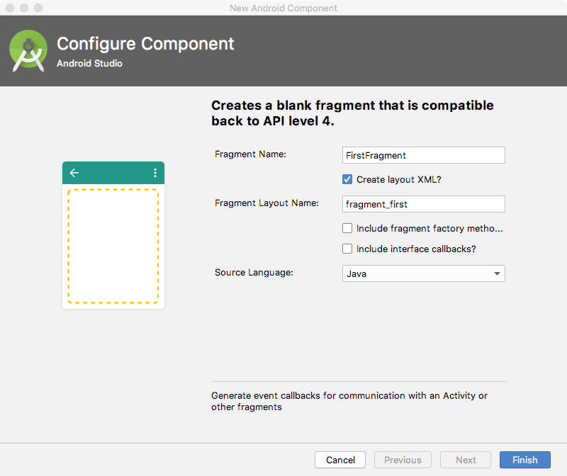

#### [연습1] - 프래그먼트 정의하기 
1. *FragmentBasic* 이라는 프로젝트를 생성한다.
2. 안드로이드 스튜디오에서 **File > New > Fragment > Fragment(Blank)** 를 이용하여 쉽게 생성
3. **Configure Component** 대화창에서 아래와 같이 설정후, **Finish** 버튼을 클릭
	- **Fragment Name** 값을 *FirstFragement*로 설정 
	- **Fragment Layout Name** 값을 *fragment\_first*로 설정 
	- **Include fragment factory metho..** 체크 안함
	- **Include interface callbacks?** 체크 안함 

	
4. [**확인**] 프로젝트에서 다음의 변경사항을 확인해 본다.
	- FirstFragment 클래스가 생성됨
	- fragment\_first.xml 파일이 생성됨

5. 자동으로 생성된 fragment\_first.xml 파일을 열고, **FrameLayout**에 다음과 가티 **background** 속성을 추가

	```xml
	<?xml version="1.0" encoding="utf-8"?>
<FrameLayout xmlns:android="http://schemas.android.com/apk/res/android"
    xmlns:tools="http://schemas.android.com/tools"
    android:layout_width="match_parent"
    android:layout_height="match_parent"
    android:background="@android:color/holo_orange_light"
    tools:context=".FirstFragment">

    <!-- TODO: Update blank fragment layout -->
    <TextView
        android:layout_width="match_parent"
        android:layout_height="match_parent"
        android:text="@string/hello_blank_fragment" />
</FrameLayout>
	```
