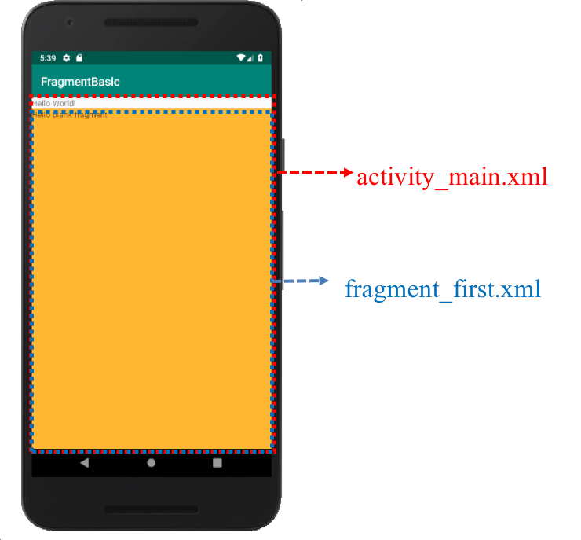

#### [연습2] - 프래그먼트를 액티비티의 레이아웃 파일에 정적 추가하기 
1. [연습1](exercise1.html)에서 생성한 프로젝트를 바탕으로 진행
2. activity\_main.xml 파일을 열고, 프래그먼트를 레이아웃 파일 안에서 선언

	```xml
	<?xml version="1.0" encoding="utf-8"?>
	<LinearLayout xmlns:android="http://schemas.android.com/apk/res/android"
	    android:layout_width="match_parent"
	    android:layout_height="match_parent"
	    android:orientation="vertical">
	    <TextView
	        android:layout_width="wrap_content"
	        android:layout_height="wrap_content"
	        android:text="Hello World!" />
	    <fragment
	            android:name="com.kwanwoo.android.fragmentbasic.FirstFragment"
	            android:layout_width="match_parent"
	            android:layout_height="match_parent"
	            android:id="@+id/fragment"
	            />
	</LinearLayout>

	```
	
	- **\<fragment\>** 안의 **android:name** 속성 값은 앞서 정의한 Fragment 클래스 이름을 패키지 이름까지 포함하여 설정. (위 코드에서 예시된 FirstFragment 클래스는 com.kwanwoo.android.fragmentbasic 패키지에 정의된 것으로 가정한다.) 
3. 실행결과

