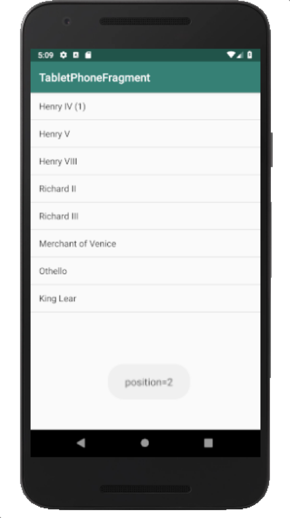

#### [연습5] - 프래그먼트-액티비티 통신 방법 (액티비티에서 직접 구현된 메소드 호출) 
1. [연습4](exercise4.html)에서 수행한 프로젝트를 바탕으로 진행
2. **activity\_main.xml** 파일을 열고, 앞서 정의한 **TitlesFragment**를 정적으로 추가	 

	```xml
	<?xml version="1.0" encoding="utf-8"?>
	<LinearLayout xmlns:android="http://schemas.android.com/apk/res/android"
	    android:layout_width="match_parent"
	    android:layout_height="match_parent"
	    android:orientation="vertical">
	
	    <fragment
	        android:name="com.android.tabletphonefragment.TitlesFragment"
	        android:id="@+id/titles"
	        android:layout_width="match_parent"
	        android:layout_height="match_parent" />
	
	</LinearLayout>	
	```
	
3. **MainActivity.java** 파일에서, **public void onTitleSelected(int i)** 메소드 정의하기

	```java
	public class MainActivity extends AppCompatActivity {
	
	    @Override
	    protected void onCreate(Bundle savedInstanceState) {
	        super.onCreate(savedInstanceState);
	        setContentView(R.layout.activity_main);
	    }
	
	    public void onTitleSelected(int i) {
	        Toast.makeText(getApplicationContext(),"position="+i,Toast.LENGTH_SHORT).show();
	    }
	}
	```
4. **TitlesFragment**의 ListView의 항목이 선택되었을 때 선택된 항목 위치를 **MainActivity**의 **onTitleSelected()**메소드를 호출하면서 파라미터로 전달
	- **onItemClick()** 메소드 재정의

	```java
	public class TitlesFragment extends Fragment {
		// ... 기존 코드와 동일
	    @Override
	    public View onCreateView(LayoutInflater inflater, ViewGroup container,
	                             Bundle savedInstanceState) {
	        
	        // ... 기존 코드와 동일
	        
	        // 리스트뷰 항목이 선택되었을 때, 항목 클릭 이벤트 처리
	        listView.setOnItemClickListener(new AdapterView.OnItemClickListener() {
	            @Override
	            public void onItemClick(AdapterView<?> adapterView, View view, int position, long id) {
	                // 현재 프래그먼트와 연결된 액티비티를 반환
	                Activity activity = getActivity();
	
	                // 선택된 항목 위치 (position)을 이 프래그먼트와 연결된 MainActivity로 전달
	                if (activity instanceof MainActivity)
	                    ((MainActivity)activity).onTitleSelected(position);
	            }
	        });
	        return rootView;
	    }
	
	}
	```
	
4. 실행결과

