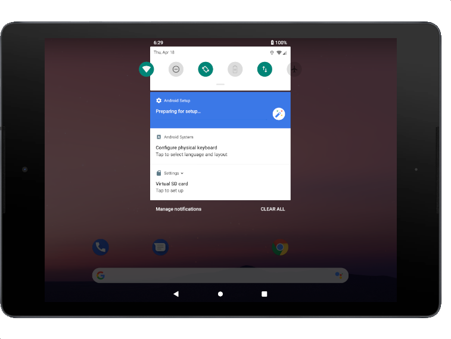
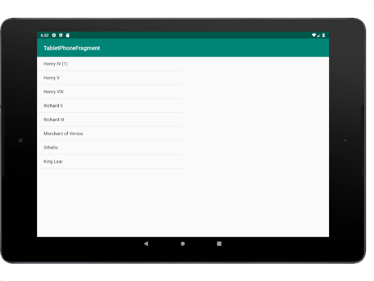

#### [연습7] - 태블릿용 화면 레이아웃 추가하기 
1. [연습6](exercise6.html)에서 수행한 프로젝트를 바탕으로 진행
2. 액티비티에 큰화면 레이아웃을 추가
	- **res/layout** 에서 마우스 오른쪽 클릭
	- **File name**은 activity\_main.xml
	- **New > Layout resource file** 선택
	- **Available Qualifiers**에서 **Size** 선택한후, **>>** 버튼 클릭
	- **Screen Size**에서 *Large*를 선택 후, **OK** 버튼 클릭

3. **res/layout\_large**폴더에 있는 **activity\_main.xml** 파일을 열고, 다음과 같이 레이아웃을 정의	 

	```xml
	<?xml version="1.0" encoding="utf-8"?>
	<LinearLayout xmlns:android="http://schemas.android.com/apk/res/android"
	    android:layout_width="match_parent"
	    android:layout_height="match_parent"
	    android:orientation="horizontal">
	
	    <fragment
	        android:name="com.android.tabletphonefragment.TitlesFragment"
	        android:id="@+id/titles"
	        android:layout_weight="1"
	        android:layout_width="0px"
	        android:layout_height="match_parent" />
	    <FrameLayout
	        android:id="@+id/details"
	        android:layout_weight="1"
	        android:layout_width="0px"
	        android:layout_height="match_parent" />
	
	</LinearLayout>	
	```
	
	
4. 태블릿용 AVD 생성
	- **Tools**>**AVD Manager** 메뉴를 선택
	- 새로운 AVD를 생성
		- Category: Tablet
		- Name: Nexus 5X

5. 테블릿용 AVD에서 실행
	- 디바이스가 **회전**이 안되도록 설정되어 있으면, 화면을 위에서 아래로 쓸어내리면 **디바이스 회전**을 가능케 하는 버튼을 활성화 시킨다.

		    
		 
	- 실행결과

		
		