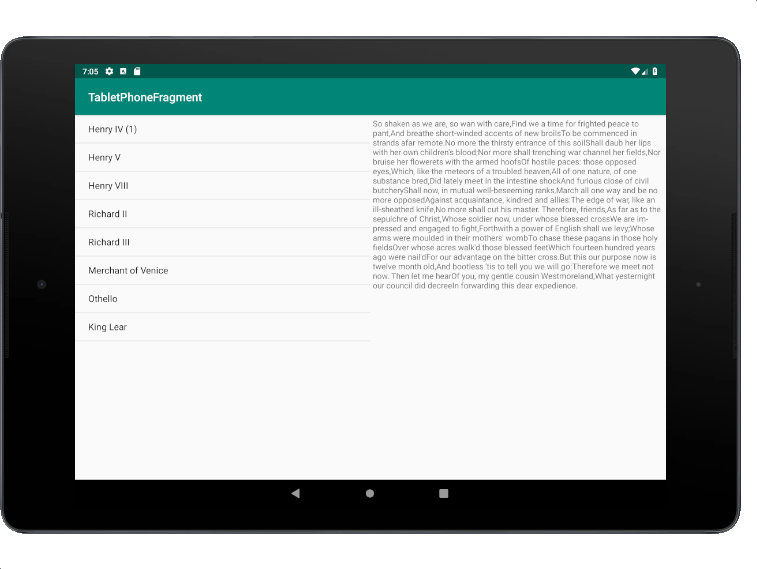

#### [연습8] - 선택된 항목의 상세정보를 보여주는 DetailsFragment 추가하기 
1. [연습7](exercise7.html)에서 수행한 프로젝트를 바탕으로 진행
2. 안드로이드 스튜디오에서 **File > New > Fragment > Fragment(Blank)** 를 이용하여 DetailsFragment를 생성한다.
3. **Configure Component** 대화창에서 아래와 같이 설정후, **Finish** 버튼을 클릭
	- **Fragment Name** 값을 *DetailsFragement*로 설정 
	- **Fragment Layout Name** 값을 *fragment\_details*로 설정 
	- **Include fragment factory metho..** 체크 안함
	- **Include interface callbacks?** 체크 안함 
4. **fragment\_details.xml** 파일을 열고, TextView 위젯을 포함한 레이아웃 정의

	```xml
	<LinearLayout xmlns:android="http://schemas.android.com/apk/res/android"
	    xmlns:tools="http://schemas.android.com/tools"
	    android:layout_width="match_parent"
	    android:layout_height="match_parent"
	    android:padding="5dp"
	    >
	
	    <ScrollView
	        android:layout_width="match_parent"
	        android:layout_height="match_parent">
	        <TextView
	            android:layout_width="match_parent"
	            android:layout_height="match_parent"
	            android:text="@string/hello_blank_fragment"
	            android:id="@+id/textview"/>
	    </ScrollView>
	</LinearLayout>
	```
5. **DetailsFragment.java**
	- DetailsFragment 클래스는 TitlesFragment의 목록에서 선택된 항목 번호를 저장하기 위한 index 멤버 변수가 정의되어 있고, 이 변수의 값은 setSelection 메소드에 의해 설정됩니다.

	- DetailsFragement 클래스는 fragment 이므로 onCreateView() 메소드를  통해 이 프래그먼트와 관련된 View 객체를 반환해야 합니다.

		- 이 프래그먼트의 뷰를 정의한 레이아웃 리소스가 fragment_details 이므로, 이 리소스로부터  뷰 객체를 얻어오고, 이 뷰 객체 내에 포함된 텍스트 뷰 객체에 TitlesFragment의 목록에서 선택된 항목 번호에 대응되는 상세정보를 표시합니다. 
		

	```java
	public class DetailsFragment extends Fragment {
	   int index=-1;
	
	    public DetailsFragment() {
	        // Required empty public constructor
	    }
	
	    public void setSelection(int i) { index = i; }
	
	
	    @Override
	    public View onCreateView(LayoutInflater inflater, ViewGroup container,
	                             Bundle savedInstanceState) {
	        // Inflate the layout for this fragment
	        View view = inflater.inflate(R.layout.fragment_details, container, false);
	        TextView tv = (TextView)view.findViewById(R.id.textview);
	
	        if (index >=0)
	            tv.setText(Shakespeare.DIALOGUE[index]);
	
	        return view;
	    }
	}
	```
6. **MainActivity.java**
	- **onTitleSelected()** 메소드에서 파라미터로 전달받은 항목 선택 번호를 새롭게 생성된 DetailsFragment 객체에게 setSelection() 메소드를 통해 전달
	- 새롭게 설정된 DetailsFragment 객체를 동적으로 교체

```java
public class MainActivity extends AppCompatActivity
                        implements TitlesFragment.OnTitleSelectedListener{

    //... 기존과 동일
    
    public void onTitleSelected(int i) {
        //Toast.makeText(getApplicationContext(),"position="+i,Toast.LENGTH_SHORT).show();
        DetailsFragment detailsFragment = new DetailsFragment();
        detailsFragment.setSelection(i);
        getSupportFragmentManager().beginTransaction().replace(R.id.details, detailsFragment).commit();
    }
}

```

7. 실행결과

	