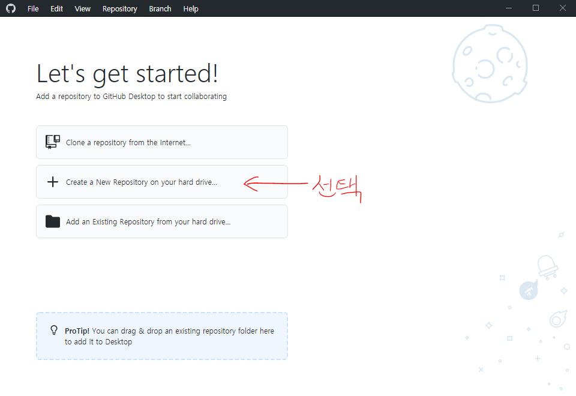
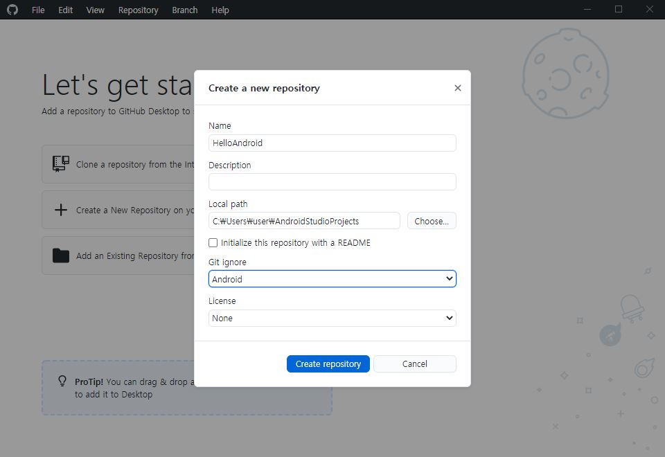
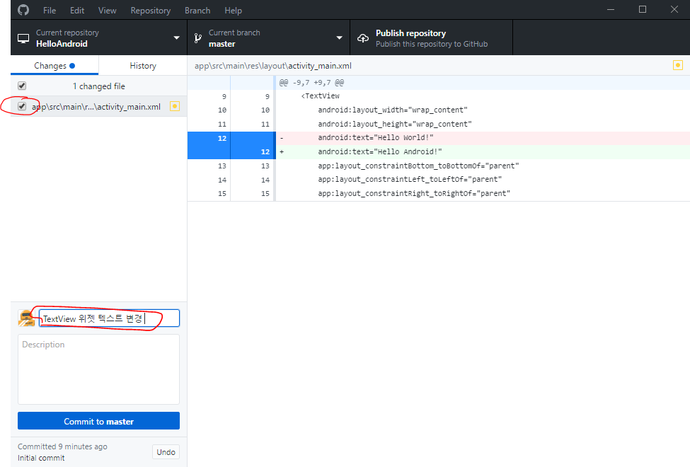
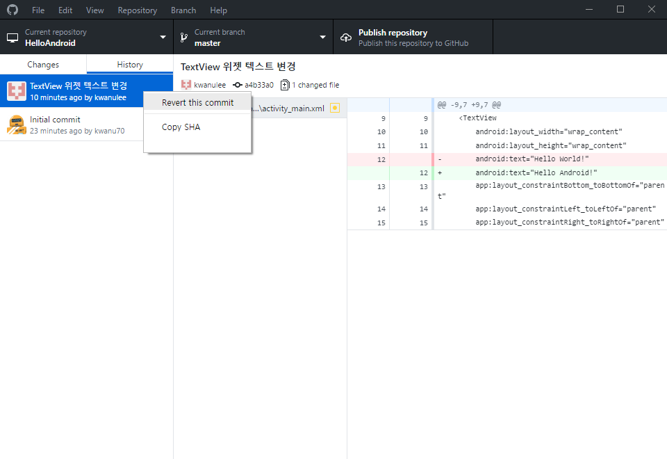
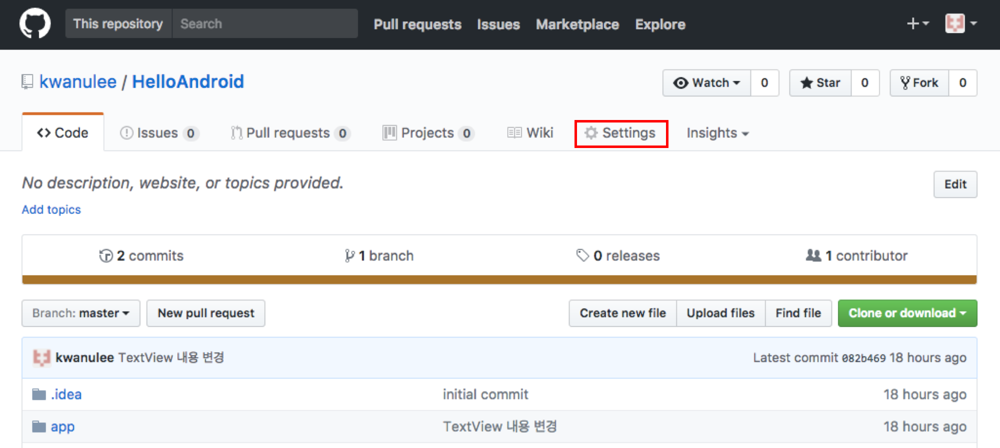
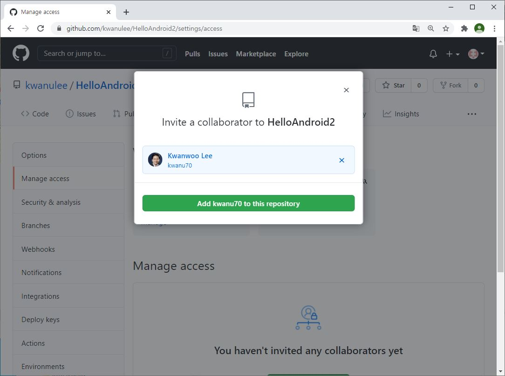
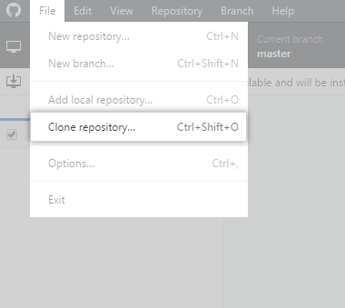
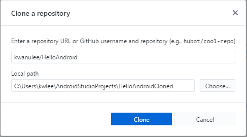
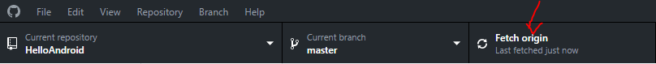

# **Git과 GitHub**을 이용한 프로젝트 관리 
## 학습목표
- Git/GitHub을 이용한 프로젝트 버전 관리 방법을 이해한다.
- GitHub을 이용한 프로젝트 협업 방법을 이해한다.

---

## 1. Git/Github 개요
- [**git**](https://git-scm.com/)이란? 
	- 소스코드의 변경을 효과적으로 관리하기 위해 개발된 '**[분산형 버전 관리 시스템](https://git-scm.com/book/ko/v1/%EC%8B%9C%EC%9E%91%ED%95%98%EA%B8%B0-%EB%B2%84%EC%A0%84-%EA%B4%80%EB%A6%AC%EB%9E%80%3F#분산-버전-관리-시스템)**'
	- 소스코드 외에 **텍스트 기반 파일의 버전관리**에 널리 사용되고 있다. 

- [**GitHub**](https://github.com/)이란?
	-  **git**의 원격 저장소로서 **협업플랫폼의 역할**을 수행한다. 
	- 여기서 **저장소**란 버전관리 대상이 되는 특정한 프로젝트의 파일들을 저장하는 공간을 나타내며, 지역 저장소와 원격 저장소로 구분된다. 
		-  *지역 저장소*는 현재 작업하고 있는 컴퓨터 내에 위치하는 프로젝트 파일을 저장하는 디렉토리를 의미
		-  *원격 저장소*는 인터넷 상의 서버에 위치하며, 여러 **git** 클라이언트와 공유될 수 있다.

- [**GitHub Desktop**](https://desktop.github.com/)이란?
	- GUI 기반의 **git 클라이언트** 중에 하나
- 이 문서에서는 **GitHub Desktop**를 이용하여 **Android Project**의 소스를 관리하는 두 가지 시나리오를 설명한다. 

	1. [**Android Project**의 버전관리](#2)
	2. [**GitHub**을 이용한 협업하기](#3)

## 2. **Android Project**의 버전관리
- **Android Project**의 버전관리 시나리오는 다음과 같다.

	1. [**Android Project**를 위한 새로운 지역 **git** 저장소 생성](#1.1)
	2. [**Android Project**의 일부 파일을 수정 후, 지역 **git** 저장소에 커밋(commit)](#1.2)
	3. [**git** 저장소를 이전 커밋(commit)으로 되돌림 (*필요한경우*)](#1.3) 
	4. [원격 **git** 저장소(**GitHub**)에 푸시(push)](#1.4)

---

###0. 사전준비
- [**Android Project** 생성 (예, HelloAndroid)](https://kwanulee.github.io/AndroidProgramming/intro-android/start-android-project.html#start-android)
- [**git** 클라이언트 설치](install_git_clients.html) 
- [**GitHub** 계정 만들기](https://git-scm.com/book/ko/v2/GitHub-%EA%B3%84%EC%A0%95-%EB%A7%8C%EB%93%A4%EA%B3%A0-%EC%84%A4%EC%A0%95%ED%95%98%EA%B8%B0)  

###가. **Android Project**를 위한 새로운 지역 **git** 저장소 생성
1. **GitHub Desktop** 시작화면에서 **Create new repository** 클릭
	

		 
	
	

	[**다른 방법**] [**File**] 메뉴에서 [**New respository..**] 클릭
	

		
	
	
	
2. 다음 정보 입력 및 선택 후 [**Create repository**] 선택
	- [**Name**]: 저장소 (프로젝트) 이름 (예, *HelloAndroid* - 이 이름의 Android Project이 생성된 것을 가정 )
	- [**Local path**]: 저장소의 위치 (예, *C:\Users\kwlee\AndroidStudioProjects*)
	- [Git ignore]: **Android** 선택 (Git에서 버전관리되지 않는 대상 파일들을 설정한 것)
	

		
	

3. 새로운 **git** 저장소(예, *C:\Users\kwlee\AndroidStudioProjects\HelloAndroid*)에 .git 폴더 및 .gitattributes, .gitignore 파일이 생성되어 있음을 확인할 수 있다.

###나. **Android Project**의 일부 파일을 수정 후, 지역 **git** 저장소에 커밋(commit)
	
- **커밋(commit)**이란 하나 이상의 파일에 대한 변경을 **git** 저장소에 저장하는 것을 의미한다. 다음은 **Android Project**의 일부 파일을 수정 후, 지역 **git** 저장소에 커밋을 하는 절차를 설명한다.

	1. **[Android Studio]**:  **Android Project**의 일부 파일을 수정 
	
		예를 들어, **HelloAndroid** 프로젝트에서 *activity_main.xml* 파일의 **TextView** 위젯의 *android:text* 속성 값을 '*Hello Android*'로 변경 
	
	2. **[GitHub Desktop]**: 커밋에 포함시킬 혹은 포함하지 않을 변경을 선택 하고, 커밋 메시지 작성후, [**Commit to BRANCH**] 클릭 
		

			
		

###다. 지역 **git** 저장소를 이전 커밋(commit)으로 되돌림 (*필요한 경우*)
- 다음은 현재 **git** 저장소를 이전 커밋 상태로 되돌리는 방법이다. 만약 여러 커밋을 되돌리고자 하는 경우에는 최신것부터 시작하여 순서대로 되돌리는 것이 좋다.

	1. **[GitHub Desktop]**: **History** 탭의 커밋 목록에서 되돌리고자 하는 커밋의 오른쪽 마우스버튼  클릭 후, 메뉴의 **Revert this commit** 클릭 
		

			
		

###라. 지역 **git** 저장소를 원격 저장소(**GitHub**)에 푸시(push)

1. **GitHub Desktop**에서 **GitHub** 계정에 로그인 설정 

	- **File** > **Options..** 메뉴를 클릭
	- **GitHub.com**의 **Sign in** 버튼 클릭 
	- **Sign in** 화면에서 **GitHub**의 Username과 Password 입력후 **Sign in** 클릭 
		

			
		

2. 작업중인 지역 **git** 저장소를 원격 저장소(**GitHub**)에 올리기
	- **GitHub Desktop** 화면 상단의 **Publish repository** 클릭 
	- *Keep this code private* 체크박스 선택 해제 후, [**Publish repository**] 버튼 클릭
	 	

			
		

3. 웹브라우저를 통해 **GitHub**의 원격 저장소에 지역 **git** 저장소의 내용이 동기화 되어 있는 확인  
	

			
		

## 3. **GitHub**이용한 협업하기
-  가정
	- GitHub에 두 개의 사용자 계정(예, kwanulee, kwanu70)이 존재 
	- kwanulee/HelloAndroid 저장소가 존재
	- **kwanulee/HelloAndroid 저장소를 kwanulee와 kwanu70이 공유하여 협업하고자 함**
- **GitHub**이용한 협업하기 시나리오는 다음과 같다.
	1. **kwanulee/HelloAndroid** 저장소의 Collaborator로 *kwanu70*을 추가 (참조. [가. **GitHub** 저장소에 Collaborator 추가하기](#2.1))
	2. *kwanu70*은 **kwanulee/HelloAndroid** 원격 저장소의 파일을 지역 **git** 저장소로 복제 (참조. [나. **GitHub** 저장소를 복제하기](#2.2))
	3. *kwanu70*은 지역 **git** 저장소로 복제된 파일을 변경/커밋하고, 이를 **kwanulee/HelloAndroid** 저장소와 동기화  (참조. [다.  복제된 **GitHub** 저장소를 수정하고 동기화하기](#2.3))
	4.  *kwanulee*는 자신의 지역 **git** 저장소를 **kwanulee/HelloAndroid** 원격 저장소의 최신 상태로 동기화 (참조. [라.  원격 **GitHub** 저장소의 최신 내용을  지역 **git** 저장소로 가져오기](#2.4))

### 가. **GitHub** 저장소에 Collaborator 추가하기
1. **GitHub** 저장소의 메인 화면에서 **Settings** 탭 선택
	

			
	

2. **Settings** 탭의 왼쪽 메뉴 중에 **Manage access** 선택 한후  **Invite a collaborator**를 클릭한다.  Collaborator로 추가할 **GitHub** 계정 ID (예, *kwanu70*)를 입력하고, [**Add XXXXX to this repository**] 클릭
	

			
	

3. Collaborator로 추가한 계정 사용자의 이메일로 아래와 같은 내용의 이메일이 전송되며, **View inviation**을 클릭하여 요청을 확인한다.
	

			
	

	
4. 다음과 같은 페이지가 나오면 **Accept invitation**을 클릭하여 Collaborator 요청을 받아들인다. 
	

			
	

### 나. **GitHub** 저장소를 복제하기

1. **GitHub Desktop**의 [**File**] 메뉴에서 [**Clone respository..**] 클릭
	

		
	
	
2. 저장소 복제 
	- **GitHub 사용자이름**과 복제(Clone)하려는 **GitHub 리파지토리**를 입력, (예, kwanulee/HelloAndroid)
	- 복제할  리포지토리가 저장될 로컬 패스를 지정 후, [**Clone**] 클릭 
	

		
	
	

### 다. 복제된 **GitHub** 저장소를 수정하고 동기화하기
1. AndroidStudio에서 복제된 *HelloAndroidCloned* 프로젝트를 열고, activity_main.xml 파일을 변경
	<code>

		<?xml version="1.0" encoding="utf-8"?>
		<LinearLayout xmlns:android="http://schemas.android.com/apk/res/android"
		    xmlns:app="http://schemas.android.com/apk/res-auto"
		    xmlns:tools="http://schemas.android.com/tools"
		    android:layout_width="match_parent"
		    android:layout_height="match_parent"
		    android:orientation="vertical"
		    tools:context="com.example.kwlee.helloandroid.MainActivity">
	
		    <TextView
		        android:layout_width="wrap_content"
		        android:layout_height="wrap_content"
		        android:text="Hello Android!"
		        />
		
		</LinearLayout>
	</code>

2. 커밋에 포함시킬 혹은 포함하지 않을 **변경을 선택**하고 **커밋 메시지 작성**후, [**Commit to master**] 클릭 
	

		
	

	 
5. **GitHub Desktop** 화면 우측 상단의 [**Push origin**] 버튼 클릭
		

			
		

		
6. 웹브라우저를 통해 **GitHub**의 원격 저장소에 지역 **git** 저장소의 내용이 동기화 되어 있는 확인  
	

			
		

 

### 라. 원격 **GitHub** 저장소의 최신 내용을  지역 **git** 저장소로 가져오기
1. **[GitHub Desktop]**의 **Fetch origin**을 클릭
	

			
		

2. 만약 원격 **GitHub** 저장소에서 지역 **git** 저장소로 가져올 커밋이 존재한다면, **Pull origin**을 클릭하여 원격 **GitHub** 저장소의  커밋을 가져온다.
	

			
		

