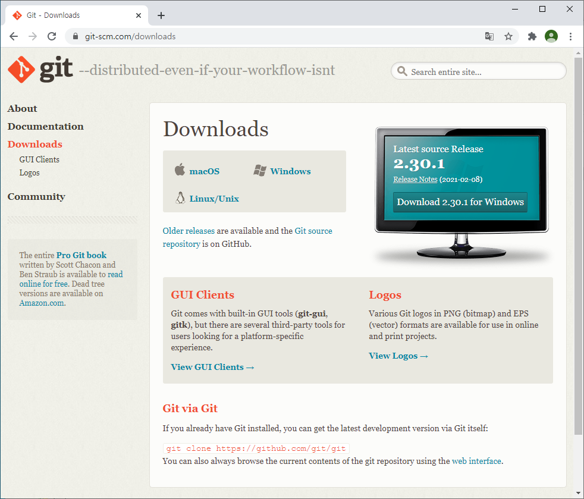
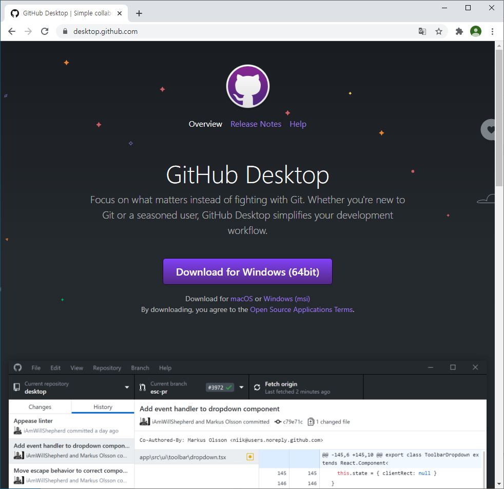
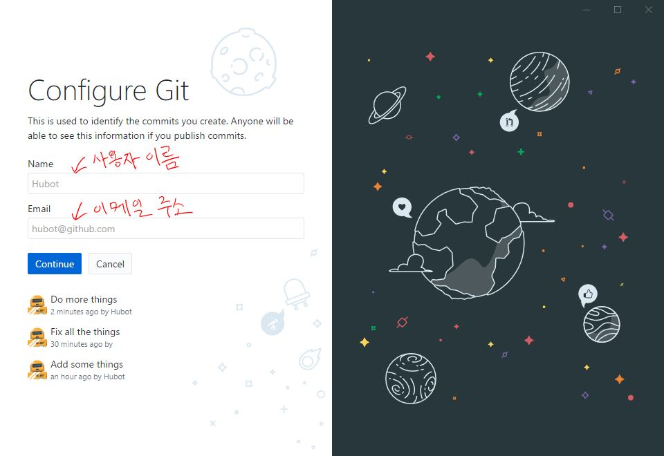
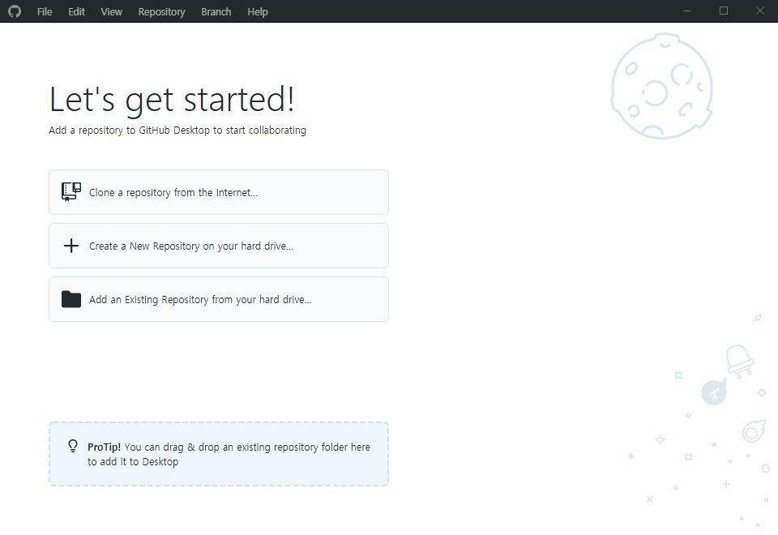

# **git** 클라이언트 설치

1. git 다운로드 사이트 접속 
	- 명령어 기반 git 클라이언트 다운로드 [https://git-scm.com/downloads](https://git-scm.com/downloads)
	

		
	

	- GUI 기반 git 클라인트 다운로드 [https://git-scm.com/downloads/guis](https://git-scm.com/downloads/guis)
	

		
	

	
2. GitHubDesktop 선택하여 다운로드

	GUI 기반 git 클라이언트가 초보자에게는 사용하기에 더 적합하므로, GUI 기반 git 클라이언트 중에서 많이 사용되는 GitHubDesktop을 설치를 예시한다. GUI 기반 git 클라이언트 중에서 다른 도구 (예, **SourceTree**)를 설치하여 사용해도 된다. 

	

		
	

3. 다운로드한 **GitHubDesktopSetup.exe** 클릭하여 설치 시작 

	a. [Skip this step] 클릭

	b. [**Name**]과 [**Email**] 란에 사용자 이름과 이메일 주소 입력 후, [**Continue**] 클릭 
		

			
		

	c. [**Finish**] 버튼 클릭하여 설치 완료 
		

			
		
	
	