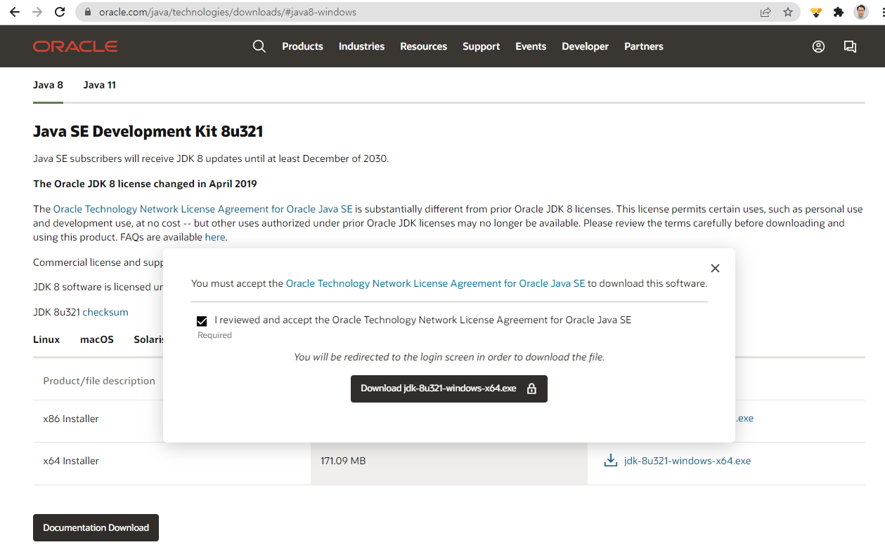

[**이전 학습**: 안드로이드 소개](intro_android.html)

# 개발환경 설치
1. [Java SE Development Kit 8 설치](#install_jdk)
2. [Android Studio 설치](#install_android_studio)
3. [SDK Manager를 이용하여 최신 SDK 도구와 플랫폼을 설치](#sdk_tools_plaforms)

## 1. Java SE Development Kit 8 설치
1. 아래 링크를 클릭하여 JavaSE 다운로드 사이트 접속

	https://www.oracle.com/java/technologies/javase-jdk8-downloads.html

2. 본인 운영체제에 맞는 JDK를 선택후,  **Oracle Technology Network License Agreement for Oracle Java SE**의 체크박스 체크 하여 다운로드 진행
	- 오라클 계정이 없는 경우에는 계정 만들기를 먼저 진행한 후에 오라클 계정으로 로그인해야 함
	

		
	 
	

	* Windows 운영체제
		- 32비트인 경우: Windows x86 다운로드
		- 64비트인 경우: Windows X64 다운로드
	* MAC 운영체제: Mac OS X 다운로드
3. 다운로드한 설치파일을 더블클릭하여 설치 진행
	
4. **Windows** 운영체제 경우에는 환경변수 업데이트
	* [**시작**] - [**제어판**] - [**시스템 및 보안**] - [**시스템**] - [**고급 시스템 설정**] - [**환경 변수**] 클릭하여 **환경 변수** 설정창 오픈
	* *시스템 변수(S)*의 **PATH**를 찾아 선택 후 **편집**을 눌러, JDK가 설치된 디렉토리의 bin 하위 디렉토리의 경로를 추가. (가령, JDK 가 설치된 디렉토리가 “C:\Program Files\Java\jdk1.8.0\_241” 이라면 “C:\Program Files\Java\jdk1.8.0\_241\bin” 경로를 추가

		

			
		

5. 명령 프롬프트을 열어 javac를 입력하여 아래와 같이 뜨는지 확인

	

		
	

## 2. Android Studio 설치
1. 아래 링크를 클릭하여 Android Studio 공식 IDE 다운로드 사이트 접속
	[https://developer.android.com/studio/](https://developer.android.com/studio/)

	

		
	

2. 사용약관 동의 후에 Android Studio 다운로드

	

		
	

3. 다운로드한 파일을 더블클릭하여 설치마법사의 안내에 따라 설치
	- 2021년 2월 현재, Android Studio 최신버전은 **4.1.1**
	- 다음 화면 캡처는 **3.5.3** 버전의 설치과정이나, 최신버전의 설치과정과 유사함.
	
	

	 	
	

    

    	
  	

   	

    	
  	

    	

    
  	

    

    	
  	

    

    	
  	

    

    	
  	

    

    	
  	

    

    	
  

    

    
  

    

    
  

    

    
  

  

    

    
  

  

    

    
  

  

## 3. SDK Manager를 이용하여 최신 SDK 도구와 플랫폼을 설치

1. **SDK Manager** 실행시키기

	다음 두 가지 방법 중 하나를 이용하여 SDK Manger를 실행시킨다.

	- Android Studio 시작 화면 하단의 [**Configure**] 클릭 후, 메뉴에서 [**SDK Manager**] 선택
	  

			
		

	- Android Studio 프로젝트 화면에서 [*SDK Manger 아이콘*] 클릭
		

			
		

2. **SDK Manager**는 앱 개발에 필요한 SDK 플랫폼, SDK 도구, 기타 구성요소를 제공

  - **SDK Platforms** 탭에서 필요한 SDK 플랫폼 설치
    

      
    

    - *Show Package Details* 체크박스를 클릭하면, 각 SDK 플랫폼 패키지에 포함되어 있는 SDK 플랫폼, 소스, 시스템 이미지들을 자세히 볼 수 있슴.

        

        
        

    - 이 중에서  **Android SDK 플랫폼 버전**과 하나 이상의 **시스템 이미지**를 선택한 후, **OK** 버튼 클릭

  		 

  			
  		 

  - </a>**SDK Tools** 탭에서 필요한 SDK 도구 설치

		

			
		

		- 기본 SDK 도구
			* Android SDK Build-Tools
			* Android SDK Platform-Tools
			* Android Emulator
		- 추가 지원 도구
			* Intel X86 Emulator Accerlerator (HAXM installer)
			* Google Play services

---

[**다음 학습**: 안드로이드 앱 시작하기](start-android-project.html)