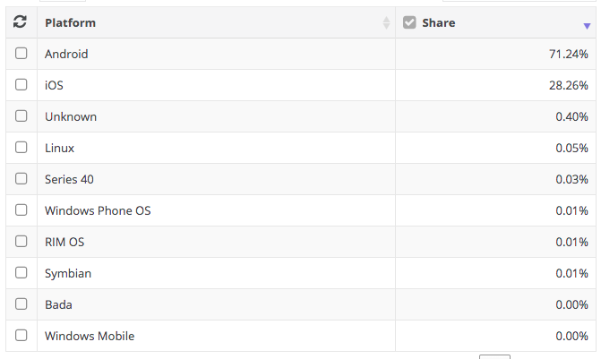
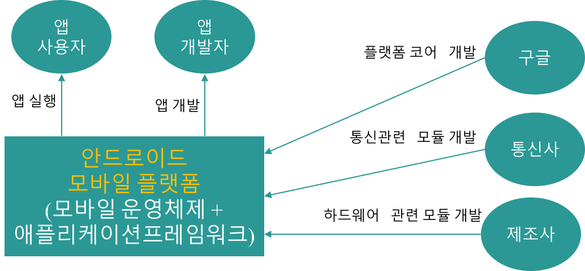

[**목차**: 안드로이드 개요](https://kwanulee.github.io/AndroidProgramming/#1)

# 안드로이드 소개

## 1. 안드로이드란?
- 안드로이드는 스마트폰을 포함한 다양한 **안드로이드 디바이스**를 위한 **모바일 운영체제** 혹은 **모바일 플랫폼**을 일컫음

	- **안드로이드 디바이스**는 안드로이드 운영체제를 기반으로 실행되는 디바이스를 말함.

		
		- 스마트폰/테블릿 					
		- 시계
		- Android TV
		- Android Auto
		
		| 스마트폰 | 시계| AndroidTV | Android Auto|
		|---|---|---|---|
		| | | | 

### 1.2 모바일 운영체제
- **운영체제 (Operating System)**은 시스템 하드웨어(CPU, Memory, IO Device)를 관리할 뿐 아니라 응용 소프트웨어를 실행하기 위하여 하드웨어 추상화 플랫폼과 공통 시스템 서비스를 제공하는 시스템 소프트웨어이다. [[1](https://ko.wikipedia.org/wiki/운영_체제)]
	
	

- **모바일 운영체제**는 모바일 기기에서 실행되는 운영체제
	- 모바일 하드웨어 자원을 직접 제어하고 관리
	- 모바일 앱 (응용 소프트웨어)를 실행하기 위한 플랫폼을 제공
- 모바일 운영체제의 종류 및 시장 점유률 (2021.1)

	
	
	- 출처: https://netmarketshare.com/operating-system-market-share.aspx?options=%7B%22filter%22%3A%7B%22%24and%22%3A%5B%7B%22deviceType%22%3A%7B%22%24in%22%3A%5B%22Mobile%22%5D%7D%7D%5D%7D%2C%22dateLabel%22%3A%22Trend%22%2C%22attributes%22%3A%22share%22%2C%22group%22%3A%22platform%22%2C%22sort%22%3A%7B%22share%22%3A-1%7D%2C%22id%22%3A%22platformsMobile%22%2C%22dateInterval%22%3A%22Monthly%22%2C%22dateStart%22%3A%222019-11%22%2C%22dateEnd%22%3A%222020-10%22%2C%22segments%22%3A%22-1000%22%7D

### 1.3 모바일 플랫폼
- **기차역 플랫폼**
	- 기차를 타기 쉽게 만든 평평한 구조물

		
	
		- 그림 출처: https://blog.lgcns.com/1067
	
- **자동차 플랫폼**
	- 여러 종류의 자동차 개발을  쉽게 해주는 **공통의 자동차 구성 요소** (기본 골격 (차체구조) 과 주요 부품들 (엔진, 변속기))

		
	
		- 그림 출처: http://global-autonews.com/bbs/board.php?bo_table=bd_013&wr_id=277

- **모바일 플랫폼** 이란?
	- 모바일 앱 실행을 쉽게 해주는 **모바일 운영체제**
	- 모바일 앱 개발을 쉽게 해주는 **애플리케이션 프레임워크**

	
		

			
		

		
## 2. 안드로이드 플랫폼	
###2.1 버전 히스토리

| 코드명 | 버전 | 발표일 | API level |
|-------|----|------|-----------|
|	 	|	Android 1.0 | 2008년 9월 | 1 |
| 		| Android 1.1 | 2009년 2월 | 2 |
| **C**upcake | Android 1.5 | 2009년 4월 | 3 |
| **D**onut | Android 1.6 | 2009년 9월 | 4 |
| **E**clair | Android 2.0~2.1 |2009년 10월  | 5~7 |
| **F**royo | Android 2.2 | 2010년 5월 | 8 |
| **G**ingerbread | Android 2.3 | 2010년 12월 | 9~10 |
| **H**oneycomb | Android 3.0 | 2011년 2월 | 11~13 |
| **I**ce Cream Sandwich | Android 4.0| 2011년 10월 | 14~15 |
| **J**elly Bean | Android 4.1~4.3.1 | 2012년 7월 | 16~18 |
| **K**itKat | Android 4.4~4.4.4 | 2013년 10월 | 19~20|
| **L**ollipop | Android 5.0~5.1.1| 2014년 11월| 21~22|
| **M**arshmallow | Android 6.0| 2015년 10월|23 |
| **N**ougat | Android 7.0| 2016년 9월| 24-25|
| **O**reo | Android 8.0| 2017년 8월| 26-27|
| **P**ie | Android 9.0| 2018년 8월| 28|
| **Q** | Android 10 | 2019년 9월| 29|
| **R**|  Android 11 | 2020년 9월 | 30 |
| **S**|  Android 12 (preview) | 2021년 2월 | 31 |

### 2.2 안드로이드 플랫폼 아키텍처 [[2](https://developer.android.com/guide/platform/)]
- Linux 기반의 오픈 소스 소프트웨어 스택 
	

			
 	

 	
 	- 그림 출처: https://developer.android.com/guide/platform/

 	- **Linux 커널**
		- ART(Android 런타임)는 스레딩 및 하위 수준의 메모리 관리와 같은 기본 기능에 Linux 커널을 사용
		- Android가 Linux 커널의 주요 보안 기능을 활용
		- 다양한 하드웨어 디바이스 드라이버 제공
	- **HAL(하드웨어 추상화 계층)**
		- HAL(하드웨어 추상화 계층)은 상위 수준의 Java API 프레임워크에 기기 하드웨어 기능을 노출하는 **표준 인터페이스**를 제공
		- 프레임워크 API가 기기 하드웨어에 액세스하기 위해 호출을 수행하면 Android 시스템이 해당 하드웨어 구성 요소에 대한 라이브러리 모듈을 로드
	- **Android 런타임**
		- Android 버전 5.0(API 레벨 21) 이상을 실행하는 기기의 경우, 각 앱이 자체 프로세스 내에서 자체 **ART(Android 런타임)** 인스턴스로 실행 
			- ART는 DEX 파일을 실행하여 저용량 메모리 기기에서 여러 가상 머신을 실행하도록 작성되었습니다. DEX 파일은 Android용으로 특별히 설계된 바이트코드 형식으로, 최소 메모리 공간에 맞게 최적화되어 있습니다. 
		- Android 버전 5.0(API 레벨 21) 이전 버전에서는 Dalvik이 Android 런타임이었습니다. 앱이 ART에서 제대로 실행되면 Dalvik에서도 제대로 실행되지만, 그 반대의 경우 제대로 실행된다는 보장은 없습니다.
		- Android에는 Java API 프레임워크가 사용하는 몇 가지 Java 8 언어 기능을 포함하여 대부분의 **Java 프로그래밍 언어 기능을 제공하는 일련의 핵심 런타임 라이브러리도 포함**되어 있습니다.
	- **네이티브 C/C++ 라이브러리**
		- ART 및 HAL 등의 많은 핵심 Android 시스템 구성 요소와 서비스가 C 및 C++로 작성된 네이티브 라이브러리를 필요로 하는 네이티브 코드를 기반으로 빌드되었습니다. 
		- Android 플랫폼은 Java 프레임워크 API를 제공하여 이러한 일부 네이티브 라이브러리의 기능을 앱에 노출합니다. 
			- 예를 들어, Android 프레임워크의 Java OpenGL API를 통해 OpenGL ES에 액세스하여 앱에서 2D 및 3D 그래픽을 그리고 조작할 수 있는 지원 기능을 추가할 수 있습니다.
	- **Java API 프레임워크**
		- Android OS의 전체 기능 세트는 **Java 언어로 작성된 API**를 통해 액세스할 수 있습니다. 이러한 API는 핵심 모듈식 시스템 구성 요소 및 서비스 재활용을 단순화하여 Android 앱을 제작하는 데 필요한 빌딩 블록을 구성하며, 이러한 빌딩 블록에는 다음이 포함됩니다.
			- **기능이 풍부하며 확장 가능한 뷰 시스템** : 목록, 그리드, 텍스트 상자, 버튼 및 삽입 가능한 웹 브라우저를 포함하여 앱의 UI를 빌드하는 데 사용 가능
			- **Resource Manager** : 현지화된 문자열, 그래픽 및 레이아웃 파일과 같은 코드가 아닌 리소스에 대한 액세스 제공
			- **Notification Manager** : 모든 앱이 상태 표시줄에 사용자 지정 알림을 표시할 수 있도록 지원
			- **Activity Manager** : 앱의 수명 주기를 관리하고 공통 탐색 백 스택 제공
			- **콘텐츠 제공자** : 앱이 주소록 앱과 같은 다른 앱의 데이터에 액세스하거나 자신의 데이터를 공유할 수 있도록 지원
	- **시스템 앱**
		- Android는 이메일, SMS 메시징, 캘린더, 인터넷 검색, 주소록 등의 주요 앱 세트와 함께 제공됩니다. 플랫폼에 기본적으로 포함된 앱에는 사용자가 설치하도록 선택하는 앱과 구별되는 특별한 상태가 없습니다. 따라서 타사 앱이 사용자의 기본 웹 브라우저, SMS 메시징 또는 기본 키보드가 될 수 있습니다(단, 시스템의 설정 앱 등 가지 예외가 적용될 수 있음).
		- 시스템 앱은 사용자를 위한 앱으로도 작동하고 개발자가 자신의 앱에서 액세스할 수 있는 주요 기능을 제공하기 위한 용도로도 작동합니다. 예를 들어, 앱이 SMS 메시지를 제공하고자 할 경우 해당 기능을 직접 빌드할 필요가 없습니다. 그 대신, 이미 설치된 SMS 앱을 호출하여 지정한 받는 사람에게 메시지를 제공할 수 있습니다.

## 참고문헌
1. https://ko.wikipedia.org/wiki/운영_체제
2. https://developer.android.com/guide/platform/

---

[**다음 학습**: 개발환경 설치](install_dev_env.html)
	
