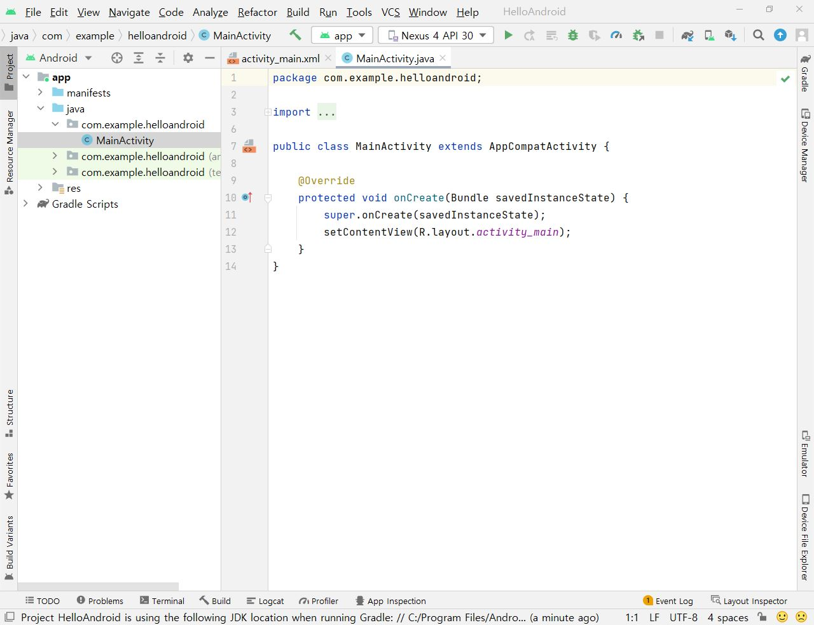

[**이전 학습**: 개발환경 설치](install_dev_env.html)

# 안드로이드 앱 시작하기
1. [**Android Studio**을 이용한 HelloAndroid 프로젝트 만들기](#start-android)
2. [**에뮬레이터 (Android Virtual Device, AVD)** 만들기](#create-avd)
3. [**에뮬레이터에서 HellAndroid 프로젝트 실행하기**](#run-helloandroid)
4. [**실제디바이스에서 HelloAndroid 프로젝트 실행하기**](#run-by-real-device)

##  1. **Android Studio**을 이용한 HelloAndroid 프로젝트 만들기

1. [**Android Studio** 시작화면]에서 **New Project** 선택
	

		
	

2. [**Select a Project Template**] 화면에서 생성할  앱의  화면 템플릿을 선택
	- **Empty Activity**을 선택함

	

		
	

3. [**Configure Your Project**] 화면에서 아래 정보 입력후 [**Finish**] 클릭
	- **Name**: *HelloAndroid* 입력 (안드로이드 앱 프로젝트 이름)
	- **Package name**: *초기값* 이용
	- **Save location**: 안드로이드 앱 프로젝트 파일의 위치, 변경 가능하나 *초기값* 이용
	-  **Language**:  *Java* 선택
	-  **Minimum SDK** 선택: 생성한 안드로이드 앱 프로젝트가 실행되는 타겟 디바이스의 최소 SDK 버전 번호로서, 낮을 수록 많은 종류의 타겟 디바이스에서 실행가능하고, 높을수록 최신의 기능을 활용할 수 있음.

	

		
	

4. *HelloAndroid* 프로젝트 생성 및 빌드 후의 화면

	

		
	

##  2. **에뮬레이터 (Android Virtual Device, AVD)** 만들기

1. Device Manager 실행시키기
	- 안드로이드 스튜디오 프로젝트 화면의 툴바에서 **Device Manager 아이콘** 클릭
	

		
	

2. [**Virtual Physical**] 화면에서 [**+ Create Device**] 버튼 클릭

	

		
	

3. [**Select Hardware**] 화면에서 기본 설정값을 유지한 채  [**Next**] 버튼 클릭
	- 디바이스 범주 (Category)와 범주별 디바이스 정의 목록 중에서 원하는 디바이스를 선택한다.
	

		
	

4. [**System Image** 화면] 에서 설치된 시스템 이미지 중 하나를 선택하거나, 설치되지 않은 시스템 이미지는 다운로드 후 해당 시스템 이미지를 선택
	- 아래 화면은 *x86 Images* 탭에서 **Android 12.0 (Google APIs)**의  시스템 이미지를 선택한 상태

	 

		
	

5. [**Android Virtual Device (AVD)**] 화면에서 기본 설정값을 유지한 채  [**Finish**] 버튼 클릭
	 

		
	

	- [**AVD Name**]: 새롭게 만들 에뮬레이터의 이름을 알기 쉽게 작명
	- [**Show Advanced Settings**] 버튼을 눌러 **Camera**나 **SD card** 설정을 변경할 수 있음.

6. 에뮬레이터 생성 결과

	

		
	

	- [**+ Create Device**] 버튼을 클릭하여 에뮬레이터를 추가로 만들 수 있음

##  3. 에뮬레이터에서 HellAndroid 프로젝트 실행하기

1. 에뮬레이터 실행시키기
	- Device Manager의 Virtual Devices 목록에서 실행할 에뮬레이터를 선택하고 **삼각형 모양 버튼**을 눌러 에뮬레이터를  실행함

  - 실행결과

	

		
	

2. HelloAndroid 프로젝트 화면에서 프로젝트 실행시키기
	- [**Run**]-[**Run 'app'**] 메뉴 실행 또는
	- 툴바의 실행 아이콘 클릭
  - 실행결과
		

			
		

## 4. 실제 디바이스에서 HellAndroid 프로젝트 실행하기

1. PC에 해당 디바이스용 USB 드라이버 설치
  - 삼성: http://local.sec.samsung.com/comLocal/support/down/kies_main.do?kind=usb
  - LG: https://www.lgservice.co.kr/download/selectProductSearch.do

2. 디바이스와 PC를 연결하고, 설정 변경하기
  - **설정**에서 **개발자 옵션** 선택 후, **USB 디버깅**을 허용함
    - (개발자 옵션이 안보이는 경우) **빌드 번호** 정보를 손가락으로 7번 터치하면, **설정**에서 **개발자옵션** 메뉴가 나타남
      - **빌드 번호**를 찾는 방법은 휴대폰 모델마다 다소 차이가 있음
        	- [**LG G 시리즈**의 경우] : **설정 > 일반 > 휴대폰 정보 > 소프트웨어 정보**를 선택
        	- [*Samsung S8 이전 버전*의 경우]  **설정 > 디바이스 정보 > 소프트웨어 정보**를 선택
        	- [*Samsung S8 포함 최신 버전*의 경우] **설정 > 휴대전화 정보 > 소프트웨어 정보**를 선택
3. [**Run**]-[**Select Device..**] 메뉴에서 실행시킬 타겟 디바이스를 선택

  

    
  

4. [**Run**]-[**Run 'app'**] 메뉴 실행 혹은 툴바의 **실행 아이콘** 클릭하여 실행결과 확인

  	

  		
  	

