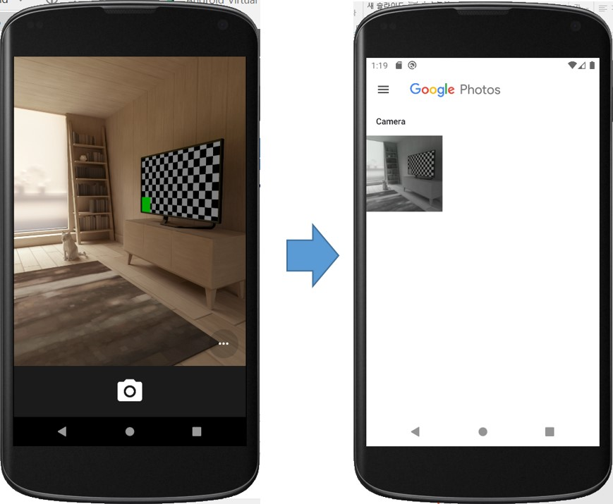
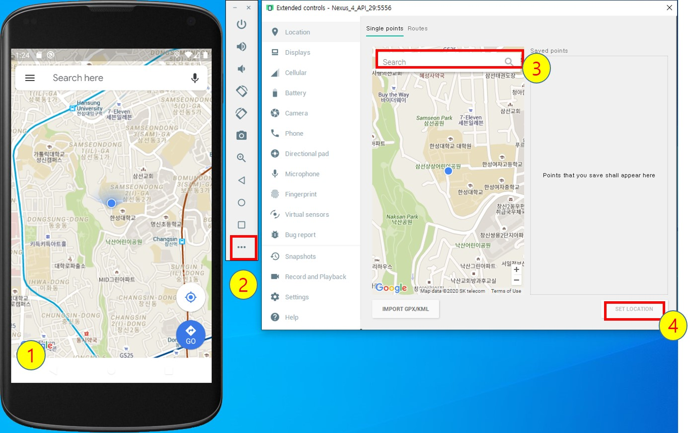
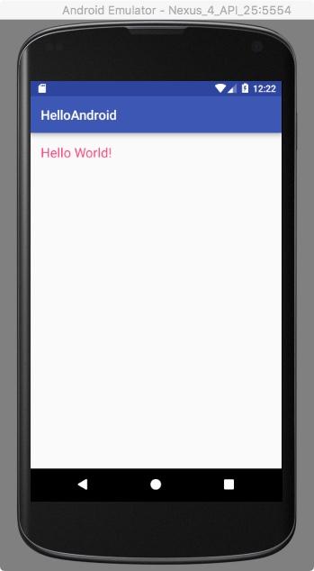

##HelloAndroid 시작하기

안드로이드 시작하기 실습
===================

## 1. Java SE Development Kit 8 설치하기 [생략가능]
- [https://www.oracle.com/java/technologies/javase-jdk8-downloads.html](https://www.oracle.com/java/technologies/javase-jdk8-downloads.html) 사이트에서 현재 사용중인 컴퓨터에 맞는 Java SE Development Kit을 다운 받아 설치하시오.

## 2. Android Studio 설치하기 [생략가능]
- [https://developer.android.com/studio/index.html](https://developer.android.com/studio/index.html) 사이트 접속하여 Android Studio를 다운받아 설치하시오

## 3. SDK Manager를 이용하여 필요한 SDK 도구와 플랫폼을 설치

SDK Manager를 이용하여 다음 SDK Tools와 SDK Platforms가 최신 버전으로 설치되었는지 확인

  * SDK Tools
   	- Android SDK Build-tools
   	- Android Emulator
	- Android SDK Platform-tools
  	- Android SDK Tools
  * SDK Platforms 	
    - Android 10.0 (Q)
	    - Android SDK Platform 29
	    - Google APIs intel x86 Atom System Image
	- Android 9.O (Pie)
		 - Android SDK Platform 28
		 - Google APIs intel x86 Atom System Image

## 4. AVD Manager를 이용하여 virtual device (안드로이드 에뮬레이터) 만들기

다음 스펙의 Phone 용 Virtual Device를 만드시오

  - Device: Nexus 4
  - Size: 4.7’’
  - Resolution 768x1280
  - Density: xhdpi
  - System Image: Q / 29 / x86 / Android 10.0 (Google APIs)
  - Camera: Front(Emulated), Back(Emulated)
  - SD card: 500 MB

## 5. 안드로이드 에뮬레이터 사용해보기
에뮬레이터 제어기의 다음 기능을 사용해 보자
	
- 디바이스 회전
    

		
	 
	
	
- 카메라 앱을 실행시켜서 촬영 후, Photos 앱에서 촬영 이미지 확인

  	

		
	
	
	
- GPS 에뮬레이션
	1. 에뮬레이터에서 Maps(구글맵 앱)을 실행
	2. 에뮬레이터 아이콘 목록 하단의 **...** 버튼을 클릭하여, **Emulator controls 다이얼로그**를 연다.
	3. **Search** 창에 *한성대학교*를 입력하여 검색한다.
	4.  **Emulator controls 다이얼로그**하단의 **SET LOCATION**버튼을 클릭한다.
	5. 에뮬레이터에서 Maps(구글맵 앱)의 위치가 업데이트 됨을 확인한다.

	

		
	
	

## 6. HelloAndroid 프로젝트 실행하기
HelloAndroid 프로젝트를 Android Studio를 이용하여 생성하고, 이를 에뮬레이터에서 실행하여 다음의 결과를 확인하라.
	

		
	
	
