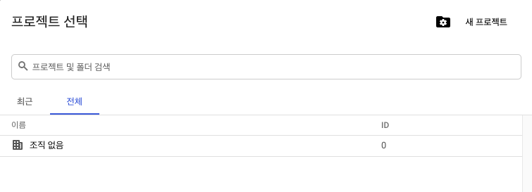
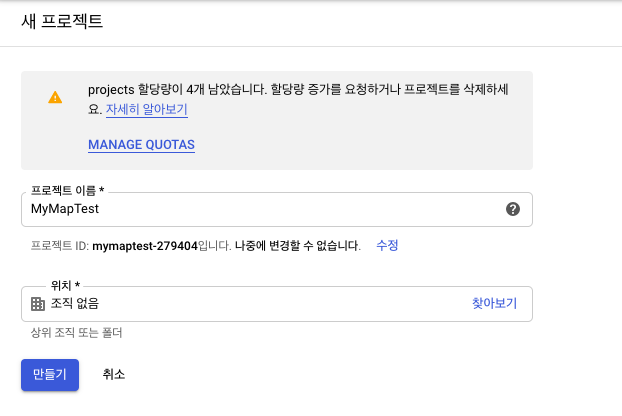

#Google Map 개요

1. [Google Play Service 설정](#1)
- [Google Maps API 키 가져오기](#2)
- [앱에 지도 추가 및 설정](#3)
- [지도에 마커 추가 및 설정](#4)
- [카메라 뷰 제어](#5)

---
<a name="1"> </a>
## 1. Google Play Service 설정

* Google Play Services SDK 다운로드 및 설치
    - Android Studio에서 Tools>SDK Manager 이용
        + **SDK Tools** 탭에서
        + **Google Play services** 선택 후 OK
     
     
* 프로젝트에 라이브러리 추가
    1. build.gradle (Module:app) 파일 오픈
    2. 새로운 빌드 규칙 추가
    
		```java
		dependencies {
		      ...
		      implementation 'com.google.android.gms:play-services-maps:17.0.0'
		}
		```
    3. 툴바에서 "Sync Project with Graddle Files()" 또는 Sync Now 클릭


.footnote[출처: https://developers.google.com/android/guides/releases]

---
<a name="2"> </a>
##2. Google Maps API 키 가져오기
Maps SDK for Android를 사용하려면 Google Cloud Platform Console에 앱 프로젝트를 등록하고 앱에 추가할 수 있는 Google API 키를 가져와야 합니다.

1. Google Cloud Platform Console로 이동
	- https://cloud.google.com/console/google/maps-apis/overview?hl=ko  
2. 프로젝트 만들기 (또는 선택) 
	- 화면 상단의 [**프로젝트 선택**] 클릭
	- **[새프로젝트]**  클릭 
		
	- 프로젝트 이름 (*MyMapTest*) 입력 후, **[만들기]** 버튼 클릭
		
	- 화면 상단의 [**프로젝트 선택**] 에서 생성된 *MyMapTest* 선택
	
3. 좌측상단의 메뉴 버튼 을 클릭하고 **API 및 서비스 > 사용자 인증 정보**를 선택합니다.
		
	
4. 사용자 인증 정보 페이지에서 **사용자 인증 정보 만들기 > API 키**를 클릭합니다.

	**API 키 생성 완료** 대화상자에 새로 만든 API 키가 표시됩니다.
5. **닫기**를 클릭합니다.
		새 API 키는 **사용자 인증 정보** 페이지의 **API 키** 아래 나열됩니다.	

<a name="3"></a>
##3. 앱에 지도 추가 및 설정
1. Google Play 서비스 버전 번호 지정
	- AndroidManifest.xml의 \<application\> 요소 내에 다음 선언을 추가합니다. 

		```xml
		<application ...>
			<meta-data
		        	android:name="com.google.android.gms.version"
		        	android:value="@integer/google_play_services_version" />
		</application>
		```	

1. Google 지도 API 키 설정
	-  AndroidManifest.xml의 \<application\> 요소 내에 다음 선언을 추가하고, 앞서 얻은 API 키를 설정합니다.

		```xml
		    <application ...>
		        <meta-data
		            android:name="com.google.android.geo.API_KEY"
		            android:value="생성된 API 키를 여기로 붙여넣기" />
		         ...
		    </application>
		```
	
2. Activity에 지도를 위한 프레그먼트 추가

	```xml
	<?xml version="1.0" encoding="utf-8"?>
	<LinearLayout xmlns:android="http://schemas.android.com/apk/res/android"
	    android:layout_height="match_parent"
	    android:layout_width="match_parent"
	    android:orientation="vertical">
	    <fragment
	        android:id="@+id/map"
	        android:layout_width="match_parent"
	        android:layout_height="match_parent"
	        android:name="com.google.android.gms.maps.SupportMapFragment" />
	</LinearLayout>
	```

3. 앱 실행시키기

	- 실제 Android 기기나 에뮬레이터에서 실행

		

---
<a name="4"></a>
##4. 지도에 마커 추가 및 설정

[GoogleMap](https://developers.google.com/android/reference/com/google/android/gms/maps/GoogleMap) 객체를 사용할 수 있을 때 지도에 마커 및 기타 설정하기 위해서는 다음 절차를 진행

1. MainActivity에서 [OnMapReadyCallback](https://developers.google.com/android/reference/com/google/android/gms/maps/OnMapReadyCallback) 인터페이스를 구현

	``` java
	public class MainActivity extends AppCompatActivity implements 	OnMapReadyCallback {
		//...
    	public void onMapReady(GoogleMap googleMap) {
        
    	}
	}
	```
4. **MapFragment** (또는 MapView) 객체에 **OnMapReadyCallback** 인스턴스를 설정

	```java
public class MainActivity extends AppCompatActivity implements OnMapReadyCallback{

	    @Override
	    protected void onCreate(Bundle savedInstanceState) {
	        //...
	        SupportMapFragment mapFragment = (SupportMapFragment) getSupportFragmentManager()
	                .findFragmentById(R.id.map);
	        mapFragment.getMapAsync(this);
	    }    
    ```

5. [OnMapReady](https://developers.google.com/android/reference/com/google/android/gms/maps/OnMapReadyCallback.html#onMapReady(com.google.android.gms.maps.GoogleMap))([GoogleMap](https://developers.google.com/android/reference/com/google/android/gms/maps/GoogleMap)) 콜백 메서드를 사용하여 GoogleMap 객체의 획득
	- 지도를 사용할 준비가 되면 콜백 메소드가 실행됨
	- 마커 추가 예제

	```java
	    public void onMapReady(GoogleMap googleMap) {
	        LatLng hansung = new LatLng(37.5817891, 127.008175);
	        googleMap.addMarker(new MarkerOptions().position(hansung).title("한성대학교"));
	        // move the camera
        	googleMap.moveCamera(CameraUpdateFactory.newLatLng(hansung));

	    }
	```
	
---
### 4.1 마커
- 지도에서 단일 위치 식별
- API로 아이콘 색상, 이미지, 앵커 지점 변경 가능
- [Marker](https://developers.google.com/android/reference/com/google/android/gms/maps/model/Marker) 유형의 객체로, GoogleMap.[addMarker](https://developers.google.com/android/reference/com/google/android/gms/maps/GoogleMap.html#addMarker(com.google.android.gms.maps.model.MarkerOptions))() 메소드로 추가됨

	``` java
	public final Marker addMarker (MarkerOptions options)
	```

- 마커 사용자 설정 항목
	- **위치 (필수)** : [LatLng](https://developers.google.com/android/reference/com/google/android/gms/maps/model/LatLng) 객체로 위치 지정 
	- 앵커: 마커 위치에 배치될 이미지의 지점 (기본값은 이미지 하단 중앙)
	- 알파: 마커의 투명도
	- 제목: 마커 클릭시에, 정보창에 표시되는 문자열
	- 스니펫: 제목 아래 표시되는 추가 문자열
	- 아이콘: 기본 마커 이미지 대신 표시되는 비트맵
	- 드래그 가능: 사용자가 마커를 이동할 수 있게 하려면 true로 설정

- 마커는 대화형으로 설계되었습니다. 기본적으로 click 이벤트를 수신하고 종종 이벤트 리스너와 함께 사용되어 정보 창을 나타냅니다.
	- [OnMarkerClickListener](https://developers.google.com/android/reference/com/google/android/gms/maps/GoogleMap.OnMarkerClickListener)를 사용하여 마커에서 클릭 이벤트를 처리

### 4.2 마커 사용 예제
- activity\_main.xml

	```xml
	<?xml version="1.0" encoding="utf-8"?>
	<LinearLayout xmlns:android="http://schemas.android.com/apk/res/android"
	    android:layout_width="match_parent"
	    android:layout_height="match_parent"
	    android:orientation="vertical">
	
	   <LinearLayout
	       android:layout_width="match_parent"
	       android:layout_height="wrap_content"
	       android:orientation="horizontal">
	      <Button
	          android:id="@+id/subway1"
	          android:layout_width="wrap_content"
	          android:layout_height="wrap_content"
	          android:text="한성대입구역"/>
	      <Button
	          android:id="@+id/subway2"
	          android:layout_width="wrap_content"
	          android:layout_height="wrap_content"
	          android:text="창신역"/>
	   </LinearLayout>
	   <fragment
	       android:id="@+id/map"
	       android:layout_width="match_parent"
	       android:layout_height="match_parent"
	       android:name="com.google.android.gms.maps.SupportMapFragment" />
	
	</LinearLayout>
	```


- MainActivity.java
	
	```java
	public class MainActivity extends AppCompatActivity implements OnMapReadyCallback{
	
	    GoogleMap mGoogleMap = null;
	    @Override
	    protected void onCreate(Bundle savedInstanceState) {
	        super.onCreate(savedInstanceState);
	        setContentView(R.layout.activity_main);
	
	        SupportMapFragment mapFragment = (SupportMapFragment) getSupportFragmentManager()
	                .findFragmentById(R.id.map);
	        mapFragment.getMapAsync(this);
	
	        Button btn1 = (Button)findViewById(R.id.subway1);
	        btn1.setOnClickListener(new View.OnClickListener() {
	            @Override
	            public void onClick(View view) {
	                if (mGoogleMap != null) {
	                    LatLng location = new LatLng(37.5882827, 127.006390);
	                    mGoogleMap.addMarker(
	                            new MarkerOptions().
	                                    position(location).
	                                    title("한성대입구역").
	                                    alpha(0.8f).
	                                    icon(BitmapDescriptorFactory.fromResource(R.drawable.arrow)).
	                                    snippet("4호선")
	                    );
	                    mGoogleMap.moveCamera(CameraUpdateFactory.newLatLngZoom(location,15));
	                }
	            }
	        });
	
	        Button btn2 = (Button)findViewById(R.id.subway2);
	        btn2.setOnClickListener(new View.OnClickListener() {
	            @Override
	            public void onClick(View view) {
	                if (mGoogleMap != null) {
	                    LatLng location2 = new LatLng(37.5793652, 127.015292);
	                    mGoogleMap.addMarker(
	                            new MarkerOptions().
	                                    position(location2).
	                                    title("창신역").
	                                    alpha(0.8f).
	                                    icon(BitmapDescriptorFactory.fromResource(R.drawable.arrow)).
	                                    snippet("6호선")
	                    );
	                    mGoogleMap.moveCamera(CameraUpdateFactory.newLatLngZoom(location2,15));
	                }
	            }
	        });
	
	    }
	
	    @Override
	    public void onMapReady(GoogleMap googleMap) {
	        mGoogleMap = googleMap;
	
	        LatLng hansung = new LatLng(37.5817891, 127.009854);
	        googleMap.addMarker(
	                new MarkerOptions().
	                        position(hansung).
	                        title("한성대학교"));
	
	        // move the camera
	        googleMap.moveCamera(CameraUpdateFactory.newLatLngZoom(hansung,15));
	
	        mGoogleMap.setOnMarkerClickListener(new MyMarkerClickListener());
	    }
	
	    class MyMarkerClickListener implements GoogleMap.OnMarkerClickListener {
	
	        @Override
	        public boolean onMarkerClick(Marker marker) {
	            if (marker.getTitle().equals("한성대입구역")) {
	                Toast.makeText(getApplicationContext(),"한성대입구역을 선택하셨습니다", Toast.LENGTH_SHORT).show();
	            }
	            return false;
	        }
	    }
	}

	```	

https://github.com/kwanulee/AndroidProgramming/blob/master/examples/SampleMapTest/app/src/main/java/com/kwanwoo/android/samplemaptest/MainActivity.java
	
---
<a name="5"></a>
##5. 카메라 뷰 제어

###5.1 카메라 이동
- **카메라 위치를 변경**하여 지도에서 보이는 부분을 변경
- [CamaraUpdateFactory](https://developers.google.com/android/reference/com/google/android/gms/maps/CameraUpdateFactory)를 사용하여 다양한 유형의 [CameraUpdate](https://developers.google.com/android/reference/com/google/android/gms/maps/CameraUpdate) 생성 
- 확대/축소 수준 변경
	- [CameraUpdate](https://developers.google.com/android/reference/com/google/android/gms/maps/CameraUpdate) CameraUpdateFactory.[zoomIn](https://developers.google.com/android/reference/com/google/android/gms/maps/CameraUpdateFactory.html#zoomIn())() : 한단계 확대
	- [CameraUpdate](https://developers.google.com/android/reference/com/google/android/gms/maps/CameraUpdate) CameraUpdateFactory.[zoomOut](https://developers.google.com/android/reference/com/google/android/gms/maps/CameraUpdateFactory.html#zoomOut())() : 한 단계 축소
	- [CameraUpdate](https://developers.google.com/android/reference/com/google/android/gms/maps/CameraUpdate) CameraUpdateFactory.[zoomTo](https://developers.google.com/android/reference/com/google/android/gms/maps/CameraUpdateFactory.html#zoomTo(float))(float) : 지정된 단계로 줌 변경
	- [CameraUpdate](https://developers.google.com/android/reference/com/google/android/gms/maps/CameraUpdate) CameraUpdateFactory.[zoomBy](https://developers.google.com/android/reference/com/google/android/gms/maps/CameraUpdateFactory.html#zoomBy(float))(float) : 지정된 단계만큼 줌 변경

- 카메라 위치 변경
	- [CameraUpdate](https://developers.google.com/android/reference/com/google/android/gms/maps/CameraUpdate) CameraUpdateFactory.[newLatLng](https://developers.google.com/android/reference/com/google/android/gms/maps/CameraUpdateFactory.html#newLatLng(com.google.android.gms.maps.model.LatLng))(LatLng) : 지정된 위치로 지도의 중심 이동
	- [CameraUpdate](https://developers.google.com/android/reference/com/google/android/gms/maps/CameraUpdate) CameraUpdateFactory.[newLatLngZoom](https://developers.google.com/android/reference/com/google/android/gms/maps/CameraUpdateFactory.html#newLatLngZoom(com.google.android.gms.maps.model.LatLng, float))(LatLng, float) : 지정된 위치로 지도의 중심을 이동하고,지정된 단계로 줌 변경

	
###5.2 카메라 뷰 업데이트

- [**GoogleMap** 클래스] public final void [moveCamera](https://developers.google.com/android/reference/com/google/android/gms/maps/GoogleMap.html#moveCamera(com.google.android.gms.maps.CameraUpdate)) (CameraUpdate update)
	- 주어진 **CameraUpdate** 객체로 즉시 카메라를 이동

- [**GoogleMap** 클래스] public final void [animateCamera](https://developers.google.com/android/reference/com/google/android/gms/maps/GoogleMap.html#animateCamera(com.google.android.gms.maps.CameraUpdate, int, com.google.android.gms.maps.GoogleMap.CancelableCallback)) (CameraUpdate update, int duration, GoogleMap.CancelableCallback callback)
	- 주어진 **CameraUpdate** 객체로 지도가 매끄럽게 이동됨
	- update: 카메라가 이동할 위치
	- duration: 애니메이션 지속시간
	- callback: GoogleMap.CancellableCallback을 구현하는 객체로 다음 두 가지 메소드를 포함
		- onFinish() 애니메이션이 중단 없이 완료되면 호출됨.
		- onCancel() stopAnimation()를 호출하거나 새로운 카메라 이동이 시작되어 애니메이션이 중단되면 
호출됩니다.

```java
private static final LatLng SYDNEY = new LatLng(-33.88,151.21);
private static final LatLng MOUNTAIN_VIEW = new LatLng(37.4, -122.1);

private GoogleMap map;
... // Obtain the map from a MapFragment or MapView.

// Move the camera instantly to Sydney with a zoom of 15.
map.moveCamera(CameraUpdateFactory.newLatLngZoom(SYDNEY, 15));

// Zoom in, animating the camera.
map.animateCamera(CameraUpdateFactory.zoomIn());

// Zoom out to zoom level 10, animating with a duration of 2 seconds.
map.animateCamera(CameraUpdateFactory.zoomTo(10), 2000, null);
```
[더 많은 예제: https://github.com/googlemaps/android-samples/blob/master/ApiDemos/java/app/src/gms/java/com/example/mapdemo/CameraDemoActivity.java]
