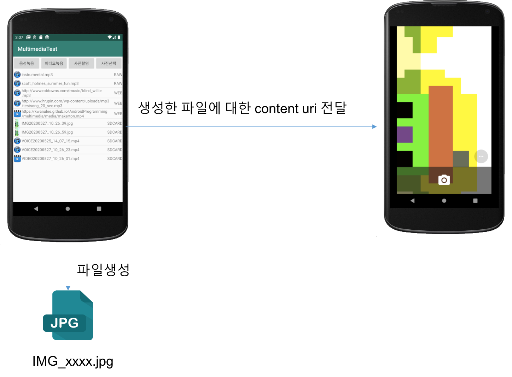

# 멀티미디어
### [1. 오디오 재생하기](#1)
### [2. 동영상 재생하기](#2)
### [3. 오디오 녹음하기](#3)
### [4. 카메라 앱으로 사진 및 동영상 저장하기](#4)
### [5. Photo 앱으로 선택한 사진 저장하기](#5)

- **멀티미디어 예제 프로젝트** 
	- https://github.com/kwanulee/AndroidProgramming/tree/master/examples/MultimediaTest 

<a name="1"></a>
## 1. 오디오 재생하기


### 1.1 MediaPlayer
* android.media 패키지에 있는 클래스
* 오디오, 동영상 재생
* 지원 미디어 포맷
    - 오디오: mp3, wav, amr 등
    - 비디오: mp4
* 데이터 소스 종류
    - 애플리케이션 로컬 리소스 파일 (raw 리소스)
    - 웹 상의 URLs 
    - 로컬에서 사용 가능한 URI (파일 URI, Content URI)


---
### 1.2 res/raw 폴더에 있는 오디오 리소스 재생
- 애플리케이션의 res/raw/ 디렉터리에 저장된 로컬 원시 리소스로 사용 가능한 오디오를 재생하는 방법

	```java
	    MediaPlayer mediaPlayer = MediaPlayer.create(context, R.raw.sound_file_1);
	    mediaPlayer.start(); // no need to call prepare(); create() does that for you
	```
	
	예제 프로젝트 코드:  https://github.com/kwanulee/AndroidProgramming/blob/master/examples/MultimediaTest/app/src/main/java/com/example/kwanwoo/multimediatest/MainActivity.java#L274-L277

---
### 1.3 로컬에서 사용 가능한 URI 기반 재생 방법
* **URI**는 정보의 고유한 명칭으로 웹 주소를 나타내는 URL보다 더 상위의 개념
    - File 타입: file://파일패스/파일이름
        
        ```
        file:///storage/emulated/0/Pictures/camera_image.jpg
        ```
    - 안드로이드 리소스 타입: android.resource://패키지이름/리소스폴더/리소스이름
    
        ```
        android.resource://com.example.kwanwoo.multimediatest/raw/instrumental
        ```
    - 컨텐츠 타입: content://정보제공자/패스/아이디
    		
    	```
        content://media/external/video/media/154
        ```

* **Uri 클래스의 주요 메소드**
    - static Uri parse(String uriString) - Uri문자열로부터 Uri 객체 생성
		    
		```java
		Uri image_Uri = Uri.parse("file:///storage/emulated/0/Pictures/camera_image.jpg");
		```
    - static Uri.fromFile(File file) - file로부터 Uri 객체 생성
    	- 앱별 외부저장소의 Pictures 하위의 camera\_image.jpg 파일의 Uri 객체를 얻는 예제
    
		```java
		Uri image_Uri = Uri.fromFile(
						new File(getExternalFilesDir(Environment.DIRECTORY_PICTURE).getPath()+ 
								"/"+
								"camera_image.jpg")));
		```

- 사용방법 

	```java
	Uri myUri = ....; // initialize Uri here
	MediaPlayer mediaPlayer = new MediaPlayer();
	mediaPlayer.setDataSource(getApplicationContext(), myUri);
	// or just mediaPlayer.setDataSource(mFileName);
	mMediaPlayer.prepare();
	mediaPlayer.start();
   ```

	예제 프로젝트 코드: https://github.com/kwanulee/AndroidProgramming/blob/master/examples/MultimediaTest/app/src/main/java/com/example/kwanwoo/multimediatest/MainActivity.java#L279-L290


---	
### 1.4 	URL로부터 오디오 재생
- 인터넷 접근 권한(**android.permission.INTERNET**) 필요
	- AndroidMenifest.xml 파일에 다음 권한 추가

		```xml
		<manifest ... >
		    <uses-permission android:name="android.permission.INTERNET" />
		</manifest>
		```
- Android Platform API 28 이상의 디바이스에서는 [ClearText](https://whatis.techtarget.com/definition/cleartext) 지원이 기본적으로 비활성화되어 있다.
	- 이를 활성화 시키기위해서, AndroidMenifest.xml 파일의 **application** 태그에 다음 속성값을 설정
	
		```xml
		<application
	        android:usesCleartextTraffic="true"
			  ... >
		```
	
	- [추가 참고자료 링크](https://stackoverflow.com/questions/45940861/android-8-cleartext-http-traffic-not-permitted)

- 사용 방법 1 (UI 스레드에서 실행)

	```java
	String url = "http://........"; // your URL here
	MediaPlayer mediaPlayer = new MediaPlayer();
	mediaPlayer.setDataSource(url);
	mediaPlayer.prepare(); // might take long! (for buffering, etc)
	mediaPlayer.start();
	```

- 사용방법 2 (별도의 스레드에서 비동기 실행)
	- [prepare()](https://developer.android.com/reference/android/media/MediaPlayer?hl=ko#prepare()) 메소드 실행은 오랜시간이 걸릴 수 있으므로, 애플리케이션 UI 스레드에서 호출하는 것은 바람직하지 않습니다.
	- [MediaPlayer](https://developer.android.com/reference/android/media/MediaPlayer?hl=ko)는 [prepareAsync()](https://developer.android.com/reference/android/media/MediaPlayer?hl=ko#prepareAsync())를 사용하여 백그라운드에서 미디어를 준비하고 실행할 수 있는 프레임워크를 제공합니다.
		1. 미디어 플레이어 객체에 [setOnPreparedListener()](https://developer.android.com/reference/android/media/MediaPlayer?hl=ko#setOnPreparedListener(android.media.MediaPlayer.OnPreparedListener)) 메소드를 통해 미디어 준비가 완료되면 호출되는  [MediaPlayer.OnPreparedListener](https://developer.android.com/reference/android/media/MediaPlayer.OnPreparedListener?hl=ko)의 [onPrepared()](https://developer.android.com/reference/android/media/MediaPlayer.OnPreparedListener?hl=ko#onPrepared(android.media.MediaPlayer)) 메서드를 재정의한다.
		2. 미디어 플레이어 객체 [prepareAsync()](https://developer.android.com/reference/android/media/MediaPlayer?hl=ko#prepareAsync()) 호출

	```java
	String url = "http://........"; // your URL here
	MediaPlayer mediaPlayer = new MediaPlayer();
	mediaPlayer.setDataSource(url);
	mediaPlayer.setOnPreparedListener(new MediaPlayer.OnPreparedListener() {
		@Override
		public void onPrepared(MediaPlayer mp) {
			mediaPlayer.start();
		}
	});
	mediaPlayer.prepareAsync();
	```

	
	예제 프로젝트 코드:  https://github.com/kwanulee/AndroidProgramming/blob/master/examples/MultimediaTest/app/src/main/java/com/example/kwanwoo/multimediatest/MainActivity.java#L292-L308


---
### 1.5 MediaPlayer 해제
- MediaPlayer는 귀중한 시스템 리소스를 소비할 수 있습니다. 따라서 항상 특히 주의를 기울여 필요 이상으로 오래 MediaPlayer 인스턴스를 유지하지 않는지 확인해야 합니다.
	-  액티비티의 [onStop()](https://developer.android.com/reference/android/app/Activity?hl=ko#onStop()) 콜백 메소드에서 MediaPlayer 해제

		```java
		protected void onStop() {
			mediaPlayer.release();
			mediaPlayer = null;
		}
		```

---
### 1.6 MediaPlayer의 다양한 메소드
| 메소드 | 설명|
|------|------|
| void pause() | 재생 일시 중지 |
| boolean isPlaying() | 재생 중인지 검사|
| void seekTo(int msec) | msec 시간 위치로 재생 위치 이동|
| int getCurrentPosition() | 현재 재생 위치를 반환|

- 예제

	```java
	 mListView.setOnItemClickListener(new AdapterView.OnItemClickListener() {
		@Override
		public void onItemClick(AdapterView<?> adapterView, View view, int position, long l) {
			// ...
			if (mMediaPlayer != null && mSelectedPosition == position) { // 이전 선택과 동일한 항목을 선택한 경우
				if (mMediaPlayer.isPlaying()) {	 // 미디어가 재생 중인 경우
					mPlaybackPosition = mMediaPlayer.getCurrentPosition();
					mMediaPlayer.pause();
					Toast.makeText(getApplicationContext(), "음악 파일 재생 중지됨.", Toast.LENGTH_SHORT).show();
				} else { 						// 미디어가 재생 중이 아닌 경우
		 			mMediaPlayer.seekTo(mPlaybackPosition);
					mMediaPlayer.start();
					Toast.makeText(getApplicationContext(), "음악 파일 재생 재시작됨.", Toast.LENGTH_SHORT).show();
				}
			}  else { // 이전 선택과 다른 항목을 선택한 경우
				// 미디어 재생
				playAudioByUri(uri);
				
				// 선택된 리스뷰 뷰 항목 위치 저장
				mSelectedPosition = position;
			}
	```

	예제 프로젝트 코드:  https://github.com/kwanulee/AndroidProgramming/blob/master/examples/MultimediaTest/app/src/main/java/com/example/kwanwoo/multimediatest/MainActivity.java#L143-L175


<a name="2"></a>
## 2. 동영상 재생하기

### 2.1 VideoView
* MediaPlayer로도 비디오 재생이 가능하나, VideoView 위젯을 이용하면 매우 간단히 비디오 재생이 가능

* VideoView 활용 절차
    - XML 레이아웃에 <VideoView> 태그 추가
    - Java 코딩
        1. VideoView 객체 참조
        2. [선택사항] 미디어콘트롤러 설정 
        
        	
        
        3. 재생할 동영상 URI 설정
        4. 재생 시작


## 예제


	
https://github.com/kwanulee/AndroidProgramming/blob/master/examples/MultimediaTest/app/src/main/res/layout/activity_video.xml

https://github.com/kwanulee/AndroidProgramming/blob/master/examples/MultimediaTest/app/src/main/java/com/example/kwanwoo/multimediatest/VideoActivity.java


<a name="3"></a>
# 3. 오디오 녹음 하기
* [참고]: Android Emulator는 오디오를 녹음할 수 없습니다. 녹음할 수 있는 실제 기기에서 코드를 테스트해야 합니다.

### 3.1 MediaRecorder
* android.media 패키지에 있는 클래스
* 오디오 녹음, 동영상 녹화 기능
* 필요한 권한

	```xml
	<manifest ... >
	    <uses-permission android:name="android.permission.RECORD_AUDIO" />
	</manifest>
	```
* 오디오 녹음 절차
    1. 권한 검사 및 요청 (Android 6.0이상 부터)
    2. MediaRecorder 객체 생성
    3. 오디오 입력 및 출력 형식 설정
    4. 오디오 인코더와 출력 파일 설정
    5. 녹음 시작


**[주의]** Android 6.0 이상부터는 앱 실행 중에 권한 검사 및 요청 필요


### 3.2 권한 검사 및 요청
- 앱 시작시에 앱에서 필요한 권한 보유여부를 검사하고 없으면 요청한다.
	- **haveRecordPermissions()** 메소드는 앱이 **RECORD\_AUDIO**권한을 허용하는 지를 검사한다.
	- **requestRecordAudioPermission()** 메소드는 **RECORD\_AUDIO**권한을 요청한다.
	 
		```java
			protected void onCreate(Bundle savedInstanceState) {
				//...
				if (haveRecordAudioPermission())
					initListView();
				else
					requestRecordAudioPermission();
			}
			
    		private boolean haveRecordAudioPermission() {
        		return ContextCompat.checkSelfPermission(this,Manifest.permission.RECORD_AUDIO)
                == PackageManager.PERMISSION_GRANTED;
    		}

    		private void requestRecordAudioPermission() {
        		String[] permissions = {
                	Manifest.permission.RECORD_AUDIO
        		};
        		ActivityCompat.requestPermissions(
                	this,
                	permissions,
                	REQUEST_RECORD_AUDIO_FOR_MULTIMEDIA);
    		}
		```
		
	https://github.com/kwanulee/AndroidProgramming/blob/master/examples/MultimediaTest/app/src/main/java/com/example/kwanwoo/multimediatest/MainActivity.java#L67-L70
	
	https://github.com/kwanulee/AndroidProgramming/blob/master/examples/MultimediaTest/app/src/main/java/com/example/kwanwoo/multimediatest/MainActivity.java#L106-L120


### 3.3 오디오 녹음 시작
1.  MediaRecorder 객체 생성
2. setAudioSource()를 사용하여 오디오 소스를 설정합니다. 대개 MIC가 사용됩니다
3. setOutputFormat()을 사용하여 출력 파일 포맷을 설정합니다. 
	- Android 8.0(API 레벨 26)부터 MediaRecorder는 스트리밍에 유용한 MPEG2_TS 포맷을 지원합니다.
5. setAudioEncoder()를 사용하여 오디오 인코더를 설정합니다.
	- [MediaRecorder.AudioEncoder](https://developer.android.com/reference/android/media/MediaRecorder.AudioEncoder?hl=ko) 상수 값 참조
4. setOutputFile()을 사용하여 출력 파일 이름을 설정합니다. 실제 파일을 나타내는 파일 설명자를 지정해야 합니다.
6. prepare()를 호출하여 초기화를 완료합니다.
7. start() 및 stop()을 각각 호출하여 녹음기를 시작 및 중지합니다.

예제 코드

```java
    private void startAudioRec()  {
*          mMediaRecorder = new MediaRecorder();
*          mMediaRecorder.setAudioSource(MediaRecorder.AudioSource.MIC);
*          mMediaRecorder.setOutputFormat(MediaRecorder.OutputFormat.MPEG_4);
*          mMediaRecorder.setAudioEncoder(MediaRecorder.AudioEncoder.DEFAULT);

			// currentDateFormat(): 현재 시각을 “yyyyMMdd_HH_mm_ss” 형태로 반환
           recFileN = "VOICE" + currentDateFormat() + ".mp4";
           
			// 출력 파일의 위치를 앱 전용 외부저장소의 /Music/ 위치로 설정
*          mMediaRecorder.setOutputFile(
*          			getExternalFilesDir(Environment.DIRECTORY_MUSIC).getPath()+"/"  + recFileN);
          

           try {
*              mMediaRecorder.prepare();
               Toast.makeText(getApplicationContext(), "녹음을 시작하세요.", Toast.LENGTH_SHORT).show();
*              mMediaRecorder.start();
           } catch (Exception ex) {
               Log.e("SampleAudioRecorder", "Exception : ", ex);
           }
   }
```

https://github.com/kwanulee/AndroidProgramming/blob/master/examples/MultimediaTest/app/src/main/java/com/example/kwanwoo/multimediatest/MainActivity.java#L310-L326


```java
    private void stopAudioRec()  {

*         mMediaRecorder.stop();
*         mMediaRecorder.release();
          mMediaRecorder = null;

          Uri uri = Uri.parse("file://" + 
          					getExternalFilesDir(Environment.DIRECTORY_MUSIC).getPath()+
          					"/" + 
          					recFileN);
          // 리스트 뷰의 항목으로 녹음된 파일 이름과 URI를 추가
          mAdapter.addItem(new MediaItem(MediaItem.SDCARD, recFileN,uri));

          Toast.makeText(getApplicationContext(), "녹음이 중지되었습니다.", Toast.LENGTH_SHORT).show();

    }
```

https://github.com/kwanulee/AndroidProgramming/blob/master/examples/MultimediaTest/app/src/main/java/com/example/kwanwoo/multimediatest/MainActivity.java#L328-L338


<a name="4"></a>
## 4. 카메라 앱으로 사진 및 동영상 저장하기

### 4.1 카메라 앱 실행 요청
* 특별한 Permission이 필요 없음

* 카메라 앱 요청

	-  이미지 캡처 작업 요청을 포함한 인텐트를 **startActivity** 메소드 파라미터로 전달하여 카메라 앱 실행
	-  [resolveActivity()](https://developer.android.com/reference/android/content/Intent?hl=ko#resolveActivity(android.content.pm.PackageManager)) 메소드는 인텐트를 처리할 수 있는 첫 번째 액티비티 컴포넌트를 반환

	```java
	private void dispatchTakePictureIntent() {
	*   Intent takePictureIntent = new Intent(MediaStore.ACTION_IMAGE_CAPTURE);
	    if (takePictureIntent.resolveActivity(getPackageManager()) != null) {
	        // resolveActivity(): takePictureIntent를 처리할 수 있는 (사진찍기) 액티비티 반환
	        startActivity(takePictureIntent);
	    }
	}
	```


### 4.2 카메라 앱으로 찍은 사진 저장하기
1. 카메라 앱으로 찍은 이미지를 저장할 파일 객체 생성
2. 생성된 파일 객체에 대한 Uri 객체를 얻기
3. Uri 객체를 Extras를 통해 카메라 앱으로 전달

	
- **[주의]** Android 7.0 이상부터는 [FileProvider](https://developer.android.com/reference/android/support/v4/content/FileProvider.html)의 [getUriForFile(Context, String, File)](https://developer.android.com/reference/android/support/v4/content/FileProvider.html#getUriForFile(android.content.Context, java.lang.String, java.io.File))를 통해 해당 파일 객체의 *content://URI*를 획득
		
	- Android 7.0 이전에서는 특정한 앱과 관련된 파일 객체를 다른 앱(예, 카메라 앱)에서 사용하고자 때, 해당 파일 객체에 대한 Uri를 *file:///URI* 형식으로 사용할 수 있었으나, Android 7.0 이상에서는 [FileUriExposedException](https://developer.android.com/reference/android/os/FileUriExposedException.html)을 발생 시킴

	

	- [**중요**] [FileProvider 설정 방법](FileProvider.html)


* [사전조건] 외부 저장소에 저장하기 위해서 Permission 획득 과정 필요

	```java
	*Intent takePictureIntent = new Intent(MediaStore.ACTION_IMAGE_CAPTURE);
	
	If (takePictureIntent.resolveActivity(getPackageManager()) != null) {
		// 1. 카메라 앱으로 찍은 이미지를 저장할 파일 객체 생성
	    mPhotoFileName = ＂IMG＂+currentDateFormat()+＂.jpg＂;
	    mPhotoFile = new File(getExternalFilesDir(Environment.DIRECTORY_PICTURES),
	                                                  mPhotoFileName);
	    if (mPhotoFile !=null) {
	        // 2. 생성된 파일 객체에 대한 Uri 객체를 얻기
	        Uri imageUri = FileProvider.getUriForFile(this, 
                                       "com.example.kwanwoo.multimediatest", mPhotoFile);
                                       
            // 3. Uri 객체를 Extras를 통해 카메라 앱으로 전달                           
	        takePictureIntent.putExtra(MediaStore.EXTRA_OUTPUT, imageUri);
	*       startActivityForResult(takePictureIntent, REQUEST_IMAGE_CAPTURE);
	    } else
	        Toast.makeText(getApplicationContext(), ＂file null＂, Toast.LENGTH_SHORT).show();
	}
	```


	https://github.com/kwanulee/AndroidProgramming/blob/master/examples/MultimediaTest/app/src/main/java/com/example/kwanwoo/multimediatest/MainActivity.java#L367-L385


### 4.3 카메라 앱으로 찍은 사진 결과 처리
* onActivityResult() 메소드에서 저장된 사진을 이미지 뷰에 출력

	```java
	protected void onActivityResult(int requestCode, int resultCode, Intent data) {
	    if (requestCode == REQUEST_IMAGE_CAPTURE && resultCode == RESULT_OK) {
	        if (mPhotoFileName != null) {
	            mPhotoFile = new File(getExternalFilesDir(Environment.DIRECTORY_PICTURES),
	                  mPhotoFileName);
	
	            ImageView imageView = findViewById(R.id.imageView);
	            imageView.setImageURI(Uri.fromFile(mPhotoFile));	        }
	    }
	}
	```

	https://github.com/kwanulee/AndroidProgramming/blob/master/examples/MultimediaTest/app/src/main/java/com/example/kwanwoo/multimediatest/MainActivity.java#L418-L428

### 4.4 카메라 앱으로 촬영한 동영상 저장하기
1.  동영상 캡처 작업 요청을 위한  인텐트를 생성
1. 카메라 앱으로 촬영한 동영상을 저장할 파일 객체 생성
2. 생성된 파일 객체에 대한 Uri 객체를 얻기
3. Uri 객체를 앞서 생성한 인텐트의 Extras에 저장 
4. 카메라 앱으로 전달


	```java
	static final int REQUEST_VIDEO_CAPTURE = 2;
		
	private void dispatchTakeVideoIntent() {
		//  1. 동영상 캡처 작업 요청을 포함한 인텐트를 생성
	*    Intent takeVideoIntent = new Intent(MediaStore.ACTION_VIDEO_CAPTURE);
		
		 if (takeVideoIntent.resolveActivity(getPackageManager()) != null) {
		     //2. 카메라 앱으로 찍은 동영상을 저장할 파일 객체 생성
		     mVideoFileName = "VIDEO"+currentDateFormat()+".mp4";
		     File destination = new File(getExternalFilesDir(Environment.DIRECTORY_MOVIES), 
		            										mVideoFileName);
		     if (destination != null) {
		           //3. 생성된 파일 객체에 대한 Uri 객체를 얻기
		           Uri videoUri = FileProvider.getUriForFile(this, 
		                				"com.example.kwanwoo.multimediatest", destination);
		                
					//4. Uri 객체를 Extras를 통해 카메라 앱으로 전달
		            takeVideoIntent.putExtra(MediaStore.EXTRA_OUTPUT, videoUri);
		            startActivityForResult(takeVideoIntent, REQUEST_VIDEO_CAPTURE);
		      }
	}
	```
	
	https://github.com/kwanulee/AndroidProgramming/blob/master/examples/MultimediaTest/app/src/main/java/com/example/kwanwoo/multimediatest/MainActivity.java#L387-L404


### 4.5 카메라 앱으로 촬영한 결과를 처리하기
- onActivityResult() 메소드에서 결과 코드가 RESULT\_OK인 경우에, 촬영 결과를 저장한 파일 이름을 리스뷰의 항목으로 추가

	```java
	protected void onActivityResult(int requestCode, int resultCode, Intent data) {
	    ...생략...
	    if (requestCode == REQUEST_VIDEO_CAPTURE && resultCode == RESULT_OK) {
	            if (mVideoFileName != null) {
	                mAdapter.addItem(new MediaItem(
	                						MediaItem.SDCARD, 
	                						mVideoFileName, 
	                						MediaItem.VIDEO));
	            } else
	                Toast.makeText(getApplicationContext(), "!!! null video.", Toast.LENGTH_LONG).show();
	        }
	    }
	```
	
	https://github.com/kwanulee/AndroidProgramming/blob/master/examples/MultimediaTest/app/src/main/java/com/example/kwanwoo/multimediatest/MainActivity.java#L428-L434

<a name="5"> </a>
## 5. Photo/Gallery 앱으로 선택한 사진 저장하기

### 5.1 Photo/Gallery 앱으로 사진 선택하기
* 특별한 Permission이 필요 없음

* Photo/Gallery 앱 요청

	```java
    private void dispatchPickPictureIntent() {
        Intent pickPictureIntent = new Intent(Intent.ACTION_PICK);
        pickPictureIntent.setType("image/*");

        if (pickPictureIntent.resolveActivity(getPackageManager()) != null) {
            startActivityForResult(pickPictureIntent,REQUEST_IMAGE_PICK);
        }
    }

	```

	https://github.com/kwanulee/AndroidProgramming/blob/master/examples/MultimediaTest/app/src/main/java/com/example/kwanwoo/multimediatest/MainActivity.java#L358-L365

###5.2 Photo/Gallery 앱으로 사진 선택한 결과 저장하기

* onActivityResult() 메소드에서 선택된 사진 결과를 이미지 뷰에 출력하기
	+ 선택된 사진 결과는 콘텐츠 Uri 형식으로 인텐트 객체를 통해 전달됨

	+ Example
	 
		``` java
		protected void onActivityResult(int requestCode, int resultCode, Intent data) {
	        if (requestCode == REQUEST_IMAGE_PICK && resultCode == RESULT_OK) {
	            Uri imgUri = data.getData();
	            ImageView imageView = findViewById(R.id.imageView);
	            imageView.setImageURI(imgUri);
		}
		
		```
* 콘텐츠 Uri 형식의 사진 결과를 외부 저장소 파일로 저장하기
	+ MediaStore.Images.Media 클래스의 [getBitmap()](https://developer.android.com/reference/android/provider/MediaStore.Images.Media.html#getBitmap(android.content.ContentResolver, android.net.Uri))를 통해 Uri로부터 비트맵 얻기
	
			Bitmap getBitmap (ContentResolver cr, Uri url)
	
	* Bitmap 클래스의 [compress](https://developer.android.com/reference/android/graphics/Bitmap.html#compress(android.graphics.Bitmap.CompressFormat, int, java.io.OutputStream)) 메소드를 이용하면 비트맵을 다양한 형식으로 저장할 수 있다.

			compress(Bitmap.CompressFormat format, int quality, OutputStream stream) 

	+ Example
	
		```java
		    private void saveToExternalFile(Uri imgUri) {
		        try {
		            Bitmap imgBitmap = MediaStore.Images.Media.getBitmap(getContentResolver(), imgUri);
		
		            mPhotoFileName = "IMG"+currentDateFormat()+".jpg";
		            mPhotoFile = new File(getExternalFilesDir(Environment.DIRECTORY_PICTURES), mPhotoFileName);
		
		            imgBitmap.compress(Bitmap.CompressFormat.JPEG,100,
		                    new FileOutputStream(mPhotoFile));
		        } catch (IOException e) {}
		    }
		```
		
		https://github.com/kwanulee/AndroidProgramming/blob/master/examples/MultimediaTest/app/src/main/java/com/example/kwanwoo/multimediatest/MainActivity.java#L436-L446


