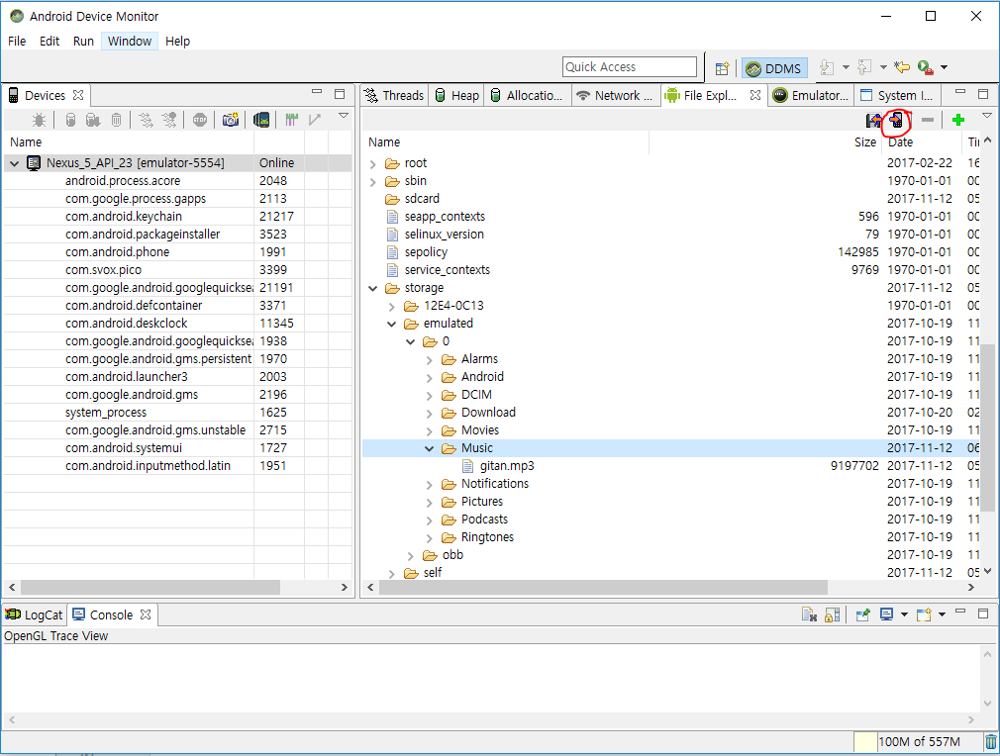
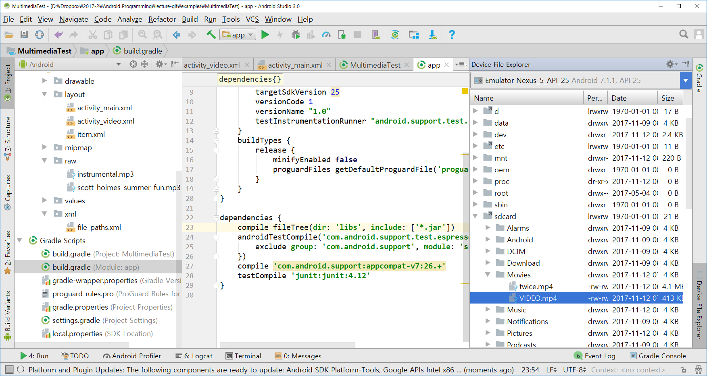

<style> 
div.polaroid {
  	width: 640px;
  	box-shadow: 0 10px 30px 0 rgba(0, 0, 0, 0.2), 0 16px 30px 0 rgba(0, 0, 0, 0.19);
  	text-align: center;
	margin-bottom: 0.5cm;
}
</style>

# 멀티미디어 실습
## 0. MainActivity의 화면 

```xml
<?xml version="1.0" encoding="utf-8"?>
<LinearLayout xmlns:android="http://schemas.android.com/apk/res/android"
    xmlns:tools="http://schemas.android.com/tools"
    android:layout_width="match_parent"
    android:layout_height="match_parent"
    android:orientation="vertical" >
    
    <LinearLayout
        android:layout_width="match_parent"
        android:layout_height="wrap_content"
        android:orientation="horizontal">

        <Button
            android:id="@+id/musicPlayBtn"
            android:layout_width="wrap_content"
            android:layout_height="wrap_content"
            android:layout_weight="1"

            android:layout_gravity="center"
            android:text="음악재생"
            />
        <Button
            android:id="@+id/videoPlayBtn"
            android:layout_width="wrap_content"
            android:layout_height="wrap_content"
            android:layout_weight="1"

            android:layout_gravity="center"
            android:text="비디오재생"
            />
        <Button
            android:id="@+id/imageCaptureBtn"
            android:layout_width="wrap_content"
            android:layout_height="wrap_content"
            android:layout_weight="1"

            android:layout_gravity="center"
            android:text="사진촬영"
            />
        <Button
            android:id="@+id/videoRecBtn"
            android:layout_width="wrap_content"
            android:layout_height="wrap_content"
            android:layout_weight="1"

            android:layout_gravity="center"
            android:text="비디오녹음/재생"
            />

    </LinearLayout>
    <ImageView
        android:id="@+id/imageView"
        android:layout_width="match_parent"
        android:layout_height="wrap_content"
        android:layout_marginTop="20dp"
        />
    <VideoView
        android:id="@+id/videoView"
        android:layout_width="match_parent"
        android:layout_height="wrap_content"
        android:layout_marginTop="20dp"
        />


</LinearLayout>


```

초기화면 


## 1. 음악 파일을 재생하기 실습입니다.
* 먼저 아래 링크의 음악 파일을 다운로드 하세요.
    - https://github.com/kwanu70/AndroidExamples/tree/master/musics/gitan.mp3,
* 위 음악파일을 res/raw 폴더에 저장한 후에 이 음악 파일을 재생하는 코드를 작성해 보세요.
* 위 음악파일을 공용 외부저장소의 Music 폴더에 저장한 후에 이 음악 파일을 재생하는 코드를 작성해 보세요
* [참조코드]     
	- raw 폴더 리소스 URI
 		+ https://github.com/kwanulee/Android/blob/master/examples/MultimediaTest/app/src/main/java/com/example/kwanwoo/multimediatest/MainActivity.java#L187
	- 공용 외부저장소 파일 URI
 		+ https://github.com/kwanulee/Android/blob/master/examples/MultimediaTest/app/src/main/java/com/example/kwanwoo/multimediatest/MainActivity.java#L218

	- 음악파일 재생
		- https://github.com/kwanulee/Android/blob/master/examples/MultimediaTest/app/src/main/java/com/example/kwanwoo/multimediatest/MainActivity.java#L239-L245  
    
* 공용 외부저장소의 Music 폴더에 파일을 복사하는 방법 
	1. Tools>android>Android Device Monitor를 띄운후,아래 그림에서 표시된 버튼을 눌러 해당 파일을 디바이스의 폴더로 복사 
		* (단 API level 23 이하의 에뮤레이터에서만 File Explorer가 정상 작동합니다.)
	<div class="polaroid">
			
	</div>	
	2. Android Studio 3.0 Upgrade 후, 화면 우측 하단에 Device File Explorer 클릭하여 폴더 탐색 후 파일 업로드.
	<div class="polaroid">
			
	</div>	

## 2. 다음은 동영상 재생하기 실습입니다.
* 먼저 아래 링크의 mp4 파일을 다운로드 하세요.
    - https://github.com/kwanu70/AndroidExamples/tree/master/musics/twice.mp4
* 위 동영상 파일을  공용 외부저장소의 Movies 폴더에 저장한 후에 이 파일을 재생하는 코드를 작성해 보세요

* [참조코드]  
https://github.com/kwanulee/Android/blob/master/examples/MultimediaTest/app/src/main/java/com/example/kwanwoo/multimediatest/VideoActivity.java

## 3. 사진찍기 버튼을 누르면, 카메라 앱을 실행시키고, 카메라 앱에서 찍은 사진을 sdcard의 Pictures 폴더에 저장하고, 저장된 파일을 다시 읽어서 화면에 표시해 보세요.
* 저장된 이미지가 해당 폴더에 제대로 있는지도 확인해 보세요

	
	
* [참조코드]  
https://github.com/kwanulee/Android/blob/master/examples/MultimediaTest/app/src/main/java/com/example/kwanwoo/multimediatest/MainActivity.java#L306-L324 
 
	https://github.com/kwanulee/Android/blob/master/examples/MultimediaTest/app/src/main/java/com/example/kwanwoo/multimediatest/MainActivity.java#L362-L365 

## 4. 동영상 촬영 버튼을 누르면, 카메라 앱을 실행시키고, 카메라 앱에서 찍은 동영상을 공용 외부저장소의 Movie 폴더에 저장하고, 저장된 파일을 다시 읽어서 화면에 표시해 보세요.
* 저장된 동영상 파일이 해당 폴더에 제대로 있는지도 확인해 보세요
	<div class="polaroid">

</div>

* [참조코드]  

	https://github.com/kwanulee/Android/blob/master/examples/MultimediaTest/app/src/main/java/com/example/kwanwoo/multimediatest/MainActivity.java#L328-L345   

 https://github.com/kwanulee/Android/blob/master/examples/MultimediaTest/app/src/main/java/com/example/kwanwoo/multimediatest/MainActivity.java#L368-L374   