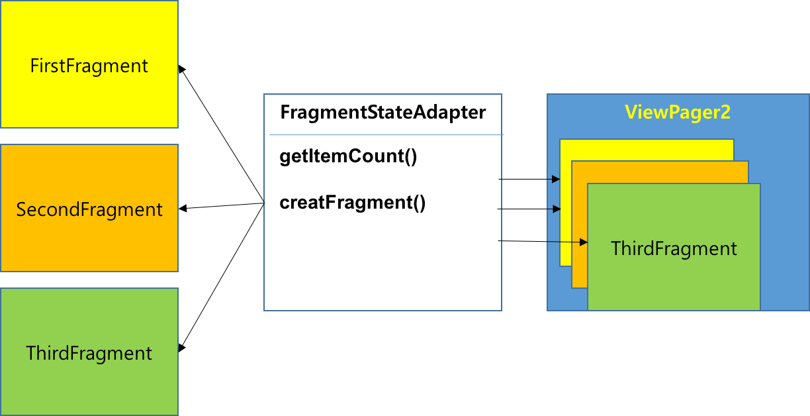

<style> 
div.polaroid {
  	width: 200px;
  	box-shadow: 0 10px 30px 0 rgba(0, 0, 0, 0.2), 0 16px 30px 0 rgba(0, 0, 0, 0.19);
  	text-align: center;
	margin-bottom: 0.5cm;
}
</style>

[**이전 학습**: 앱바](actionbar.html)

# Swipe Views with Tabs

## 학습목표

- ViewPager를 사용하여 스와이프 뷰를 구현한다.
- 탭을 표시하는 방법을 살펴본다.

	

## 1. ViewPager란?
- **[ViewPager](https://developer.android.com/reference/android/support/v4/view/ViewPager)**는 데이터를 페이지 단위로 표시하고 화면을 쓸어 넘기는 동작인 스와이프(Swipe)를 통해 페이지 전환을 할 수 있는 컨테이너(Container)입니다.
- [어댑터 뷰 단원](https://kwanulee.github.io/AndroidProgramming/adapter-view/adapterview.html)에서 어댑터 뷰(ListView, GridView)의 항목에 표시될 정보를 [Adapter](https://developer.android.com/reference/android/widget/Adapter) 객체를 통해서 얻었듯이, **[ViewPager](https://developer.android.com/reference/android/support/v4/view/ViewPager)**는 [PagerAdapter](https://developer.android.com/reference/android/support/v4/view/PagerAdapter) 객체를 통해서 각 페이지에 표시될  정보를 제공 받습니다.
	-  **[ViewPager](https://developer.android.com/reference/android/support/v4/view/ViewPager)**는 보통 [Fragment](https://developer.android.com/reference/android/app/Fragment.html)와 함께 사용되므로, 다음 두 가지 유형의 내장 어댑터 중에 하나를 사용할 수 있습니다. 두 어댑터의 차이점은 
		-  [FragmentPagerAdapter](https://developer.android.com/reference/android/support/v4/app/FragmentPagerAdapter) : 고정된 소수의 화면 간을 탐색할 때 사용
		-  [FragmentStatePagerAdapter](https://developer.android.com/reference/androidx/fragment/app/FragmentStatePagerAdapter): 알 수 없는 수의 페이지를 페이징할 때 사용.  사용자가 다른 곳을 탐색할 때 프래그먼트를 삭제하여 메모리 사용량을 최적화
	
			

## 2. ViewPager 사용하기
- [FragmentPagerAdapter](https://developer.android.com/reference/android/support/v4/app/FragmentPagerAdapter)를 이용한  [ViewPager](https://developer.android.com/reference/android/support/v4/view/ViewPager) 사용 예제 구현은 다음과 같은 절차로 진행됩니다.
	1. [XML 레이아웃에 ViewPager를 추가](#2.1)
	2. [페이지를 나타내는 프레그먼트 정의](#2.2)
	3.  [FragementPagerAdapter 재정의](#2.3)
	4.  [ViewPager 객체에 FragmentPagerAdapter 객체 설정](#2.4)

<a name="2.1"></a>
### 2.1 XML 레이아웃에 ViewPager를 추가
-  **ViewPagerTest** 안드로이드 프로젝트를 생성하고, **activity\_main.xml** 파일을 아래와 같이 정의합니다.

	```xml
	<?xml version="1.0" encoding="utf-8"?>
	<LinearLayout xmlns:android="http://schemas.android.com/apk/res/android"
	    android:layout_width="match_parent"
	    android:layout_height="match_parent"
	    android:orientation="vertical">
	 
	    <androidx.viewpager.widget.ViewPager
	        android:id="@+id/vpPager"
	        android:layout_width="match_parent"
	        android:layout_height="wrap_content">
	    </androidx.viewpager.widget.ViewPager>
	</LinearLayout>
	```

<a name="2.2"></a>
### 2.2 페이지를 나타내는 프래그먼트 정의
-  3개의 각기 다른 페이지 화면을 프래그먼트(FirstFragment, SencondFragment, ThirdFragment)로 정의합니다.  아래에는 FirstFragment만 예시하였고, 나머지 프래그먼트 코드도 유사하게 작성할 수 있습니다.
-  FirstFragment (Java 코드)

	```java
	public class FirstFragment extends Fragment {
	    @Override
	    public View onCreateView(LayoutInflater inflater, ViewGroup container,
	                             Bundle savedInstanceState) {
	        // Inflate the layout for this fragment
	        return inflater.inflate(R.layout.fragment_first, container, false);
	    }
	}
	```  
- fragment\_first.xml (XML 레이아웃)

	```xml
	<?xml version="1.0" encoding="utf-8"?>
	<FrameLayout xmlns:android="http://schemas.android.com/apk/res/android"
	    xmlns:tools="http://schemas.android.com/tools"
	    android:layout_width="match_parent"
	    android:layout_height="match_parent"
	    android:background="@android:color/holo_orange_light"
	    tools:context=".FirstFragment">
	
	    <TextView
	        android:layout_width="wrap_content"
	        android:layout_height="wrap_content"
	        android:layout_gravity="center"
	        android:text="FirstFragment 페이지 입니다."
	        android:textAppearance="?android:attr/textAppearanceLarge" />
	
	</FrameLayout>
	```

<a name="2.3"></a>
### 2.3  FragementPagerAdapter 재정의
- [FragmentPagerAdapter](https://developer.android.com/reference/android/support/v4/app/FragmentPagerAdapter) 재정의하여 몇 개의 페이지가 존재하며, 각 페이지를 나타내는 프래그먼트가 무엇인지를 정의합니다.

	```java
	public class PagerAdapter extends FragmentPagerAdapter {
	    private static int NUM_ITEMS=3;
	
	    public PagerAdapter(FragmentManager fm) {
	        super(fm);
	    }
	
	    // 각 페이지를 나타내는 프래그먼트 반환
	    @Override
	    public Fragment getItem(int position) {
	
	        switch (position) {
	            case 0:
	                FirstFragment first = new FirstFragment();
	                return first;
	            case 1:
	                SecondFragment second = new SecondFragment();
	                return second;
	            case 2:
	                ThirdFragment third = new ThirdFragment();
	                return third;
	            default:
	                return null;
	        }
	    }
	
	    // 전체 페이지 개수 반환
	    @Override
	    public int getCount() {
	        return NUM_ITEMS;
	    }
	}
	```

<a name="2.4"></a>
### 2.4  ViewPager 객체에 FragmentPagerAdapter 객체 설정
- 이제, MainActivity 클래스의 onCreate() 메소드에서 ViewPager 객체에 앞서 정의한 PagerAdapter 객체를 설정합니다.

	```java
	public class MainActivity extends AppCompatActivity {
	
	    @Override
	    protected void onCreate(Bundle savedInstanceState) {
	        super.onCreate(savedInstanceState);
	        setContentView(R.layout.activity_main);
	
	        ViewPager vpPager = findViewById(R.id.vpPager);
	        FragmentPagerAdapter adapterViewPager = new PagerAdapter(getSupportFragmentManager());
	        vpPager.setAdapter(adapterViewPager);
	    }
	}
	```
	

	
### 2.5 기타 ViewPager 설정

- [getCurrentItem()](https://developer.android.com/reference/androidx/viewpager/widget/ViewPager.html#getCurrentItem()): ViewPager 객체의 현재 페이지를 반환

	```java
	vpPager.getCurrentItem(); // --> 2
	```

- [setCurrentItem(int item)](https://developer.android.com/reference/androidx/viewpager/widget/ViewPager.html#setCurrentItem(int)): ViewPager 객체의 현재 페이지를 설정

	```java
	vpPager.setCurrentItem(2)
	```
- [ViewPager.OnPageChangeListener](https://developer.android.com/reference/androidx/viewpager/widget/ViewPager.OnPageChangeListener.html): ViewPager 객체의 페이지 변화가 일어날 때, 특정한 일을 처리해 주기 위해서 사용

	```java
	// Attach the page change listener inside the activity
	vpPager.addOnPageChangeListener(new OnPageChangeListener() {
		
		// This method will be invoked when a new page becomes selected.
		@Override
		public void onPageSelected(int position) {
			Toast.makeText(MainActivity.this, 
	                    "Selected page position: " + position, Toast.LENGTH_SHORT).show();
		}
		
		// This method will be invoked when the current page is scrolled
		@Override
		public void onPageScrolled(int position, float positionOffset, int positionOffsetPixels) {
			// Code goes here
		}
		
		// Called when the scroll state changes: 
		// SCROLL_STATE_IDLE, SCROLL_STATE_DRAGGING, SCROLL_STATE_SETTLING
		@Override
		public void onPageScrollStateChanged(int state) {
			// Code goes here
		}
	});
```

### 2.6 실행 결과
- 실행화면

	

	
## 3. Tab Indicator 표시하기 
-  [**PagerTabStrip**](https://developer.android.com/reference/androidx/viewpager/widget/PagerTabStrip.html)은 [ViewPager](https://developer.android.com/reference/androidx/viewpager/widget/ViewPager)의 자식 뷰로 XML 레이아웃에 포함되어서, **이전, 현재, 다음 페이지**를 나타내는 indicator입니다. 
-  **PagerTabStrip**을 *ViewPager*에 추가하기 위해서는 2장까지 진행된 프로젝트에 다음 두 가지 단계를 추가합니다.

	1. XML 레이아웃에 PagerTabStrip 위젯 추가
	2.  [PagerAdapter.getPageTitle(int)](https://developer.android.com/reference/androidx/viewpager/widget/PagerAdapter#getPageTitle(int)) 메소드 재정의

### 3.1 XML 레이아웃에 PagerTabStrip 위젯 추가
- XML 레이아웃의 ViewPager 위젯의 자식뷰로 PagerTabStrip 을 추가합니다.

	```xml
	<?xml version="1.0" encoding="utf-8"?>
	<LinearLayout xmlns:android="http://schemas.android.com/apk/res/android"
	    android:layout_width="match_parent"
	    android:layout_height="match_parent"
	    android:orientation="vertical">
	
	    <androidx.viewpager.widget.ViewPager
	        android:id="@+id/vpPager"
	        android:layout_width="match_parent"
	        android:layout_height="wrap_content">
	        
	        <androidx.viewpager.widget.PagerTabStrip
	            android:id="@+id/pager_header"
	            android:layout_width="match_parent"
	            android:layout_height="wrap_content"
	            android:layout_gravity="top"
	            android:paddingBottom="4dp"
	            android:paddingTop="4dp" />
	            
	    </androidx.viewpager.widget.ViewPager>
	</LinearLayout>	
	```
	-  **android:layout_gravity**:  Indicator의 위치(top 혹은 bottom)를 설정 

### 3.2  [PagerAdapter.getPageTitle(int)](https://developer.android.com/reference/androidx/viewpager/widget/PagerAdapter#getPageTitle(int)) 메소드를 재정의
- 각 페이지의 제목을 반환하는 [PagerAdapter.getPageTitle(int)](https://developer.android.com/reference/androidx/viewpager/widget/PagerAdapter#getPageTitle(int)) 메소드를 재정의합니다. [2.3절](#2.3)의 코드에 다음 부분을 추가하세요.

	```java
	public class PagerAdapter extends FragmentPagerAdapter {
	    //...
	    private String tabTitles[] = new String[] { "First", "Second", "Third" };
	
	    //...
	    @Override
	    public CharSequence getPageTitle(int position) {
	        // Generate title based on item position
	        return tabTitles[position];
	    }
	}
	```
	
### 3.3 실행 결과

- 실행화면

	| android:layout_gravity="top" | android:layout_gravity="bottom"|
	|:---:|:---:|
	|||
	
	
## 4. Google Play Style 탭 표시하기
-  [**TabLayout**](https://developer.android.com/reference/com/google/android/material/tabs/TabLayout.html)은 Google Play Style의 슬라이딩 탭을 구현한 것으로, 디자인 지원 라이브러리에 포함되어 있습니다.
-  이를 이용하기 위해서는 3장까지 진행된 프로젝트에 다음 두 단계를 추가합니다. (PagerAdapter.getPageTitle(int) 메소드가 재정의 되어 있는 것을 가정)
	1. 디자인 지원 라이브러리 설정
	2.  XML 레이아웃에 TabLayout 추가 
	
### 4.1  디자인 지원 라이브러리 설정
- app/build.gradle 파일에 다음 의존성을 추가

	```
	dependencies {
	    ...
	    implementation 'com.google.android.material:material:1.0.0'
	}
	```

### 4.2 XML 레이아웃에 TabLayout 추가
- XML 레이아웃에서 ViewPager 위젯의 자식뷰로 **com.google.android.material.tabs.TabLayout**을 추가 (PagerTabStrip 위젯은 제거)

	``` xml
	<?xml version="1.0" encoding="utf-8"?>
	<LinearLayout xmlns:android="http://schemas.android.com/apk/res/android"
	    xmlns:app="http://schemas.android.com/apk/res-auto"
	    android:layout_width="match_parent"
	    android:layout_height="match_parent"
	    android:orientation="vertical">
	    
	    <androidx.viewpager.widget.ViewPager
	        android:id="@+id/vpPager"
	        android:layout_width="match_parent"
	        android:layout_height="wrap_content">
	        
	        <!-- TabLayout 추가-->
	        <com.google.android.material.tabs.TabLayout
	            android:id="@+id/sliding_tabs"
	            android:layout_width="match_parent"
	            android:layout_height="wrap_content"
	            app:tabMode="fixed" />
	
	        <!-- PagerTabStrip 삭제-->
	        
	    </androidx.viewpager.widget.ViewPager>
	
	
	</LinearLayout>	
	```

- 다양한 TablLayout의 속성 값을 커스터마이징 할 수 있습니다.

	| Name | Options | Description|
	|----|----|----|
	|tabBackground	|@drawable/image	|Background applied to the tabs|
	|tabGravity|	center, fill|	Gravity of the tabs|
	|tabIndicatorColor|	@color/blue	|Color of the tab indicator line
	|tabIndicatorHeight|	@dimen/tabh	|Height of the tab indicator line
	|tabMaxWidth	|@dimen/tabmaxw	|Maximum width of the tab
	|tabMode|	fixed, scrollable|	Small number of fixed tabs or scrolling list
	|tabTextColor	|@color/blue	|Color of the text on the tab
	
	- [추가 속성 정보](https://developer.android.com/reference/com/google/android/material/tabs/TabLayout.html#lattrs)
	
### 4.3 실행 결과
- 실행 화면

	
	
- 전체 프로젝트 코드 (Github 저장소 위치)
	- https://github.com/kwanulee/AndroidProgramming/tree/master/examples/ViewPagerTest


### 4.4 TabLayout 추가 정보
- [Google Play Style Tabs using TabLayout](https://guides.codepath.com/android/Google-Play-Style-Tabs-using-TabLayout#add-custom-view-to-tablayout) 자료에는  다음과 같은 작업을 수행하는 방법을 공부할 수 있습니다.
	
	| TabLayout의 탭에 Icon 설정 | TabLayout의 탭에 Icon+Text 설정|
	|---|---|
	|||
	-  TabLayout의 탭에 커스텀 뷰 설정

### 참고링크
- [ViewPager with FragmentPagerAdapter](https://guides.codepath.com/android/ViewPager-with-FragmentPagerAdapter)
- [[Android] ViewPager와 Fragment를 활용하여 효율적인 UI 구성하기](https://coding-factory.tistory.com/206)
- [Android ViewPager 예제 - 좌우로 스와이프로 화면 전환](https://webnautes.tistory.com/1013)

---