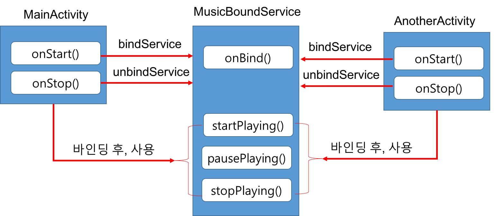

# 서비스

##1. 서비스 개요

###1.1 서비스 (Service) 란?
- 어플리케이션을 구성하는 4대 컴포넌트 (액티비티, 콘텐츠 제공자, 방송 수신자) 중에 하나
- 액티비티처럼 UI를 가지는 컴포넌트가 아니라, **UI없이 백그라운드에서 오래 실행되는 작업을 수행할 수 있는 애플리케이션 구성 요소**
	- 백그라운드 작업의 예
		- 배경 음악 재생
		- 주기적으로 특정 웹사이트의  데이터 수집
		- 주기적으로 폰 의 사용량 계산 
- 서비스의 시작과 종료는 다른 서비스, 액티비티, 방송 수신자를 포함한 다른 어플리케이션 컴포넌트에서 가능.

### 1.2 서비스의 종류
- **시작된 서비스 (Started Service)**
	-  [startService()](https://developer.android.com/reference/android/content/Context?hl=ko#startService(android.content.Intent))를 호출하여서 시작된 서비스
		-  애플리케이션 컴포넌트(예: 액티비티)가  시작할 서비스를 지정한 [Intent](https://developer.android.com/reference/android/content/Intent?hl=ko)를 파라미터로 전달  
	-  한번 시작되면, 처리를 완료하여 스스로 자신을 종료시키기 전까지 백그라운드에서 무한정 실행될 수 있다.
	-  이 종류의 서비스는 호출자에게 결과를 반환할 수는 없다.
		- 예: 네트워크에서 파일을 다운로드 하거나 업로드하는 서비스  
- **바인딩된 서비스 (Bound Service)**
	- [bindService()](https://developer.android.com/reference/android/content/Context?hl=ko#bindService(android.content.Intent,%20android.content.ServiceConnection,%20int)) 를 호출하여 시작된 서비스
	- **바인딩된 서비스**는 클라이언트-서버 인터페이스를 제공하여 다른 어플리케이션 컴포넌트(예, 액티비티 컴포넌트)가 서비스와 상호작용하여 결과를 받을 수도 있다.
	-  **바인딩된 서비스**는 다른 애플리케이션 컴포넌트가 이에 바인딩되어 있는 경우에만 실행되고, 여러 개의 컴포넌트가 서비스에 한꺼번에 바인딩될 수 있지만, 이 모든 것에서 바인딩이 해제되면 해당 서비스는 소멸됩니다.

### 1.3 서비스 컴포넌트 기본
- 서비스를 생성하려면 [Service](https://developer.android.com/reference/android/app/Service?hl=ko)의 하위 클래스(또는 이것의 기존 하위 클래스 중 하나)를 생성해야 합니다. 다음은 재정의가 필요한 가장 중요한 콜백 메서드입니다.
	- [onCreate()](https://developer.android.com/reference/android/app/Service?hl=ko#onCreate())
		- 시스템은 서비스가 처음 생성되었을 때, 이 메서드를 호출하여 일회성 설정 절차를 수행합니다. 서비스가 이미 실행 중인 경우, 이 메서드는 호출되지 않습니다.

	- [onStartCommand()](https://developer.android.com/reference/android/app/Service?hl=ko#onStartCommand(android.content.Intent,%20int,%20int))
		- [startService()](https://developer.android.com/reference/android/content/Context?hl=ko#startService(android.content.Intent))를 통해 시작된 서비스인 경우에 실행됩니다.
		- 이 메서드가 실행되면 서비스가 시작되고 백그라운드에서 무한히 실행될 수 있습니다. 이것을 구현하면 서비스의 작업이 완료되었을 때 해당 서비스를 중단하는 것은 개발자 본인의 책임이며, 이때 [stopSelf()](https://developer.android.com/reference/android/app/Service?hl=ko#stopSelf()) 또는 [stopService()](https://developer.android.com/reference/android/content/Context?hl=ko#stopService(android.content.Intent))를 호출하면 됩니다. 
		- 이 메소드 구현에 대한 자세한 사항은 [2. 시작된 서비스 구현하기](#2)을 참조하세요
		- 바인딩만 제공하고자 하는 경우, 이 메서드를 구현하지 않아도 됩니다.
	- [onBind()](https://developer.android.com/reference/android/app/Service?hl=ko#onBind(android.content.Intent))
		- [bindService()](https://developer.android.com/reference/android/content/Context?hl=ko#bindService(android.content.Intent,%20android.content.ServiceConnection,%20int)) 를 통해 시작된 서비인 경우에 실행됩니다. 
		- 이 메서드를 구현할 때에는 클라이언트가 서비스와 통신을 주고받기 위해 사용할 인터페이스를 제공해야 합니다. 이때 [IBinder](https://developer.android.com/reference/android/os/IBinder?hl=ko)를 반환하면 됩니다. 이 메서드는 항상 구현해야 하지만, 바인딩을 허용하지 않으려면 null을 반환해야 합니다.
		- 이 메소드 구현에 대한 자세한 사항은 [3. 바인딩된 서비스 구현하기](#3)을 참조하세요
	- [onDestroy()](https://developer.android.com/reference/android/app/Service?hl=ko#onDestroy())
		- 시스템이 이 메서드를 호출하는 것은 서비스를 더 이상 사용하지 않고 소멸시킬 때입니다. 서비스는 스레드, 등록된 리스너 또는 수신기 등의 각종 리소스를 정리하기 위해 이것을 구현해야 합니다. 이는 서비스가 수신하는 마지막 호출입니다.

	
		
- 액티비티 및 다른 구성 요소와 마찬가지로, 서비스는 모두 애플리케이션의 매니페스트 파일에서 선언해야 합니다.

	```xml
	<manifest ... >
	  ...
	  <application ... >
	      <service android:name=".ExampleService" />
	      ...
	  </application>
	</manifest>
	```
		

##2. 시작된 서비스 구현하기
- 배경음악을 백그라운드에서 재생하는 서비스 구현을 예제로 설명합니다.
	- 예제 프로젝트 Github [링크](https://github.com/kwanulee/AndroidProgramming/tree/master/examples/MusicService) 
- 구현 절차
	1. 프로젝트 및 서비스 컴포넌트 생성 (AndroidStudio Wizard 사용)
	2. 서비스 클래스 구현
	3. 메인 액티비티 클래스와 화면 레이아웃 클래스 완성하기

### 2.1 프로젝트 및 서비스 컴포넌트 생성
1. AndroidStudio에서 *MusicService* 이름의 프로젝트를 생성한다.
2. AndroidStudio에서 **File**-**New**-**Service**-**Service** 메뉴 선택
3. **Configure Component** 화면에서 **Class Name**으로 *MusicService* 입력후 **Finish** 버튼 클릭

### 2.2  서비스 클래스 구현
- 음악 파일 준비
	- /res/raw 폴더에 *instrumental.mp3*와 같은 이름의 음악 파일을 설정한다.

- **MusicService** 클래스 구현

	```java
	public class MusicService extends Service {
	    private final String TAG="MusicService";
	    private MediaPlayer mMediaPlayer;
	
	    @Override
	    public IBinder onBind(Intent intent) {
	        Log.d(TAG,"onBind()");
	        return null;
	    }
	
	    @Override
	    public void onCreate() {
	        Log.d(TAG,"onCreate()");
	        if (mMediaPlayer == null) {
	            mMediaPlayer = MediaPlayer.create(this, R.raw.instrumental);
	            mMediaPlayer.setLooping(true);
	        }
	    }
	
	    @Override
	    public void onDestroy() {
	        Log.d(TAG,"onDestroy()");
	        if (mMediaPlayer !=null) {
	            mMediaPlayer.stop();
	            mMediaPlayer.release();
	            mMediaPlayer = null;
	        }
	    }
	
	    @Override
	    public int onStartCommand(Intent intent, int flags, int startId) {
	        Log.d(TAG,"onStartCommand()");
	        if (mMediaPlayer != null) {
	            mMediaPlayer.start();
	            Toast.makeText(this,"음악 재생 시작",Toast.LENGTH_LONG).show();
	        }
	
	        return START_STICKY;
	    }
	}
	``` 

### 2.3 메인 액티비티 클래스와 화면 레이아웃 클래스 완성하기
- **activity\_main.xml** 파일 작성

	```xml
	<?xml version="1.0" encoding="utf-8"?>
	<LinearLayout xmlns:android="http://schemas.android.com/apk/res/android"
	    android:layout_width="match_parent"
	    android:layout_height="match_parent"
	    android:orientation="vertical">
	
	    <TextView
	        android:layout_width="match_parent"
	        android:layout_height="wrap_content"
	        android:gravity="center"
	        android:padding="20dp"
	        android:text="음악 서비스 테스트"
	        android:textSize="20sp"
	        />
	    <Button
	        android:layout_width="match_parent"
	        android:layout_height="wrap_content"
	        android:id="@+id/start"
	        android:text="시작"
	        />
	    <Button
	        android:layout_width="match_parent"
	        android:layout_height="wrap_content"
	        android:id="@+id/stop"
	        android:text="중지"
	        />
	</LinearLayout>
	```
- **MainActivity** 클래스 구현
	- **시작** 버튼 클릭시, **MusicService** 시작 
	- **중지** 버튼 클릭시, **MusicService** 중지

	```java
	public class MainActivity extends AppCompatActivity {
	
	    @Override
	    protected void onCreate(Bundle savedInstanceState) {
	        super.onCreate(savedInstanceState);
	        setContentView(R.layout.activity_main);
	
	        Button start = findViewById(R.id.start);
	        start.setOnClickListener(new View.OnClickListener() {
	            @Override
	            public void onClick(View v) {
	                startService(new Intent(MainActivity.this,MusicService.class));
	            }
	        });
	
	        Button stop = findViewById(R.id.stop);
	        stop.setOnClickListener(new View.OnClickListener() {
	            @Override
	            public void onClick(View v) {
	                stopService(new Intent(MainActivity.this,MusicService.class));
	            }
	        });
	    }
	}
	```

### 2.4 실행 결과 확인
1. MusicService 앱을 실행하고, **시작** 버튼을 클릭하여 음악을 연주한다.
2. 디바이스의 **뒤로가기** 버튼을 눌러 앱을 종료하여도 음악이 계속 연주되는 것을 확인한다.
3. MusicService 앱을 다시 시작하여 **중지** 버튼을 클릭하여 음악 연주를 중단한다.
4. 디바이스의 **개요** 버튼을 눌러 최근 작업한 앱의 미리보기 이미지 목록을 엽니다.
5. 목록에서 MusicService 앱을 탭하여 다시 시작한 후,  **시작** 버튼을 클릭하여 음악 연주를 연주한다.
6.  디바이스의 **개요** 버튼을 눌러 최근 작업한 앱의 미리보기 이미지 목록을 열고, MusicService 앱을 스와이프하여 목록에서 삭제한다.
7. 음악 연주 상태를 확인한다.
	- **Android 7.0 (API 레벨 25)**이하의 디바이스에서는 음악이 계속 연주된다.
	- **Android 8.0 (API 레벨 26)**이상 부터는 배터리 사용 최적화를 위해서 백그라운드 실행이 제한을 받기 때문에 음악 연주가 중단된다.

## 3. 바인딩된 서비스 구현하기
- **바인딩된 서비스**는 애플리케이션 컴포넌트(예, 액티비티)가 [bindService()](https://developer.android.com/reference/android/content/Context?hl=ko#bindService(android.content.Intent,%20android.content.ServiceConnection,%20int)) 를 통해서 연결하는 서비스로서, 애플리케이션 컴포넌트는 이 서비스가 제공하는 인터페이스를 통해서 직접 상호작용을 할 수 있다.
- 애플리케이션 컴포넌트는 다음과 같은 세 가지 방법으로 BindService 메서드를 사용 하 여 서비스에 바인딩할 수 있습니다.
	1. **바인더 클래스 확장**  [본 강의자료에서 다루는 내용]
		- 서비스가 애플리케이션과 동일한 프로세스에서 백그라운드로 동작하는 경우에 적합
	2. [메신저 사용](https://developer.android.com/guide/components/bound-services?hl=ko#Messenger)
		- 서비스가 애플리케이션 프로세스와는 별도의 프로세스에 있을 수 있는 경우에 적합
		- 모든 서비스 요청을 단일 스레드로 처리
	3. [AIDL 사용](https://developer.android.com/guide/components/aidl?hl=ko) 
		- 서비스가 애플리케이션 프로세스와는 별도의 프로세스에 있을 수 있는 경우에 적합
		- 서비스 여러 요청을 동시에 처리하기 위해서 다중 스레드를 이용
	
	
### 3.1 바인더 클래스 확장 방법
- 서비스가 해당 애플리케이션에서만 사용되는 경우, 자체적인 [Binder](https://developer.android.com/reference/android/os/Binder?hl=ko) 클래스를 구현하여 클라이언트가 서비스 내의 공개 메서드에 직접 액세스하도록 할 수도 있습니다.
	- 사례:  백그라운드에서 음악을 재생하는 서비스에 여러 액티비티가 바인딩하여 제어하는 예제 
		
		
	
- 설정 절차
	1. 서비스에서 다음 기능을 하는 [Binder](https://developer.android.com/reference/android/os/Binder?hl=ko)  인스턴스를 생성합니다.
		- 현재 Service 인스턴스를 반환하는 메소드를 포함하고 있습니다.
	2. [Binder](https://developer.android.com/reference/android/os/Binder?hl=ko)의 인스턴스를 [onBind()](https://developer.android.com/reference/android/app/Service?hl=ko#onBind(android.content.Intent)) 콜백 메서드에서 반환합니다.
	3. [ServiceConnection](https://developer.android.com/reference/android/content/ServiceConnection?hl=ko) 구현 객체 생성
	4. 클라이언트의 경우, [Binder](https://developer.android.com/reference/android/os/Binder?hl=ko)를 [onServiceConnected()](https://developer.android.com/reference/android/content/ServiceConnection?hl=ko#onServiceConnected(android.content.ComponentName,%20android.os.IBinder)) 콜백 메서드에서 받아서 제공된 메서드로 바인딩된 서비스를 호출합니다

### 3.2  예제 ([MusicBoundService](https://github.com/kwanulee/AndroidProgramming/tree/master/examples/MusicBoundService))
- 예제 프로젝트 Github [링크](https://github.com/kwanulee/AndroidProgramming/tree/master/examples/MusicBoundService)  

	

#### 3.2.1 MusicBoundService 클래스 구현
- [Service](https://developer.android.com/reference/android/app/Service?hl=ko)의 서브 클래스에서 [IBinder](https://developer.android.com/reference/android/os/IBinder?hl=ko) 객체를 반환하는 [onBind()](https://developer.android.com/reference/android/app/Service?hl=ko#onBind(android.content.Intent)) 콜백 메서드를 구현해야 합니다.
	- [IBinder](https://developer.android.com/reference/android/os/IBinder?hl=ko) 객체는 클라이언트가 바인딩된 서비스 객체 인스턴스를  참조할 수 있도록 서비스 객체 인스턴스를 반환하는 메소드(**getService()**)를 제공합니다.

	```java
	public class MusicBoundService extends Service {
	    private final String TAG = "BoundMusicService";
	    
	    // 클라이언트에 반환할 바인더 객체 생성
	    private final IBinder mBinder = new LocalBinder();
	
	    public class LocalBinder extends Binder {
	        // 클라이언트는 이 메소드를 이용하여 MusicBoundService 객체 인스턴스를 얻음
	        MusicBoundService getService() {
	            return MusicBoundService.this;
	        }
	    }
	
	    @Override
	    public IBinder onBind(Intent intent) {
	        return mBinder;
	    }
	    // ...
	}
	```

-  필요한 수명주기 콜백 메소드를 재정의하고, 클라이언트가 사용할 공개 메소드를 정의한다.

	```java
	public class MusicBoundService extends Service {
	    private final String TAG = "BoundMusicService";
	    //...
	    
	    private MediaPlayer mMediaPlayer;
	    private int mPlaybackPosition;
	
	    @Override
	    public void onCreate() {
	        Log.d(TAG, "onCreate()");
	        if (mMediaPlayer == null) {
	            mMediaPlayer = MediaPlayer.create(this, R.raw.instrumental);
	            mMediaPlayer.setLooping(true);
	            mPlaybackPosition = 0;
	        }
	    }
	
	    @Override
	    public void onDestroy() {
	        Log.d(TAG, "onDestroy()");
	        if (mMediaPlayer != null) {
	            mMediaPlayer.stop();
	            mMediaPlayer.release();
	            mMediaPlayer = null;
	        }
	    }
	
	    public void startPlaying() {
	        Log.d(TAG, "startPlaying()");
	        if (mMediaPlayer == null) {
	            mMediaPlayer = MediaPlayer.create(this, R.raw.instrumental);
	            mMediaPlayer.setLooping(true);
	            mPlaybackPosition = 0;
	        }
	        mMediaPlayer.seekTo(mPlaybackPosition);
	        mMediaPlayer.start();
	        Toast.makeText(this, "음악 재생 시작", Toast.LENGTH_LONG).show();
	    }
	
	    public void stopPlaying() {
	        Log.d(TAG, "stopPlaying()");
	        if (mMediaPlayer != null) {
	            mMediaPlayer.stop();
	            mMediaPlayer.release();
	            mMediaPlayer = null;
	            Toast.makeText(this, "음악 재생 중지", Toast.LENGTH_LONG).show();
	        }
	    }
	
	    public void pausePlaying() {
	        Log.d(TAG, "pausePlaying()");
	        if (mMediaPlayer != null) {
	            mPlaybackPosition = mMediaPlayer.getCurrentPosition();
	            mMediaPlayer.pause();
	
	            Toast.makeText(this, "음악 재생 일시 중지", Toast.LENGTH_LONG).show();
	        }
	    }
	}
	```

#### 3.2.2 MainActivity 클래스 구현

1. 서비스와의 연결 상태를 모니터링하는 [ServiceConnection](https://developer.android.com/reference/android/content/ServiceConnection?hl=ko) 구현 객체 생성 
- 클라이언트는  [bindService()](https://developer.android.com/reference/android/content/Context?hl=ko#bindService(android.content.Intent,%20android.content.ServiceConnection,%20int)) 를 호출하여 서비스에 바인딩합니다. 이때 반드시 서비스와의 연결을 모니터링하는  [ServiceConnection](https://developer.android.com/reference/android/content/ServiceConnection?hl=ko)의 구현을 제공해야 합니다. 
3. Android 시스템이 클라이언트와 서비스 사이에 연결을 설정하면  [ServiceConnection](https://developer.android.com/reference/android/content/ServiceConnection?hl=ko) 객체의 [onServiceConnected()](https://developer.android.com/reference/android/content/ServiceConnection?hl=ko#onServiceConnected(android.content.ComponentName,%20android.os.IBinder))을 호출합니다. 
	- [onServiceConnected()](https://developer.android.com/reference/android/content/ServiceConnection?hl=ko#onServiceConnected(android.content.ComponentName,%20android.os.IBinder)) 메서드에는 [IBinder](https://developer.android.com/reference/android/os/IBinder?hl=ko) 인수가 포함되고 클라이언트는 이를 사용(예, binder.getService())하여 바인딩된 서비스 객체 인스턴스를 얻습니다.
4. 클라이언트는 확보된 서비스 객체 인스턴스를 통해 서비스 객체의 공개 메소드를 사용합니다.
		
	```java
	public class MainActivity extends AppCompatActivity {
	
	    @Override
	    protected void onCreate(Bundle savedInstanceState) {
	        super.onCreate(savedInstanceState);
	        setContentView(R.layout.activity_main);
	
	
	        Button start = findViewById(R.id.start);
	        start.setOnClickListener(new View.OnClickListener() {
	            @Override
	            public void onClick(View v) {
	            	//4. 서비스 객체의 공개 메소드 사용
	                mService.startPlaying();
	            }
	        });
	
	       // ...생략
	    }
	
	    MusicBoundService mService;
	    boolean mBound = false;
	
	   // 1. 서비스와의 연결 상태를 모니터링하는 ServiceConnection 구현 객체 생성
	    private ServiceConnection mConnection = new ServiceConnection() {
	        @Override
	        public void onServiceConnected(ComponentName name, IBinder service) {
	            MusicBoundService.LocalBinder binder = (MusicBoundService.LocalBinder)service;
	            
	            // 3. 클라이언트는 바인딩된 서비스 객체 인스턴스를 얻습니다.
	            mService = binder.getService();
	            mBound = true;
	        }
	
	        @Override
	        public void onServiceDisconnected(ComponentName name) {
	            mBound = false;
	        }
	    };
	
	    @Override
	    protected void onStart() {
	        super.onStart();
	        
	        // 2. 클라이언트는 bindService() 를 호출하여 서비스에 바인딩합니다.
	        bindService(new Intent(MainActivity.this, MusicBoundService.class),
	                mConnection, Context.BIND_AUTO_CREATE);
	    }
	
	    @Override
	    protected void onStop() {
	        unbindService(mConnection);
	        super.onStop();
	    }
	}
	```
